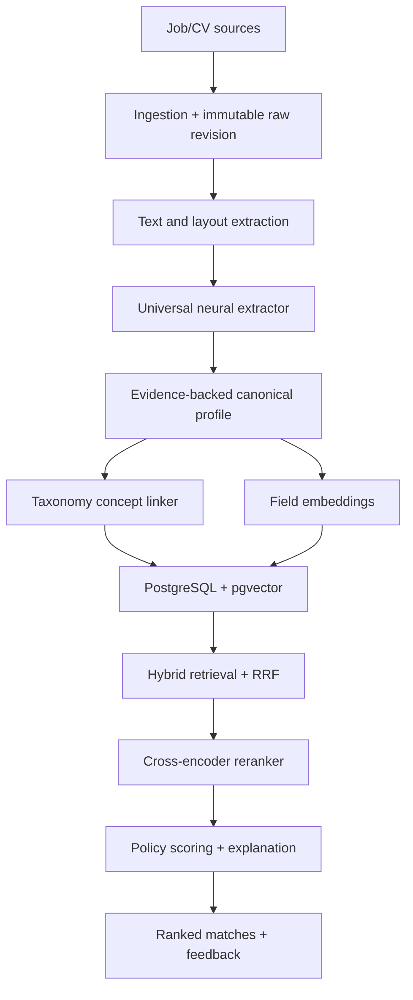
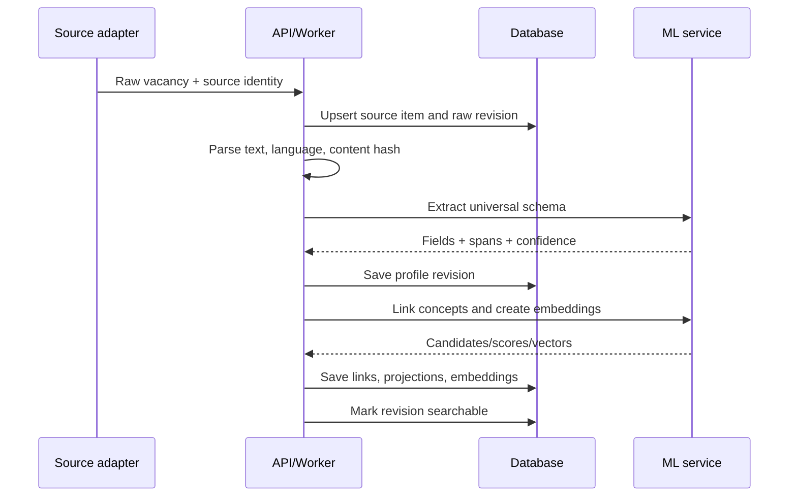

# Universal Job–Candidate Matching Engine

## Технічна специфікація та план реалізації v1.0

**Статус:** draft, узгоджений із наявним репозиторієм; готовий до реалізації після
рішень із 3.5  
**Основна мова документа:** українська  
**Читати першими:** 3.3 (що вже є в коді), 3.4 (конфлікти), 3.5 (відкриті
рішення), 24.0 (інваріанти), 24.1 (скорочений шлях)  
**Ціль:** універсальний матчинг CV ↔ вакансія для IT, продажів, фінансів, медицини, логістики, виробництва, сервісу та інших професій без генеративної LLM у core pipeline.  
**Базовий стек:** FastAPI, PostgreSQL + pgvector, Redis, Celery, React + TypeScript.  
**Початкова інфраструктура:** одна Oracle Always Free VM, орієнтовно 4 OCPU / 24 GB RAM.  

---

## 1. Результат, який треба отримати

Система повинна:

1. Приймати вакансії та CV різними мовами й у різних форматах.
2. Зберігати оригінал документа та всі наступні версії його обробки.
3. Витягувати лише факти, присутні в тексті, разом із доказовими фрагментами та confidence.
4. Працювати з універсальними поняттями: occupation, competency, knowledge, tool, qualification, license, language, responsibility, work condition, compensation, location constraint.
5. Не залежати від словника лише IT-технологій.
6. Нормалізувати професії та компетенції через зовнішню ontology/taxonomy, але не змушувати кожну згадку мати canonical concept.
7. Знаходити кандидатів або вакансії через hybrid retrieval: dense semantic search + lexical search + structured concept signals.
8. Переранжовувати обмежену множину результатів cross-encoder reranker’ом.
9. Показувати не тільки score, а й перевірювані причини: що збіглося, що частково збіглося, де інформації немає, а де є реальний конфлікт.
10. Збирати feedback і пізніше навчити власний reranker/ranking model без переписування системи.

Core pipeline не повинен викликати GPT, Claude, Gemini або іншу генеративну LLM. Генеративну модель можна підключити пізніше лише для пояснення людською мовою, cover letter або підказок, але вона не повинна визначати ranking.

---

## 2. Принципи, які не можна порушувати

### 2.1. Universal core, optional domain adapters

Основна схема однакова для всіх професій. Специфічні галузеві поля додаються через adapters/extensions:

- healthcare: license, specialty, clinical procedures;
- transport: driving category, ADR, vehicle type;
- finance/accounting: IFRS, GAAP, audit qualification;
- construction/trades: permits, safety certifications, equipment;
- software: languages, frameworks, architecture, cloud;
- sales: sales motion, customer segment, CRM, quota responsibility.

Domain adapter не створює окремий pipeline і не змінює core tables. Він додає namespaced extension data та, після окремої валідації, додаткові signals.

### 2.2. Evidence first

Кожен витягнутий факт має посилатися на конкретний фрагмент оригінального тексту:

```json
{
  "value": "Kubernetes",
  "confidence": 0.91,
  "evidence": {
    "document_revision_id": "uuid",
    "start_char": 1421,
    "end_char": 1431,
    "text": "Kubernetes"
  }
}
```

Якщо модель не може дати span, результат зберігається як low-trust inferred field і не може стати hard filter.

### 2.3. `unknown` не дорівнює `false`

Якщо у CV не написано про певну компетенцію, система не має права стверджувати, що кандидат її не має.

Для кожної вимоги використовуються чотири стани:

| Стан | Значення |
|---|---|
| `satisfied` | у профілі є сильний доказ відповідності |
| `partial` | є споріднений або слабший доказ |
| `conflicting` | у профілі є явний несумісний факт |
| `unknown` | даних недостатньо |

`unknown` зменшує впевненість пояснення, але не повинен поводитися як нульовий match.

### 2.4. Hard filters тільки з перевірених фактів

Hard filter дозволений лише коли одночасно:

1. Обмеження справді має бінарну природу: work authorization, strict location, strict schedule, explicit employment type, legally required license тощо.
2. Вакансія явно позначає його mandatory.
3. Extraction confidence перевищує конфігурований поріг.
4. У кандидата є явний конфлікт або він сам позначив preference як strict.

Відсутність поля в CV не активує hard exclusion.

### 2.5. Taxonomy допомагає, але не вирішує

ESCO/O*NET потрібні для normalization, aliases, related concepts, filters, analytics і explanations. Остаточна релевантність не визначається лише збігом taxonomy IDs. Semantic embeddings і reranker залишаються основним механізмом.

### 2.6. Версіонування всього ML-контексту

Кожен результат повинен містити:

- `schema_version`;
- `extractor_model_id`;
- `embedding_model_id`;
- `reranker_model_id`;
- `taxonomy_version`;
- `match_policy_version`;
- `created_at`.

Без цього неможливо відтворити score, порівняти моделі або безпечно переіндексувати дані.

### 2.7. No big-bang microservices

На старті потрібен modular monolith плюс один окремий ML inference process, а не зоопарк із десяти сервісів. FastAPI, Celery, PostgreSQL, Redis і ML process можуть працювати на одній VM. Внутрішні interfaces повинні дозволяти винести inference на іншу машину пізніше.

---

## 3. Межі v1 та стан репозиторію

### 3.1. У v1 входить

- ingestion вакансій із JSON/API/HTML/plain text;
- ingestion CV із PDF/DOCX/plain text;
- language detection;
- universal extraction;
- evidence spans;
- deterministic normalization одиниць і форматів;
- ESCO import і concept linking;
- dense embeddings;
- PostgreSQL lexical retrieval;
- structured retrieval signals;
- reciprocal rank fusion;
- cross-encoder reranking;
- versioned match results та explanations;
- ручне виправлення candidate profile;
- feedback events;
- evaluation harness;
- basic operational monitoring.

### 3.2. У v1 не входить

- автоматична відмова кандидату;
- ranking на основі фото, віку, статі, імені, етнічності, сімейного стану, інвалідності або інших protected attributes;
- автоматичне надсилання application;
- generative cover letters;
- повноцінний learning-to-rank у production;
- окремі fine-tuned models для кожної галузі;
- real-time streaming architecture;
- Kubernetes.

### 3.3. Що вже є в репозиторії (baseline, станом на 2026-09-02)

Цей документ написаний як greenfield-специфікація, але репозиторій уже містить
працюючий pipeline. Комміт `b5569d7` цілеспрямовано **видалив** попередній
LLM-шар (skill extraction, `candidate_profiles`, `ai_invocations`,
`document_versions`) і залишив вузьку систему на двох викликах Voyage. Робота за
цим документом починається не з нуля, а з наступного стану.

| Область специфікації | Що є в коді | Висновок |
|---|---|---|
| Modular monolith (4) | FastAPI + Celery + PostgreSQL/pgvector + Redis + React, Docker Compose, Caddy | є; окремого `ml-service` немає |
| Source adapters (Phase 2) | `JobSourceAdapter` + registry, DOU і Djinni, ротація категорій | є; цей контракт треба визнати джерелом істини, а не писати другий |
| Raw → Normalized → Canonical (14.1) | `raw_jobs`, `job_source_records`, `canonical_jobs`, `DeduplicationService` (company + title + description similarity) | конфлікт із `source_items`/`document_revisions`, див. 3.4 |
| Immutable revisions, blocks, offsets (7.1) | немає | будувати з нуля |
| Language detection (5.1) | немає | будувати з нуля |
| Neural extraction, evidence spans, profile revisions (8) | немає; було і свідомо видалено | див. 3.4 |
| Taxonomy / ESCO / concept linking (9) | немає | будувати з нуля |
| Embeddings (10) | Voyage `voyage-4-large` через REST; **один вектор на весь документ**, `unique(document_type, document_id, model)`, `content_hash` для пропуску повторного embedding, точний cosine scan без ANN | інша архітектура: зовнішній провайдер, немає field-level векторів і model registry |
| Lexical retrieval, `tsvector` (11.2) | немає | будувати з нуля |
| Hybrid retrieval + RRF (11) | один dense-канал | будувати з нуля |
| Reranker (12) | Voyage `rerank-3` через REST, top-`rerank_top_k` (60) | зовнішній провайдер замість локального cross-encoder |
| Requirement evaluation, чотири статуси, explanations (13) | немає | будувати з нуля |
| Score | `similarity × (1−w) + relevance × w`; усі три числа зберігаються на рядку матчу і показуються в UI | принцип «score — це арифметика, а не вирок» уже виконано |
| Hard filters (2.4) | `HardFilterService`: blocked stack, salary floor, локації, blacklist компаній, стеля досвіду; кожна відмова зберігає причину, а відхилена вакансія все одно записується | збігається за духом, але фільтри керуються **преференціями кандидата**, а не вимогами вакансії |
| `match_runs` / `match_results` (7.5) | `job_matches` з `unique(user_id, canonical_job_id)` — upsert, не append-only | пряма суперечність, див. 3.4 |
| `feedback_events` (7.5) | лише `job_matches.decision` (`pending`/`approved`/`rejected`) з кнопок Telegram | частково |
| Version bundle (2.6) | `embedding_model`, `rerank_model`, `rerank_weight` на кожному матчі | немає `model_registry` і pinned revisions — Voyage дає лише назву моделі |
| Idempotency (15, 16) | через unique-констрейнти; немає `Idempotency-Key` і немає outbox | частково |
| Evaluation harness (20) | немає | будувати з нуля |
| Observability (19) | структуровані логи, `pipeline_runs` з лічильниками кожного кроку, System page | немає метрик і дашбордів |
| Тести | 23 unit-файли, `ruff`, `mypy --strict`; немає integration/contract/evaluation каталогів | частково |

Крім того, у репозиторії є функціональність, якої **немає в цій специфікації** і
яку не можна зламати. Вона не «поза scope» — вона вже в продакшені:

- **Notifications.** Telegram-картки з Approve/Reject через webhook, quiet hours,
  поріг за score, ідемпотентна доставка per (notification, channel).
- **Pipeline config у базі.** Кожне число, на якому працює pipeline, редагується
  на System page разом із власним описом і межами; `.env` тримає лише секрети.
  Будь-яке нове число з цього документа (`rrf_k`, ліміти каналів, пороги
  confidence) має потрапити в той самий механізм, а не в YAML-файл поруч.
- **Operator surface.** System page: readiness і блокери, ручний запуск того
  самого Celery-таска, що й розклад, run locks, reset-дії з підрахунком
  видалених рядків.
- **Retention.** `job_retention_days` видаляє вакансію та все, що на неї
  посилається, після того як вона зникла зі скрейпів.
- **Category rotation.** Один категорійний скрейп на джерело за запуск,
  найдавніший першим.

### 3.4. Конфлікти, які специфікація зараз не вирішує

1. **Voyage проти локальних моделей.** Уся AI-частина застосунку — два REST-виклики
   до платного провайдера. Специфікація припускає self-hosted GLiNER2 + E5/BGE-M3 +
   cross-encoder, які резервують 8–11 GB RAM на Oracle VM. Документ ніде не каже,
   чи Voyage лишається, замінюється, чи співіснує — а це визначає 10, 12, 17 і
   майже весь план фаз. Додатково 25.1 забороняє агенту додавати платний
   зовнішній сервіс, хоча він уже в системі.
2. **Екстракція вже була, і її видалили.** Специфікація повертає структуровану
   екстракцію як фундамент. Це саме те, що команда свідомо прибрала, бо екстракція
   виявилася найненадійнішою частиною системи, а впевнений вердикт на поганому
   списку скілів гірший за відсутність вердикту. Документ мусить явно сказати,
   **що цього разу інакше** — інакше він читається як пропозиція повторити те, що
   вже відкотили. Три відмінності, які варто зафіксувати як умову: кожен факт має
   evidence span у вихідному тексті, кандидат бачить і виправляє видобуте до того,
   як воно впливає на ranking, і жодна екстракція не потрапляє в score, поки
   eval-набір не покаже, що вона краща за поточний baseline.
3. **Дві моделі дедуплікації.** `source_items` + `document_revisions` (7.1) дають
   одну вакансію на одне джерело, а 14.2 окремо описує кластери крос-джерельних
   дублікатів — але таблиці кластерів у 7 немає. У репозиторії ж `canonical_jobs`
   уже виконує роль «одна реальна вакансія, кілька джерел». Треба обрати одну
   модель і описати міграцію, а не тримати обидві.
4. **Upsert проти append-only.** `job_matches` тримає один рядок на (user, job) і
   зберігає рішення користувача між запусками. `match_runs`/`match_results` —
   незмінні per-run. За `retrieval_limit = 400` і щоденними запусками це дає
   ~146 000 рядків результатів на користувача за рік без політики retention, якої
   в 7.5 немає. Потрібен також шлях міграції наявного `job_matches.decision` у
   `feedback_events`, інакше історія рішень користувача зникне.
5. **Напрям продукту.** 7 містить `tenant_id`, RLS і права рекрутера, а 18.4
   класифікує систему як high-risk employment за AI Act. Наявний застосунок шукає
   **вакансії для кандидата**, а не кандидатів для роботодавця. Це різні продукти
   з різним регуляторним навантаженням, і специфікація зараз змішує їх у одному
   наборі таблиць.

### 3.5. Рішення, які треба ухвалити до Phase 1

Кожна відповідь тут змінює схему, бюджет RAM і план фаз. Жодну фазу після
Phase 0 не можна починати, поки вони відкриті.

| Рішення | Варіанти | Що воно змінює |
|---|---|---|
| **Провайдер моделей** | (a) лишити Voyage, додати лише локальний extractor; (b) повністю self-hosted; (c) гібрид — локальні embeddings, Voyage rerank | 10, 12, 17.2, `model_registry`, вартість одного запуску |
| **Напрям продукту** | (a) candidate-side, як зараз; (b) recruiter-side; (c) обидва | 7 (tenant/RLS), 18.4 (AI Act), пріоритет UI |
| **Ambition ranking** | (a) hybrid retrieval без ESCO; (b) повний стек із taxonomy | 9 і Phase 4 — найдорожча фаза документа |
| **Обсяг eval-набору** | (a) 200–300 пар, дві мови, три домени; (b) 3 000+ пар, як у 20.1 | реалістичність усього плану для одного оператора |
| **Форма VM** | Oracle A1.Flex (ARM Ampere) чи x86 | доступність wheels, латентність CPU-інференсу, 17.2 |

Поки ці рішення не зафіксовані як ADR, документ описує щонайменше два різні
продукти на двох різних стеках.

---

## 4. Високорівнева архітектура



### Runtime components

| Компонент | Відповідальність |
|---|---|
| `web` | React/TypeScript UI |
| `api` | FastAPI, auth, CRUD, orchestration, match endpoints |
| `worker` | Celery I/O tasks, parsing, indexing, maintenance |
| `ml-service` | завантажує extractor/embedding/reranker один раз і виконує batched inference |
| `postgres` | canonical data, revisions, taxonomy, lexical index, pgvector |
| `redis` | Celery broker/result backend, short-lived cache, distributed locks |

ML models не можна завантажувати в кожен Celery worker. Інакше кілька worker processes продублюють модель у RAM і задушать VM.

---

## 5. Повний data flow

### 5.1. Ingestion вакансії



Detailed steps:

1. Source adapter sends `source`, `external_id`, URL, raw payload, observed timestamps.
2. Compute stable `source_key = source + external_id` where possible.
3. Compute `content_hash` from normalized-but-not-semantically-modified text.
4. If `source_key` and hash already exist, return idempotent success and do nothing.
5. If source item exists but hash changed, create a new immutable `document_revision`.
6. Parse HTML/PDF/DOCX into ordered blocks with character offsets.
7. Detect document language; preserve original text.
8. Run extraction in bounded passes.
9. Validate output against versioned Pydantic/JSON Schema.
10. Store both accepted and rejected/low-confidence fields for audit, but expose only accepted fields to search projections.
11. Link mentions to taxonomy with abstention support.
12. Build deterministic textual representations for embedding.
13. Generate field embeddings.
14. Update relational projections and lexical `tsvector`.
15. Mark job revision `SEARCHABLE` in the same final transaction.
16. Trigger match refresh only for active candidates affected by the source/user policy; do not synchronously rerank every candidate.

"Affected" needs a definition, or step 16 is unimplementable. A candidate is
affected by a newly searchable job revision when all of these hold:

- the candidate has `matching_enabled` and a reviewed or extracted current
  profile revision;
- the job passes the candidate's hard filters (2.4) — cheap, structured, and it
  eliminates most pairs before any model runs;
- the job is within the candidate's retrieval reach: either it enters the
  candidate's top `fused_limit`, or the candidate has no match run newer than
  the job's revision.

Everything else waits for the candidate's next scheduled run. The existing
pipeline already refreshes every user on a timer rather than per document, which
is a perfectly good v1 answer at this corpus size — per-document fan-out is an
optimisation to reach for when the timer stops keeping up, and the definition
above is what it should mean when it arrives.

### 5.2. Ingestion CV

CV follows the same flow, with two differences:

- PII is stored separately from the matching profile.
- The user receives a review screen where extracted facts can be confirmed, corrected or hidden.

Candidate edits create a new `profile_revision` with `origin = user_override`; they never overwrite extracted history. User-confirmed facts have higher trust than neural extraction.

### 5.3. Match request

1. Load current candidate profile revision.
2. Apply safe pre-filters to active jobs.
3. Run parallel retrieval channels against precomputed job representations.
4. Merge result lists with Reciprocal Rank Fusion (RRF).
5. Keep top 100–200 candidates, configurable by benchmark.
6. Build compact pair representations for reranker; do not concatenate unlimited raw CV and raw vacancy.
7. Rerank top N, initially 50–100 depending on CPU benchmark.
8. Evaluate structured requirements against candidate evidence.
9. Apply explicit constraint penalties/exclusions.
10. Produce final score, confidence and explanation.
11. Store immutable `match_run` and `match_result` rows.

---

## 6. Canonical data model

### 6.1. Чому не один великий JSON і не повністю normalized SQL

Потрібен hybrid design:

- immutable JSONB profile revision зберігає повний output конкретної schema version;
- relational projection tables індексують concepts, requirements, evidence та fields для search;
- vector table зберігає кілька embeddings на revision;
- raw original залишається окремо.

Повністю normalized модель зробить кожну зміну extractor schema дорогою. Один JSONB зробить пошук, constraints і explainability болючими. Hybrid design дає обидві переваги.

### 6.2. Спільні типи

```json
{
  "EvidenceSpan": {
    "id": "uuid",
    "block_id": "uuid|null",
    "start_char": 0,
    "end_char": 12,
    "text": "source substring",
    "page": 1,
    "confidence": 0.93
  },
  "ConceptMention": {
    "raw_text": "MS Excel",
    "category": "tool",
    "concept_id": "esco:...|onet:...|internal:...|null",
    "link_status": "linked|ambiguous|unmapped|manual",
    "link_score": 0.91,
    "alternatives": [],
    "evidence_ids": ["uuid"]
  },
  "Requirement": {
    "id": "uuid",
    "kind": "competency|experience|education|credential|language|location|work_authorization|schedule|physical|other",
    "necessity": "required|preferred|unspecified",
    "operator": "has|at_least|at_most|one_of|all_of|not",
    "value": {},
    "explicit": true,
    "confidence": 0.92,
    "evidence_ids": ["uuid"]
  }
}
```

`operator: "not"` needs its interaction with the four statuses spelled out,
because negation inverts them and a naive implementation gets 2.3 exactly
backwards. For a negated requirement ("must not require relocation", "no night
shifts"):

- candidate evidence that contradicts the negated value → `conflicting`;
- candidate evidence consistent with it → `satisfied`;
- **silence stays `unknown`, not `satisfied`.** The temptation is to read "the CV
  never mentions night shifts" as compliance. It is absence of evidence, and
  treating it as satisfaction is the mirror image of treating a missing skill as
  `false`.

Negated requirements may never become hard filters on `unknown`, whatever their
confidence.

### 6.3. JobProfile v1

```json
{
  "schema_version": "job-profile/1.0",
  "document": {
    "language": "en",
    "title_raw": "Senior Financial Accountant",
    "source": "example_source"
  },
  "role": {
    "display_title": "Senior Financial Accountant",
    "occupation_mentions": [],
    "seniority": "senior|lead|manager|entry|mid|unknown",
    "management_scope": "none|people|function|project|unknown",
    "industries": [],
    "domains": []
  },
  "requirements": [],
  "competencies": [],
  "responsibilities": [
    {
      "text": "Prepare monthly consolidated statements",
      "evidence_ids": [],
      "confidence": 0.89
    }
  ],
  "experience_requirements": [
    {
      "years_min": 3,
      "years_max": null,
      "context": "corporate accounting",
      "necessity": "required",
      "evidence_ids": []
    }
  ],
  "education_requirements": [],
  "credentials": [],
  "languages": [],
  "work_conditions": {
    "employment_types": [],
    "work_modes": [],
    "schedule": null,
    "travel_percent_max": null,
    "relocation_required": null
  },
  "locations": [],
  "work_authorization": [],
  "compensation": {
    "raw": null,
    "currency": null,
    "min": null,
    "max": null,
    "period": null,
    "gross_net": "unknown",
    "normalized_monthly_min": null,
    "normalized_monthly_max": null
  },
  "benefits": [],
  "extensions": {},
  "quality": {
    "overall_confidence": 0.0,
    "warnings": [],
    "missing_critical_fields": []
  }
}
```

### 6.4. CandidateProfile v1

```json
{
  "schema_version": "candidate-profile/1.0",
  "document": {
    "language": "en"
  },
  "target_roles": [],
  "occupation_history": [
    {
      "title_raw": "Accountant",
      "occupation_mentions": [],
      "company": null,
      "industry_mentions": [],
      "start_date": "2022-05",
      "end_date": null,
      "duration_months": 52,
      "responsibilities": [],
      "achievements": [],
      "competencies": [],
      "evidence_ids": []
    }
  ],
  "competencies": [],
  "education": [],
  "credentials": [],
  "languages": [],
  "achievements": [],
  "preferences": {
    "target_occupations": [],
    "employment_types": [],
    "work_modes": [],
    "locations": [],
    "salary_min": null,
    "currency": null,
    "strict_fields": []
  },
  "work_authorization": [],
  "extensions": {},
  "quality": {
    "overall_confidence": 0.0,
    "warnings": [],
    "user_reviewed": false
  }
}
```

### 6.5. Competency record

Не всі competencies є software skills. Запис має бути універсальним:

```json
{
  "raw_text": "manage enterprise accounts",
  "category": "professional_skill",
  "necessity": "required",
  "proficiency": "advanced|intermediate|basic|unspecified",
  "years_min": null,
  "recency": null,
  "concept": {
    "concept_id": "esco:...",
    "status": "linked",
    "score": 0.88
  },
  "explicit": true,
  "confidence": 0.91,
  "evidence_ids": ["uuid"]
}
```

Allowed competency categories:

- `professional_skill`;
- `tool`;
- `technology`;
- `methodology`;
- `domain_knowledge`;
- `regulation_knowledge`;
- `transversal_skill`;
- `physical_skill`;
- `other`.

Certification, formal language level and license remain separate first-class objects rather than being hidden inside competencies.

---

## 7. PostgreSQL schema

Нижче — logical schema. AI-агент має реалізувати її через SQLAlchemy 2.x models та Alembic migrations відповідно до conventions наявного repository.

### 7.1. Core document tables

#### `source_items`

- `id uuid pk`
- `tenant_id uuid nullable/indexed`
- `source varchar(64) not null`
- `external_id text nullable`
- `canonical_url text nullable`
- `entity_kind enum(job, candidate)`
- `first_seen_at timestamptz`
- `last_seen_at timestamptz`
- unique `(tenant_id, source, external_id)` when `external_id is not null`

#### `document_revisions`

- `id uuid pk`
- `source_item_id uuid fk`
- `revision_no int`
- `content_hash char(64)`
- `mime_type text`
- `raw_payload jsonb nullable`
- `raw_text text`
- `parsed_text text`
- `language_code varchar(16)`
- `parser_name`, `parser_version`
- `status enum(received, parsed, extracting, extracted, indexing, searchable, failed)`
- `failure_code`, `failure_detail`
- `created_at timestamptz`
- unique `(source_item_id, revision_no)`
- unique `(source_item_id, content_hash)`

#### `document_blocks`

- `id uuid pk`
- `document_revision_id uuid fk/index`
- `ordinal int`
- `block_type enum(title, heading, paragraph, list_item, table_cell, metadata, unknown)`
- `text text`
- `start_char int`, `end_char int`
- `page int nullable`
- `layout jsonb nullable`

### 7.2. Profile tables

#### `profile_revisions`

- `id uuid pk`
- `document_revision_id uuid fk/index`
- `profile_kind enum(job, candidate)`
- `schema_version text`
- `origin enum(neural_extraction, user_override, migration)`
- `parent_revision_id uuid nullable`
- `extractor_model_id text`
- `extracted_profile jsonb`
- `overall_confidence real`
- `validation_warnings jsonb`
- `created_at timestamptz`

#### `jobs`

- `id uuid pk`
- `source_item_id uuid unique`
- `current_profile_revision_id uuid`
- `company_id uuid nullable`
- `status enum(active, expired, removed, draft)`
- `published_at`, `expires_at`, `closed_at`
- denormalized filter columns: `remote_type`, `employment_type`, `country_code`, `salary_min_monthly`, `salary_max_monthly`, `currency`

#### `candidates`

- `id uuid pk`
- `user_id uuid/index`
- `current_profile_revision_id uuid`
- `matching_enabled bool`
- `created_at`, `updated_at`

PII such as email, phone and full name should be stored in a separate encrypted/permission-limited `candidate_private_data` table and must never be included in embedding or reranker input.

### 7.3. Evidence and concept projection

#### `evidence_spans`

- `id uuid pk`
- `profile_revision_id uuid/index`
- `document_block_id uuid nullable`
- `field_path text`
- `start_char`, `end_char`, `page`
- `text text`
- `confidence real`
- check offsets are non-negative and `end_char > start_char`

#### `taxonomy_concepts`

- `id uuid pk`
- `namespace text` (`esco`, `onet`, `internal`)
- `external_id text`
- `concept_type text`
- `preferred_label text`
- `labels jsonb`
- `description text`
- `status enum(active, obsolete)`
- `taxonomy_version text`
- unique `(namespace, external_id, taxonomy_version)`

#### `taxonomy_relations`

- `source_concept_id uuid`
- `target_concept_id uuid`
- `relation_type enum(broader, narrower, related, essential_for, optional_for, same_as)`
- composite primary key over source, target, type

#### `profile_concept_mentions`

- `id uuid pk`
- `profile_revision_id uuid/index`
- `evidence_span_id uuid nullable`
- `concept_id uuid nullable/index`
- `raw_text text`
- `category text`
- `role enum(held, target, required, preferred, responsibility, domain)`
- `link_status enum(linked, ambiguous, unmapped, manual)`
- `extraction_confidence real`
- `link_score real nullable`
- `metadata jsonb`

#### `profile_requirements`

- relational projection of `Requirement` objects;
- `kind`, `necessity`, `operator`, `value_jsonb`, `explicit`, `confidence`, `evidence_span_id`;
- indexes on `profile_revision_id`, `kind`, `necessity`.

### 7.4. Search and model tables

#### `profile_embeddings`

- `id uuid pk`
- `profile_revision_id uuid/index`
- `field_type enum(occupation, competencies, experience, responsibilities, full_profile)`
- `chunk_no int default 0`
- `model_id text`
- `model_revision text`
- `embedding vector(D)` or `halfvec(D)`
- `source_text_hash char(64)`
- unique `(profile_revision_id, field_type, chunk_no, model_id, model_revision)`

Do not add five vector columns to `jobs`; a row-per-field table makes model migrations and multiple model versions manageable.

#### `profile_search_documents`

- `profile_revision_id uuid pk`
- separate text columns for title/occupation, competencies, responsibilities, full profile;
- `search_vector tsvector` generated or transactionally updated;
- GIN index on `search_vector`;
- trigram indexes only if benchmark proves value.

#### `model_registry`

- model purpose, provider/repository, pinned revision/commit, license, dimensions, max tokens, runtime backend, status, created time, benchmark metadata.

### 7.5. Matching and feedback tables

#### `match_runs`

- `id uuid pk`
- `candidate_profile_revision_id uuid`
- `query_jsonb`
- all model/taxonomy/policy versions;
- `status`, `started_at`, `finished_at`, `duration_ms`.

#### `match_results`

- `id uuid pk`
- `match_run_id uuid/index`
- `job_profile_revision_id uuid`
- `rank int`
- `final_score real`
- `confidence real`
- `retrieval_score`, `reranker_score`, `requirement_score`, `constraint_penalty`
- `component_scores jsonb`
- `explanation_jsonb`
- unique `(match_run_id, job_profile_revision_id)`

#### `requirement_match_results`

- `match_result_id`
- `job_requirement_id`
- `status enum(satisfied, partial, conflicting, unknown)`
- `score real`
- candidate evidence IDs;
- method/version metadata.

#### `feedback_events`

- `user_id`, `candidate_id`, `job_id`, `match_result_id nullable`;
- `event_type enum(impression, open, save, dismiss, apply, interview, offer, hired, correction)`;
- `value jsonb`, `occurred_at`, `source`;
- immutable append-only events.

Migration note: the repository already stores one user verdict per match
(`job_matches.decision`, set from the Telegram Approve/Reject buttons and
deliberately never overwritten by a re-match). That history is real feedback and
must be backfilled into `feedback_events` as `save`/`dismiss` events with their
original timestamps before `job_matches` is reshaped.

### 7.6. Operational tables

Sections 15, 16 and 14.2 require tables that the schema above does not define.
Without them those sections cannot be implemented as written.

#### `idempotency_keys`

Required by 15 ("all async mutation endpoints accept `Idempotency-Key`").

- `key text`, `endpoint text`, `tenant_id uuid nullable`
- `request_hash char(64)` — rejects a reused key carrying a different body
- `response_status int`, `response_body jsonb`
- `created_at`, `expires_at`
- primary key `(tenant_id, endpoint, key)`
- a `maintenance` task purges expired rows

#### `outbox_events`

Required by 16 ("transactional outbox").

- `id bigserial pk`, `aggregate_type text`, `aggregate_id uuid`
- `event_type text`, `payload jsonb`
- `created_at`, `published_at timestamptz nullable`, `attempts int`
- partial index on `published_at is null`
- written in the same transaction as the state change; a relay publishes to
  Celery and stamps `published_at`

#### `job_clusters` / `job_cluster_members`

Required by 14.2 ("select a representative for display, retain all source
records"). With `jobs.source_item_id` unique, one job row is one source posting,
so cross-source duplicates need an explicit cluster:

- `job_clusters`: `id uuid pk`, `representative_job_id uuid`, `method text`,
  `method_version text`, `created_at`
- `job_cluster_members`: `cluster_id`, `job_id`, `similarity real`,
  `matched_on jsonb`, primary key `(cluster_id, job_id)`
- the existing `canonical_jobs` table is the same idea under another name —
  decision 3.4.3 picks one and the other becomes a migration, not a second
  mechanism

#### Retention for match artifacts

`match_runs` and `match_results` are append-only per run. At
`retrieval_limit = 400` with a daily run that is ~146 000 result rows per
candidate per year, plus their explanations. Define, and make configurable
alongside the existing `job_retention_days`:

- keep the newest N runs per candidate in full (`match_run_retention_count`);
- keep older runs as the run row plus aggregate counters, dropping
  `match_results` and `explanation_jsonb`;
- never delete a run referenced by a `feedback_event`;
- deletion of a candidate removes runs, results, embeddings and evidence — this
  is the same flow 18.1 requires, so build it once.

---

## 8. Extraction design

### 8.1. Model adapter

Define an interface independent of GLiNER:

```python
class ProfileExtractor(Protocol):
    async def extract_job(self, document: ParsedDocument) -> ExtractionResult: ...
    async def extract_candidate(self, document: ParsedDocument) -> ExtractionResult: ...
```

`ExtractionResult` contains schema version, values, evidence spans, confidence, warnings, model ID and model revision.

Initial candidate: multilingual GLiNER2.5. The official project currently exposes multilingual schema-driven extraction, classification, records, relations, span attributes and long-document chunking. Pin the exact model revision rather than using an unpinned `main` branch.

### 8.2. Do not request the whole profile in one giant schema

Use 2–4 bounded passes:

1. `document_meta`: role title, occupation, seniority, industries, work mode, employment type, locations, salary spans.
2. `requirements`: explicit requirement spans with necessity and requirement type.
3. `competencies`: skill/tool/knowledge mentions and required/preferred attributes.
4. `experience_blocks`: CV roles, dates, achievements and responsibilities.

Why: too many competing labels in one forward pass usually lower recall and make debugging impossible. The optimal number of passes must be confirmed by benchmark.

### 8.3. Chunking

- Parse into semantic blocks first.
- Prefer section/block windows rather than arbitrary character slicing.
- For overlong blocks, use overlapping token windows.
- Store local-to-global offset mapping.
- Merge duplicate spans by global offsets and label.
- Never silently truncate a document.
- Add `document_truncated=false/true` and warnings.

### 8.4. Confidence policy

Thresholds live in versioned configuration, not scattered constants.

Suggested initial states:

- `accepted`: above field-specific threshold and valid evidence;
- `review`: near threshold or several conflicting values;
- `rejected`: invalid span, impossible type or below threshold.

Thresholds must be calibrated per field on the validation dataset. One universal `0.5` threshold is not acceptable.

### 8.5. What deterministic code is allowed

Avoid semantic rules such as `if "senior" in title`. Deterministic code is still required for:

- currency and period conversion;
- ISO country/language codes;
- dates and durations;
- numerical ranges;
- email/phone removal from matching text;
- text hashing and deduplication;
- validating that evidence span equals the source substring;
- schema/type validation.

This is serialization and arithmetic, not a hand-written understanding engine. Do not replace reliable arithmetic with a neural model just to claim “zero regex”. Any parser regex must be small, tested, field-local and never infer professional meaning.

---

## 9. Taxonomy and concept linking

### 9.1. Sources

Use ESCO as the primary European universal ontology. ESCO v1.2.1 exposes 13,939 skill/knowledge concepts, preferred and non-preferred labels, descriptions and occupation relationships in 28 languages. Import a pinned downloadable release rather than depending on a live API during matching.

Use O*NET as an optional US-centric enrichment layer, not as the universal truth. Keep namespaces separate and create explicit crosswalk relations where available.

### 9.2. Import pipeline

1. Download/pin source version and checksum.
2. Parse concepts, multilingual labels, descriptions and relations into staging tables.
3. Validate counts and referential integrity.
4. Generate a concept representation from preferred label + aliases + description + parents.
5. Embed concepts with the same or separately versioned concept model.
6. Atomically activate the new taxonomy version.
7. Keep previous version available for reproducibility.

### 9.3. Linking algorithm

For every extracted mention:

1. Retrieve top 20 concept candidates by multilingual embedding similarity.
2. Add lexical candidates from preferred/non-preferred labels.
3. Optionally bias candidates using predicted occupation, but never exclude concepts outside that occupation.
4. Rerank `mention context ↔ concept label + description`.
5. If top score is below threshold, store `unmapped`.
6. If top-1 and top-2 are too close, store `ambiguous` plus alternatives.
7. Only `linked` and `manual` concepts participate in exact concept overlap.

Forced linking is forbidden. A correct NIL/unmapped decision is better than a wrong taxonomy ID.

### 9.4. Internal concepts

New tools and market-specific terms will appear before ESCO updates. Allow `internal` concepts with:

- stable UUID;
- labels and aliases learned from reviewed mentions;
- provisional type;
- optional parent/related links;
- approval state.

Do not automatically create a new concept for every unknown mention. Cluster unknown mentions offline and require review before promotion.

### 9.5. Linking cost budget

Step 4 of 9.3 reranks each mention against ~20 concept candidates. That is the
most expensive thing in the whole ingestion path and the throughput target in
17.3 does not account for it.

Order of magnitude: 30 linkable mentions per document × 20 candidates = 600
cross-encoder pairs per document. At 5 000 documents/day that is 3 000 000 pairs
per day on the same CPU that also has to serve interactive reranking. It does not
fit, and no amount of batching makes it fit.

So the linker must be budgeted explicitly, and every one of these is a benchmark
input rather than a fixed value:

- **Cache by mention text.** Linking is a function of `(normalized mention,
  taxonomy_version, model bundle)`, not of the document. A `mention_link_cache`
  table keyed on that tuple collapses the repeated 80% of mentions across a
  corpus — measure the hit rate before assuming a number.
- **Skip the reranker on confident cases.** If the top embedding candidate is
  above a high threshold and the gap to top-2 is wide, accept it without a
  cross-encoder pass. Reserve reranking for the ambiguous band.
- **Cut the candidate list.** 20 is a recall setting; measure top-5 recall and
  use the smallest list that holds it.
- **Link asynchronously.** Concept links are a retrieval *signal*, not a
  precondition. A revision can become `SEARCHABLE` on dense + lexical channels
  and gain its concept channel when linking completes, as long as the retrieval
  code treats a missing channel as absent rather than as zero.
- **Measure before Phase 4, not during it.** Phase 0's benchmark should include
  "cost to link one document" for exactly this reason.

If the measured cost still does not fit the VM, the honest fallback is embedding
similarity against concept vectors with abstention and no cross-encoder — worse
top-1 accuracy, and a linker that actually runs.

---

## 10. Embeddings and representations

### 10.1. Model abstraction

```python
class EmbeddingProvider(Protocol):
    dimensions: int
    max_tokens: int
    async def encode_queries(self, texts: list[str]) -> ndarray: ...
    async def encode_documents(self, texts: list[str]) -> ndarray: ...
```

The database and application must read dimension/model ID from the active model configuration. A model change requires background re-embedding and dual-read/dual-write migration, not an in-place overwrite.

### 10.2. Representations per job/candidate

Create deterministic plain-text projections, not raw JSON dumps:

- `occupation`: titles, normalized occupations, seniority and domain;
- `competencies`: raw and canonical competencies grouped by held/required/preferred;
- `experience`: job history, experience requirements and achievements;
- `responsibilities`: responsibility/outcome statements;
- `full_profile`: compact combination of the above plus education/languages/credentials.

The template version is part of model metadata. Example:

```text
[ROLE]
Senior Financial Accountant

[OCCUPATIONS]
financial accountant; accounting professional

[REQUIRED COMPETENCIES]
IFRS; consolidated reporting; Microsoft Excel

[PREFERRED COMPETENCIES]
SAP

[RESPONSIBILITIES]
prepare monthly consolidated statements
coordinate external audit
```

Do not include name, email, photo, age, address or other irrelevant PII.

### 10.3. Initial model benchmark set

Do not hard-code a winner before measuring on Ukrainian/English/Polish job data.

The list below is the **self-hosted** shortlist and only applies if 3.5 answers
(b) or (c). If Voyage stays, the incumbent is `voyage-4-large` and the benchmark
question is different: does a self-hosted model close enough of the quality gap
to be worth 2–4 GB of RAM and the operational burden, given that the current
provider costs nothing to run and the corpus is small? Measure the incumbent as a
baseline row in the same table either way — a benchmark that omits what is
already deployed cannot tell you whether to change anything.

Candidates:

- fast baseline: `intfloat/multilingual-e5-small`;
- balanced baseline: `intfloat/multilingual-e5-base` (768 dimensions, 512-token limit);
- quality/long-context contender: `BAAI/bge-m3` (1024 dimensions, multilingual, up to 8192 tokens, dense + sparse modes).

E5 requires the correct `query:` and `passage:` prefixes; omitting them degrades quality. Long profiles must be represented by fields/chunks instead of silent truncation.

### 10.4. Storage/index strategy

- Start with exact search if the collection is small enough and benchmark it.
- Add HNSW cosine indexes when exact search misses latency targets.
- Use one HNSW index per active embedding model/field partition.
- For restrictive metadata filters, enable/test pgvector iterative scans or prefilter candidates by indexed SQL columns.
- Consider `halfvec` only after measuring recall difference.
- Monitor approximate recall by periodically comparing with exact search.

---

## 11. Hybrid retrieval

### 11.1. Retrieval channels

Run independently:

1. occupation dense retrieval;
2. competencies dense retrieval;
3. experience/responsibility dense retrieval;
4. full-profile dense retrieval;
5. lexical retrieval over `tsvector`;
6. canonical concept overlap/graph proximity;
7. optional sparse retrieval if BGE-M3 sparse vectors are validated and operationally affordable.

### 11.2. Lexical MVP

Use PostgreSQL Full Text Search with a language-safe/simple configuration plus normalization. It is not strict BM25, so name it `lexical_score`, not `bm25_score`.

**Ukrainian is the hard case, and `simple` does not solve it.** PostgreSQL ships
no Ukrainian dictionary. Under the `simple` configuration there is no stemming at
all, so `розробника`, `розробники` and `розробник` are three unrelated lexemes —
in a heavily inflected language that costs most of the lexical channel's recall.
Decide this explicitly rather than inheriting the default:

- install `unaccent` and a hunspell/ispell `uk_UA` dictionary into a custom text
  search configuration, and pin the dictionary files the way models are pinned;
- or accept `simple` plus `pg_trgm` similarity as the Ukrainian path, and say so;
- benchmark both against the evaluation set — this is a measurable choice, not a
  matter of taste.

The configuration is also per-document, not global: a Polish vacancy and a
Ukrainian CV need different ones. Either store `search_vector` per
`language_code` with the config chosen at write time, or keep one column per
supported configuration. A generated column cannot depend on another row's
language, so a transactionally updated column is the simpler option here. Mixed
language documents (a Ukrainian CV with English skill names) must be indexed
under both their detected language and `simple`, or the English half disappears.

If benchmark proves lexical quality insufficient, replace this adapter with:

- ParadeDB/pg_search BM25;
- OpenSearch/Elasticsearch;
- BGE-M3 sparse retrieval.

The rest of matching must not depend on the implementation.

### 11.3. Result fusion

Use Reciprocal Rank Fusion for v1:

```text
RRF(document) = Σ channel_weight / (k + rank_channel(document))
```

Recommended starting `k = 60`, but keep it versioned and benchmark it. Rank-based fusion avoids pretending that cosine, lexical and concept scores share a calibrated scale.

Use broad retrieval to protect recall. Suggested starting limits:

- top 150 per dense channel;
- top 200 lexical;
- top 200 concept;
- fused top 150;
- rerank top 50–100.

These are benchmark inputs, not permanent truths.

---

## 12. Reranking

### 12.1. Interface

```python
class Reranker(Protocol):
    async def score(self, pairs: list[tuple[str, str]]) -> list[float]: ...
```

### 12.2. Pair representation

Candidate side:

- target/current occupations;
- confirmed competencies;
- experience/achievements;
- education, credentials, languages;
- explicit preferences relevant to the job.

Job side:

- role/occupation;
- required/preferred requirements;
- responsibilities;
- conditions.

Use a strict token budget and deterministic truncation priority:

1. required requirements;
2. candidate evidence relevant to those requirements;
3. role/occupation;
4. responsibilities and achievements;
5. preferred requirements;
6. other context.

Never let company marketing text push requirements out of the context window.

### 12.3. Initial model benchmark set

- CPU-oriented baseline: `cross-encoder/mmarco-mMiniLMv2-L12-H384-v1`;
- multilingual quality contender: `BAAI/bge-reranker-v2-m3`.

The MiniLM model card lists 15 training languages and reports transfer to others; that is not proof of strong Ukrainian quality. BGE v2 M3 is explicitly multilingual but heavier. Choose using nDCG/latency/RAM measurements on the actual dataset.

### 12.4. Calibration

Raw reranker output is a ranking signal, not a truthful percentage. Do not display raw sigmoid as “83% fit”.

After collecting a labeled validation set:

- fit Platt scaling or isotonic calibration;
- measure Expected Calibration Error/Brier score;
- display `match_score` separately from `confidence`;
- until calibration exists, label the UI score as relative relevance.

---

## 13. Requirement evaluation and final scoring

### 13.1. Requirement-level evaluation

For each job requirement, compare it with candidate evidence using this order:

1. exact manually confirmed concept;
2. exact linked concept;
3. taxonomy relation or ancestor/child relation;
4. semantic similarity of requirement and evidence;
5. targeted cross-encoder comparison;
6. no evidence → `unknown`.

Store method and evidence for every decision.

### 13.2. Generic dynamic weighting

Do not define weights by profession in v1. Derive weights from the vacancy itself:

- required + explicit gets the largest weight;
- preferred gets smaller weight;
- unspecified gets minimal weight;
- legally mandatory/credential requirement can receive a policy multiplier only through a reviewed adapter;
- repeated wording may raise confidence but should not linearly multiply importance.

Initial configurable values, to be replaced after evaluation:

```yaml
requirement_weights:
  required: 3.0
  preferred: 1.0
  unspecified: 0.5
status_values:
  satisfied: 1.0
  partial: 0.65
  unknown: 0.45
  conflicting: 0.0
```

These values must live in `match-policy/v1.yaml`, be stored with each match run and never appear as unexplained constants in Python.

Two constraints on those numbers:

- **Ordering is an invariant, not a tuning choice:**
  `conflicting < unknown ≤ partial < satisfied`. A policy file that violates it
  should fail to load. This is what mechanically enforces 2.3 — `unknown` may
  never collapse onto `conflicting`.
- **`unknown` is a prior, so measure it.** `0.45` is a guess about how often a
  requirement the CV is silent on turns out to be satisfied. Once the evaluation
  set exists, estimate it from the data — the rate at which requirements marked
  `unknown` were judged satisfied by an annotator — instead of leaving a guess in
  the file forever. Note the visible consequence of any value: at `0.45` against
  `partial = 0.65`, a candidate who says nothing scores 69% of one with weak
  evidence, which is a product decision worth stating out loud rather than
  discovering from a support ticket.

**Where the policy lives.** The repository's existing convention is that every
number the pipeline runs on is stored in the database and edited from the System
page (see 3.3), while this document specifies a versioned YAML file. Both are
right about different things: a file gives a reproducible, reviewable version,
and a UI-editable value gives an operator control. Reconcile them as follows —
policy *versions* are files, checked in and immutable once published; the
*active policy version* is the DB-editable setting; and the full resolved policy
is snapshotted onto every `match_run`, so an edit can never retroactively change
what an old score meant.

### 13.3. Component scores

Calculate:

- `reranker_relevance`;
- `required_coverage`;
- `preferred_coverage`;
- `occupation_alignment`;
- `experience_alignment`;
- `constraints_status`;
- `evidence_completeness`;
- `retrieval_consensus`.

Suggested initial final formula:

```text
base = 0.60 * calibrated_reranker
     + 0.25 * requirement_coverage
     + 0.10 * occupation_alignment
     + 0.05 * retrieval_consensus

final = clamp(base - explicit_constraint_penalties, 0, 1)
```

This formula is a transparent baseline only. Keep all components so it can later be replaced by Logistic Regression, LightGBM or LambdaMART without reprocessing source documents.

`requirement_coverage` is not in the component list above; define it, rather than
leaving the formula referring to a name nothing produces:

```text
requirement_coverage =
    (w_required * required_coverage + w_preferred * preferred_coverage)
  / (w_required + w_preferred)
```

with `w_required` / `w_preferred` taken from `requirement_weights` in the policy
file, so the same weights drive requirement scoring and its rollup.

Four components appear in the list but not in the formula:
`experience_alignment`, `constraints_status`, `evidence_completeness` and
`preferred_coverage` (which enters only through `requirement_coverage`). This is
deliberate and should be stated where a reader will see it: they are **stored,
displayed and unscored** in v1. Storing them is what makes a later learned model
trainable on historical rows; scoring them now would mean inventing four more
weights with nothing to fit them against. `constraints_status` is the same
quantity as `explicit_constraint_penalties` in the formula — use one name.

**What the number may be called on screen.** 12.4 forbids presenting a raw
reranker sigmoid as a percentage fit; the same objection applies one level up.
Until calibration exists, `calibrated_reranker` is literally the raw score, so
`final` is an *ordinal* quantity — good for sorting, not for "78% match". Until
the evaluation set supports calibration, the UI shows rank order and bands
(strong / possible / weak) and the numeric breakdown on demand, exactly as the
existing app already shows `similarity`, `relevance` and the weight rather than a
verdict. After calibration, a percentage may appear — next to `confidence`, never
instead of it.

### 13.4. Explanations without a generative LLM

Build structured explanations:

```json
{
  "summary": {
    "matched_required": 6,
    "partial_required": 2,
    "unknown_required": 1,
    "conflicting_required": 0
  },
  "strengths": [
    {
      "job_requirement": "consolidated reporting",
      "candidate_evidence": "Prepared monthly consolidated reports for ...",
      "status": "satisfied"
    }
  ],
  "gaps": [],
  "unknowns": [],
  "constraints": []
}
```

UI renders this with fixed localized templates. Optional LLM prose may summarize the JSON later, but cannot alter statuses or score.

---

## 14. Deduplication and vacancy lifecycle

### 14.1. Exact deduplication

Use, in order:

1. `(source, external_id)`;
2. canonical URL;
3. content hash.

### 14.2. Cross-source near duplicates

Create a non-destructive duplicate cluster using:

- normalized company identity;
- occupation/title embedding;
- location/work mode;
- description MinHash/SimHash or embedding similarity;
- publication time window.

Do not delete duplicates automatically. Select a representative for display, retain all source records and expose source alternatives.

### 14.3. Updates

- A changed source item creates a new document/profile revision.
- Existing match results remain reproducible against old revision.
- Active UI points to current revision.
- Expired/removed jobs remain in history but are excluded from retrieval.

---

## 15. API contract

All async mutation endpoints accept `Idempotency-Key`. Use UUIDs, ISO 8601 timestamps, cursor pagination and a consistent problem-details error format.

### Ingestion

- `POST /api/v1/jobs:ingest` — one job;
- `POST /api/v1/jobs:bulk-ingest` — batch payload, returns operation ID;
- `POST /api/v1/candidates/{candidate_id}/documents` — upload CV;
- `GET /api/v1/operations/{operation_id}` — progress/failures;
- `POST /api/v1/documents/{revision_id}:reprocess` — explicit admin action with target schema/model version.

### Candidate review

- `GET /api/v1/candidates/{id}/profile`;
- `POST /api/v1/candidates/{id}/profile-revisions` — create user-corrected revision;
- `GET /api/v1/candidates/{id}/profile-revisions`;
- `POST /api/v1/candidates/{id}/profile-revisions/{revision_id}:activate`.

### Matching

- `POST /api/v1/candidates/{id}/match-runs`;
- `GET /api/v1/match-runs/{id}`;
- `GET /api/v1/match-runs/{id}/results?cursor=...`;
- `GET /api/v1/match-results/{id}/explanation`;
- `POST /api/v1/match-results/{id}/feedback`.

### Admin/ML operations

- `GET /api/v1/admin/models`;
- `POST /api/v1/admin/models/{id}:activate`;
- `POST /api/v1/admin/taxonomies:import`;
- `POST /api/v1/admin/evaluations:run`;
- `GET /api/v1/admin/evaluations/{id}`.

### Important response fields

Every match response includes:

- display score and score semantics;
- confidence/evidence completeness;
- component scores;
- matched/partial/unknown/conflicting requirements;
- source and job revision IDs;
- model/policy version bundle;
- warnings such as `candidate_profile_not_reviewed`.

---

## 16. Queues, retries and idempotency

### Celery queues

| Queue | Tasks | Initial concurrency |
|---|---|---|
| `ingest_io` | downloads, source adapters, HTML/PDF parsing | 2 |
| `ml_extract` | calls to local ML extractor | 1 |
| `ml_embed` | batched embedding requests | 1 |
| `ml_rerank` | interactive reranking | 1, priority queue |
| `maintenance` | expiry, taxonomy imports, reindexing | 1 off-peak |
| `notifications` | user notifications | 1 |

Actual concurrency must come from benchmark. `ml-service` should batch requests and prioritize interactive reranking over background embeddings.

**This is six queues where the repository has one worker running one sequential
task** (`scrape → embed → match → notify`), chosen so that "what is the pipeline
doing right now" has a single honest answer. Do not split it into six on the
strength of this table. The split earns its complexity only when a specific
problem appears, and each queue has a different trigger:

- `ml_rerank` separates first, and only when interactive match latency is hurt by
  background embedding work — that is the one genuine priority inversion here;
- `ingest_io` separates when a slow source blocks the rest of a run;
- `maintenance` separates when taxonomy imports or reindexing start colliding
  with normal runs;
- `notifications` is already separate in the repository (`notify.dispatch`).

Until then, one worker with the stage counters it already writes to
`pipeline_runs` is easier to operate and easier to debug on a 4-core VM. Whatever
the split, keep the property the existing design has: the scheduled run and the
System page button execute the same code path.

### Task properties

- tasks receive stable IDs, not entire documents;
- each stage checks current state and becomes idempotent;
- exponential backoff with jitter for transient errors;
- invalid document/schema is a permanent failure and goes to a dead-letter/admin view;
- retry count and last error are persisted;
- distributed lock key is based on revision + stage + model version;
- final state transition to `SEARCHABLE` happens transactionally after all required projections exist.

### Outbox

Use a transactional outbox for events that must not be lost between database commit and Celery publish, especially `document_revision_created`, `profile_revision_activated` and `job_expired`.

---

## 17. Deployment on Oracle VM 4/24

### 17.1. Recommended topology

One Docker Compose deployment:

- reverse proxy;
- frontend static assets;
- FastAPI API;
- one general Celery worker;
- one ML service process;
- one ML queue worker or orchestration worker;
- PostgreSQL + pgvector;
- Redis.

Do not run multiple replicas of `ml-service` until RAM and throughput benchmarks justify it.

### 17.2. Resource budget target

Initial guardrails, not promises:

| Component | RAM target |
|---|---:|
| OS + Docker overhead | 2–3 GB |
| PostgreSQL + vector indexes | 4–6 GB |
| Redis/API/frontend/workers | 2–3 GB |
| loaded ML models/runtime | 8–11 GB |
| safety reserve/page cache | 3–5 GB |
| **total** | **19–28 GB** |

The upper bound does not fit a 24 GB machine, which is the point of writing the
total down. Three of the rows have to give:

- **Models are the swing factor.** Extractor + embedder + reranker resident
  simultaneously is the 11 GB case. Lazy loading with an idle eviction timer, or
  two operating modes (ingestion mode holds extractor + embedder; interactive
  mode holds reranker), brings it to 4–6 GB at the cost of load latency on a cold
  path. Benchmark both.
- **PostgreSQL 4–6 GB assumes HNSW indexes are resident.** At the corpus size
  this system actually has, exact search may be enough (10.4 already says start
  there), and that row drops to 2–3 GB.
- **If decision 3.5 keeps Voyage**, the ML row is roughly zero and the whole
  budget stops being interesting — which is exactly why that decision comes
  first.

Avoid swap-dependent normal operation, and set a hard container memory limit on
`ml-service` so an OOM kills one process rather than the database.

**Architecture check.** Oracle's Always Free 4 OCPU / 24 GB shape is
`VM.Standard.A1.Flex` — ARM (Ampere), not x86. That affects this plan in ways
worth confirming in Phase 0, not in Phase 7: wheel availability for `torch` and
ONNX runtimes, absence of x86-only quantized kernels, and CPU inference latency
that does not transfer from an x86 laptop benchmark. Measure reranker latency for
a 75-pair batch on the actual VM before committing to synchronous match UX.

### 17.3. Throughput target

5,000 jobs/day equals about 0.058 jobs/second average. Design for at least 3× sustained headroom and burst queues:

- ingestion target: ≥ 0.18 completed job revisions/second sustained;
- queue age p95 below 30 minutes during a normal daily import;
- no unbounded retry loop;
- interactive match result may be async in v1 if p95 reranking latency exceeds UI target.

### 17.4. Backup

- nightly PostgreSQL logical backup plus periodic base backup;
- retain raw document revisions and taxonomy/model configs;
- test restore monthly;
- model weights can be re-downloaded only if exact revision/checksum is pinned;
- do not treat Docker volumes as backups.

---

## 18. Security, privacy and employment-risk controls

### 18.1. Data minimization

- Strip PII from embedding and reranker representations.
- Do not embed full names, email, phone, photo captions, date of birth or home address.
- Encrypt sensitive candidate data at rest where supported.
- Separate permissions for recruiters/admins/candidates.
- Apply tenant filters in every query; consider PostgreSQL Row-Level Security for multi-tenant deployment.
- Log access to candidate documents.
- Define retention/deletion flow that also removes derived embeddings and match data.

### 18.2. Protected attributes

No score feature may derive from:

- name or inferred gender/ethnicity/nationality;
- photo or appearance;
- exact age/date of birth;
- marital/family status;
- health/disability;
- religion/political views;
- other legally protected information.

Country/location and work authorization may be used only as explicit operational constraints, not as proxies for protected identity.

### 18.3. Human oversight

The product must present ranking as decision support, not an automatic hiring decision. Users need:

- source evidence;
- ability to correct candidate facts;
- ability to inspect why a result ranked high/low;
- ability to override ranking;
- reporting path for incorrect or discriminatory results.

### 18.4. EU note

Scope this against decision 3.5 before paying for it. The application as it
stands is candidate-side: it ranks vacancies for a person looking for work, which
is not the employment use case the AI Act's high-risk annex is aimed at. The
obligations below attach when the direction changes — when an employer uses the
system to screen, filter or rank *applicants*. Building the whole compliance
apparatus for a product nobody has decided to build is as much a mistake as
bolting it on late; deciding first is what avoids both.

If this system is offered to employers for CV sorting/recruitment in the EU, it can fall into the AI Act high-risk employment category. Therefore audit logs, dataset quality, technical documentation, accuracy/robustness testing, human oversight and post-market monitoring should be designed in now rather than bolted on later. This document is an engineering control plan, not legal advice; obtain specialist legal review before commercial recruitment deployment.

---

## 19. Observability

### Metrics

Ingestion:

- documents received/processed/failed by source and type;
- stage duration p50/p95/p99;
- queue depth and oldest-task age;
- dedup ratio;
- document language/domain distribution.

Extraction:

- accepted/review/rejected field counts;
- mean confidence by field/language/domain;
- schema validation failures;
- missing evidence span rate;
- truncation/chunk count.

Search/matching:

- retrieval latency by channel;
- RRF candidate count;
- reranker batch size/latency;
- result score distribution;
- unknown/conflict rate;
- exact-vs-HNSW recall sample;
- zero-result rate.

Infrastructure:

- per-process RSS/CPU;
- PostgreSQL buffer/cache/index statistics;
- Redis memory;
- disk usage and backup freshness.

### Logs/traces

Use structured JSON logs with `request_id`, `operation_id`, `document_revision_id`, `profile_revision_id`, `match_run_id`, task ID and version bundle. Never log raw CV or sensitive PII.

---

## 20. Evaluation strategy

### 20.1. Build the evaluation set before tuning weights

Minimum useful v1 set:

- 50–100 candidate profiles;
- 500+ unique vacancies;
- at least 10 occupational families;
- Ukrainian, English and Polish, including cross-language pairs;
- 3,000+ judged candidate–job pairs;
- labels `0 irrelevant`, `1 weak`, `2 relevant`, `3 strong`;
- double annotation on at least 15% to measure agreement.

Split by candidate and near-duplicate vacancy cluster, not random pairs, to prevent leakage.

**Annotation is the critical path, so start it in Phase 0.** 3 000 judged pairs
at roughly a minute of careful reading each is about 50 hours of one person's
attention, and that work is a hard dependency of the recall gate (20.4), the
confidence thresholds (8.4), the `unknown` prior (13.2) and calibration (12.4).
Placing it in Phase 9 means every one of those is tuned on nothing. Split it:

| Tier | Size | Gates | When |
|---|---:|---|---|
| **Seed** | 300 pairs, 2 languages, 3 occupational families | Phase 6 recall measurement, Phase 7 sanity | annotate during Phases 1–3 |
| **Core** | 1 200 pairs, 3 languages, 6 families | threshold and weight tuning, first calibration | before Phase 7 ships |
| **Full** | 3 000+, as above | release gates, counterfactual slices, LTR | before Phase 10 |

Two shortcuts that are legitimate and two that are not. Legitimate: sample the
pairs to judge from what the current system already retrieved, so annotators
spend their time in the region where ranking decisions actually happen, and mine
the existing `job_matches.decision` history — real Approve/Reject verdicts on
real vacancies — as weak labels for agreement checks and for prioritising which
pairs a human should look at. Not legitimate: generating judgements with an LLM
and calling them ground truth, or letting the same person who tuned a weight be
the only annotator for the slice that weight affects.

Suggested occupational coverage:

- software/data;
- accounting/finance;
- sales/customer success;
- marketing/design;
- HR/operations;
- healthcare;
- logistics/driving;
- skilled trades/construction;
- hospitality/service;
- entry-level/general office.

### 20.2. Extraction metrics

- span precision/recall/F1 by entity type;
- requirement necessity accuracy;
- numeric normalization accuracy;
- evidence offset validity;
- field coverage;
- results sliced by language and occupation.

### 20.3. Concept linking metrics

- top-1 accuracy;
- top-5 recall;
- NIL/unmapped precision and recall;
- ambiguity detection accuracy;
- taxonomy coverage by domain/language.

### 20.4. Retrieval/ranking metrics

- Recall@50/100/200 before reranking;
- nDCG@5/10/20;
- MRR@10;
- Precision@10;
- candidate-level zero-result rate;
- latency and memory alongside quality.

The retrieval gate is Recall@100. A reranker cannot recover a relevant job that retrieval never returned.

### 20.5. Counterfactual and fairness tests

Create paired candidate documents where job-relevant evidence stays identical but name, pronouns or formatting vary. Scores/ranks should remain within a tiny configured tolerance. Also compare error rates by language, occupational family, seniority and CV length.

### 20.6. Release gates

A new model/policy does not ship merely because average nDCG increased. Required:

- no material regression in any critical language/domain slice;
- retrieval recall gate passes;
- latency/RAM within deployment budget;
- extraction evidence validity stays above target;
- counterfactual tests pass;
- pinned model license and revision recorded;
- rollback path tested.

---

## 21. Feedback and learning-to-rank roadmap

### 21.1. Signal strength

Do not treat all events as labels:

| Event | Interpretation |
|---|---|
| impression | exposure only |
| open | weak positive, position-biased |
| save | medium positive |
| dismiss as irrelevant | useful explicit negative |
| apply | strong intent, not proof of fit |
| interview | stronger downstream signal |
| offer/hired | strong but sparse and affected by employer behavior |
| rejection | not automatically negative; reason is often unknown |
| profile correction | direct extraction supervision |

### 21.2. Later training stages

1. Calibrate existing scores.
2. Train simple Logistic Regression/LightGBM on stored components.
3. Train pairwise LambdaMART when enough unbiased labels exist.
4. Fine-tune reranker with judged positives and hard negatives from retrieval.
5. Fine-tune extractor using user corrections/reviewed annotations.

Never train directly on raw clicks without accounting for impression/rank bias.

---

## 22. Domain adapter contract

```python
class DomainAdapter(Protocol):
    name: str
    version: str

    def applicable(self, profile: BaseProfile) -> float: ...
    def extraction_extension_schema(self) -> dict: ...
    def validate_extensions(self, extensions: dict) -> list[Warning]: ...
    def project_signals(self, profile: BaseProfile) -> list[StructuredSignal]: ...
```

Rules:

- adapter applicability is multi-label;
- core extraction always runs first;
- extension data lives under `extensions.<adapter_name>`;
- adapter failure does not fail core ingestion;
- new adapter signals run in shadow mode before affecting ranking;
- every adapter needs its own test fixtures and evaluation slice;
- adapter cannot access or infer protected attributes.

---

## 23. Repository structure

Adapt names to the existing repository instead of blindly creating a second architecture.

```text
backend/
  app/
    api/v1/
    core/
      config.py
      errors.py
      observability.py
    domain/
      documents/
      profiles/
      taxonomy/
      matching/
      feedback/
    application/
      ingestion/
      extraction/
      indexing/
      matching/
    infrastructure/
      db/
      queues/
      parsers/
      ml_client/
      taxonomy_importers/
    workers/
  ml_service/
    adapters/
      extractor.py
      embedder.py
      reranker.py
    batching/
    schemas/
    main.py
  migrations/
  tests/
    unit/
    integration/
    contract/
    evaluation/
frontend/
  src/
    features/candidate-profile/
    features/matches/
    features/match-explanation/
    features/admin-processing/
evaluation/
  datasets/
  scripts/
  reports/
config/
  extraction/
  match-policies/
  models/
docs/
  adr/
  architecture/
```

Keep domain logic independent from FastAPI, Celery and particular model libraries. Do not create abstractions with no second implementation unless the boundary is explicitly required here for model replacement/testing.

**The tree above is illustrative; the repository's existing layout wins.** It
already satisfies the requirement this section is really making — framework-free
domain logic, adapters at the edges — under different names. Use this mapping and
do not create the left column:

| Above | Actual | Note |
|---|---|---|
| `app/api/v1/` | `app/api/routes/` + `app/api/router.py` | no version prefix in the tree; versioning is in the URL |
| `app/core/` | `app/config/`, `app/observability/` | `errors.py` does not exist yet — add it where the API layer already lives |
| `app/domain/documents|profiles|taxonomy|matching|feedback/` | `app/domain/{jobs,candidates,matching,notifications}/` | add `documents/`, `profiles/`, `taxonomy/`, `feedback/` alongside; **keep `notifications/`** |
| `app/application/ingestion|extraction|indexing|matching/` | `app/services/` | this repository calls the use-case layer `services`; do not introduce a second one |
| `app/infrastructure/db|queues|parsers|ml_client|taxonomy_importers/` | `app/db/`, `app/workers/`, `app/integrations/` | `integrations/sources/` is the existing adapter home; `ml_client` goes beside `integrations/voyage.py` |
| `app/workers/` | `app/workers/tasks/` | already exists, with `pipeline`, `notify`, `retention` |
| `ml_service/` | new top-level, if 3.5 chooses self-hosted | otherwise it does not exist |
| `migrations/` | `backend/alembic/versions/` | |
| `tests/unit|integration|contract|evaluation/` | `backend/tests/unit/` + `fixtures/` | the other three directories are genuinely missing and should be added |
| `config/extraction|match-policies|models/` | new — but see 13.2 | versioned policy files; runtime tunables stay in the database |
| `frontend/src/features/...` | `frontend/src/pages/` + `api/` + `components/` | page-based, not feature-folder-based; follow what is there |

Two directories in the tree have no counterpart because the corresponding
functionality does not exist yet and is genuinely new: `evaluation/` and
`docs/adr/`. Create those as written.

---

## 24. Detailed implementation plan

### 24.0. Invariants that survive every phase

These hold in every phase below. A change that breaks one is wrong even if the
phase's own definition of done is met:

1. **The app keeps working throughout.** Scraping, matching, Telegram delivery
   and the System page must function at the end of every phase, not only at the
   end of Phase 10. Nothing in this document is worth a week of downtime.
2. **The operator surface stays truthful.** Every new pipeline stage reports its
   counts onto the `pipeline_runs` row and appears on the System page. A stage
   that runs invisibly is a stage nobody can debug.
3. **New tunables go where the existing ones are** — database-backed, with a
   description and bounds rendered by the UI (3.3), not a YAML file nobody can
   see. The exception is versioned policy, resolved in 13.2.
4. **Nothing that costs money runs twice for the same input.** The existing
   `content_hash` skip is the pattern: every new model call gets the same
   treatment.
5. **User data is never destroyed by a migration.** Uploaded CVs, preferences,
   Telegram connections, pipeline config and Approve/Reject decisions survive
   every schema change in this plan.
6. **Retention comes with the table.** Any new table that grows per run ships
   with its cleanup in the same phase, not in Phase 9.

### 24.1. Cut-down path (v0.5), if this is one person's project

Phases 0–10 as written are a team's roadmap: ESCO import, 3 000 judged pairs,
counterfactual fairness suites, an LTR programme. If the answer to 3.5's
"ambition" question is (a), the following subset delivers most of the quality
gain and can be built alone. It is the recommended default until the evaluation
set says otherwise.

| Include | Skip for now |
|---|---|
| Phase 1 revisions and versioning (the foundation everything else needs) | Phase 4 ESCO import and concept linking entirely |
| Phase 2 parsing, blocks, offsets, language detection | Domain adapters (22) |
| Phase 3 extraction, but candidate-side only at first | Multi-tenant, RLS, recruiter roles |
| Phase 5 field-level embeddings and lexical projections | Sparse retrieval / BGE-M3 multi-vector |
| Phase 6 hybrid retrieval with dense + lexical channels and RRF | The concept channel (it needs Phase 4) |
| Phase 7 requirement evaluation and explanations | Learned ranking (21) |
| Seed evaluation tier (20.1) | Full 3 000-pair set |

The single highest-value item on that list is **Phase 7's requirement evaluation
with explanations**, because it is the one thing the current system genuinely
cannot do: it can say "this vacancy is near your experience" but has no opinion
on "do you meet requirement 3". Everything upstream exists to make that answer
checkable.

The single highest-*risk* item is **Phase 3 extraction**, for the reason in
3.4.2 — it is the component that was already built once and removed. Treat its
definition of done as a gate, not a milestone.

### Phase 0 — Baseline, decisions and measurement

**Goal:** replace assumptions with measurements, and close the open decisions
before any schema changes.

The repository audit this phase used to ask for is already written up in 3.3,
with its conflicts in 3.4 — do not redo it, verify it.

Tasks:

1. Verify 3.3 against the current tree and correct anything that has drifted.
2. Resolve every decision in 3.5 and record each as an ADR under `docs/adr/`.
   Until this is done, no migration in Phase 1 has a fixed shape.
3. Add ADRs for the four boundaries this document introduces: canonical
   revisions vs the existing `canonical_jobs`, the ML service boundary, the
   taxonomy namespace, and score semantics.
4. Create a fixture set across at least five occupational domains and three
   languages, drawn from the corpus already in the database rather than invented.
5. **Benchmark on the target VM, not a laptop** — this is the deliverable that
   makes the rest of the plan real:
   - extractor latency and RSS for one document, per pass count;
   - embedding throughput per model candidate (10.3);
   - reranker latency for a 75-pair batch (12.3), cold and warm;
   - cost to link one document (9.5);
   - all of it under the ARM/x86 answer from 3.5.
6. Start seed-tier annotation (20.1) in parallel — it has the longest lead time.
7. Record current end-to-end pipeline timings and add characterization tests for
   present behavior before anything is refactored.

Definition of done:

- no production behavior changed;
- every decision in 3.5 is closed and recorded as an ADR;
- a benchmark report exists with numbers from the deployment VM, and 17.2's
  budget has been rewritten against them;
- migration sequence is proposed and reviewed;
- seed annotation is underway with an agreed labelling guide;
- baseline tests run in CI and local compose.

### Phase 1 — Storage foundation and versioning

Tasks:

1. Enable pgvector extension in migration/bootstrap.
2. Add source items, document revisions, blocks, profile revisions and model registry.
3. Add enums/check constraints/unique idempotency constraints.
4. Implement state machine with allowed transitions.
5. Add repository/service tests and rollback-safe migrations.

Definition of done:

- duplicate ingest does not create a new revision;
- changed content creates revision `n+1`;
- failed processing preserves raw document;
- every state transition is audited.

### Phase 2 — Parsing and immutable ingestion

Tasks:

1. Implement `SourceAdapter` contract.
2. Implement initial JSON/plain text/HTML adapters and CV PDF/DOCX parsing.
3. Produce ordered blocks and global offsets.
4. Add language detection and PII-safe logs.
5. Add transactional outbox and Celery workflow.

Definition of done:

- source-specific code ends at the raw document boundary;
- parsed text is deterministic for identical input/version;
- block spans reconstruct substrings correctly;
- retrying every stage is safe.

### Phase 3 — Universal extraction

Tasks:

1. Create versioned Pydantic schemas shown above.
2. Implement `ProfileExtractor` adapter and local ML endpoint.
3. Add bounded passes, chunking and span remapping.
4. Persist accepted/review/rejected results and warnings.
5. Add extraction fixtures for all occupational slices.
6. Add user correction revision flow for candidates.

Definition of done:

- no semantic job-specific `if keyword` rules;
- every accepted field has valid evidence or explicit low-trust marker;
- a long document is not silently truncated;
- extractor/model failures never corrupt current active profile.

### Phase 4 — Taxonomy import and concept linker

Tasks:

1. Build pinned ESCO importer into staging tables.
2. Import labels/aliases/descriptions/relations and validate counts/checksum.
3. Generate concept representations/embeddings.
4. Implement retrieval + rerank + abstention linker.
5. Add manual mapping and unknown-mention review workflow.

Definition of done:

- imports are repeatable and versioned;
- current and previous taxonomy versions can coexist;
- linker can return unmapped/ambiguous;
- concept link always retains raw mention and evidence.

### Phase 5 — Embedding and indexing

Tasks:

1. Implement deterministic representation templates.
2. Implement embedding adapter with batching and pinned revisions.
3. Store field/chunk vectors and lexical projections.
4. Add exact search baseline, then HNSW behind configuration.
5. Implement re-embedding job and dual model version support.

Definition of done:

- identical representation/model version is not re-embedded;
- vector dimension mismatch fails early with a clear error;
- model migration does not overwrite old vectors;
- exact/HNSW recall comparison test exists.

### Phase 6 — Hybrid retrieval

Tasks:

1. Implement independent retrieval channels.
2. Implement safe metadata prefilters.
3. Implement RRF with versioned config.
4. Persist per-channel ranks for debugging.
5. Measure Recall@100 on evaluation fixtures.

Definition of done:

- disabling one channel does not break others;
- `unknown` fields do not exclude candidates/jobs;
- retrieval result explains which channels found each job;
- recall gate passes before reranker work continues.

### Phase 7 — Reranker and requirement matching

Tasks:

1. Implement reranker adapter and priority batching.
2. Build token-budgeted pair representation.
3. Add requirement-level evidence matching.
4. Add score components and versioned policy file.
5. Generate deterministic explanation JSON.

Definition of done:

- reranker scores only fused candidates;
- raw score is not presented as probability;
- every gap/strength points to source evidence;
- same inputs/version bundle reproduce the same result within defined numeric tolerance.

### Phase 8 — Product API and frontend

Tasks:

1. Implement async operations and match endpoints.
2. Candidate profile review/correction UI.
3. Match list with score semantics and confidence.
4. Explanation view with `matched`, `partial`, `unknown`, `conflicting` sections.
5. Feedback actions with impression tracking.
6. Admin processing/failure screen.

Definition of done:

- user can correct extracted facts without editing raw CV;
- UI clearly distinguishes unknown from missing requirement;
- loading/error/empty/reprocessing states are handled;
- accessibility and keyboard navigation are covered.

### Phase 9 — Evaluation, security and operations

Tasks:

1. Build offline evaluation command and report artifact.
2. Add metrics, logs and dashboards/alerts.
3. Add retention/deletion flow for raw and derived data.
4. Add counterfactual tests and access-control tests.
5. Run Oracle VM load/memory benchmark.
6. Document backup/restore and rollback runbooks.

Definition of done:

- release gates are automated where possible;
- model/config change produces comparative report;
- deletion removes embeddings and derived match artifacts;
- system survives worker/API restart without lost processing state.

### Phase 10 — Shadow launch and learning loop

Tasks:

1. Run new engine alongside existing behavior if one exists.
2. Compare rankings without affecting users.
3. Review worst disagreements and extractor/linker errors.
4. Activate for a small user cohort behind a feature flag.
5. Collect explicit feedback and corrections.
6. Tune thresholds/weights only from evaluation evidence.

Definition of done:

- rollback is one feature flag/config activation;
- no old data is destroyed;
- launch report includes quality, latency, RAM and slice regressions.

---

## 25. AI coding agent instructions

### 25.1. Master prompt

Give the coding agent this document and the following instruction:

```text
You are modifying an existing production-oriented repository. Implement only the requested phase from Universal Job–Candidate Matching Engine Spec v1.0.

Before editing:
1. Read ARCHITECTURE.md, README.md and docs/ completely — especially
   docs/pipeline.md, docs/domain-model.md and docs/source-adapters.md, which
   describe the behavior you are extending.
2. Read sections 3.3, 3.4, 3.5, 23 and 24.0 of this specification. They record
   what already exists, where this document conflicts with it, which decisions
   are open, and which invariants hold in every phase.
3. Inspect the relevant tree, current models, migrations, services, tests and Docker configuration.
4. Confirm or correct 3.3 against what you find; report any drift.
5. Propose the smallest migration-compatible implementation plan for this phase.

Implementation rules:
- Do not rewrite unrelated code.
- Do not implement future phases unless a minimal interface is required now.
- Preserve user changes and existing API behavior unless this phase explicitly changes it.
- Use FastAPI/SQLAlchemy/Alembic/Celery conventions already present in the repository.
- Keep model-specific libraries behind extractor/embedder/reranker adapters.
- Do not introduce generative LLM calls into extraction, retrieval, reranking or scoring.
- Do not add profession-specific semantic keyword rules or large regex dictionaries.
- Deterministic parsing is allowed only for formatting, units, dates, offsets, hashing, PII removal and schema validation.
- Preserve raw values, evidence spans, confidence and complete version metadata.
- Treat missing candidate information as unknown, never as false.
- Never use protected attributes or PII in embeddings, reranker inputs or scores.
- Add reversible migrations and idempotent tasks.
- Pin model IDs and revisions; never depend on floating latest/main in production.
- No placeholder TODO implementation in a path claimed complete.
- The repository already depends on Voyage for embeddings and reranking. Keeping,
  replacing or supplementing it is decision 3.5, resolved by an ADR — never an
  agent's inline choice, and never a silent second provider.
- Do not create a parallel use-case layer, adapter registry, config mechanism or
  documentation set beside the ones that exist; see the mapping in 23.
- Leave scraping, matching, notifications and the System page working at the end
  of every phase.
- New per-run tables ship with their retention in the same change.

Testing rules:
- Add/update unit, integration and contract tests for every changed behavior.
- Include negative cases, retries, duplicate requests, invalid model output and long-document chunk boundaries.
- Run the narrowest relevant test suite first, then the full available suite.
- Run formatting, linting and type checks used by the repository.
- Report commands and exact outcomes.

At the end provide:
1. Outcome summary.
2. Files changed and why.
3. Database/API/config changes.
4. Tests run and results.
5. Remaining risks and intentionally deferred work.
6. Rollback notes.

Stop and ask for clarification if a required choice would cause destructive data migration, break a public API, add a paid/external service, or materially expand the phase.
```

### 25.2. Phase request template

```text
Implement Phase <N>: <name> from the attached specification.

Scope:
- <copy exact phase tasks>

Acceptance criteria:
- <copy exact Definition of done>

Additional repository-specific constraints:
- <fill only known constraints>

Do not start Phase <N+1>. You may add interfaces required by the current phase, but leave later implementations out.
```

### 25.3. How to review AI output

Reject the change if any of these appear:

- a giant service/function implementing the whole pipeline;
- generated facts without source evidence;
- missing skill treated as `false`;
- one vector column overwritten when the model changes;
- `score = 0.8` style weights scattered through code;
- raw reranker sigmoid called a probability/percentage fit;
- regex/keyword lists encoding occupations in application code;
- taxonomy linking that always chooses some concept;
- Celery tasks passing whole PDFs/JSON blobs through Redis;
- every worker independently loading all models;
- migrations that drop/overwrite current data without a staged path;
- embeddings containing candidate PII;
- tests only for software-engineer vacancies;
- “works locally” without memory/latency measurements;
- a new per-run table with no retention policy in the same change;
- a model call that repeats for input whose content hash has not changed;
- a second use-case layer, adapter registry or config mechanism parallel to the
  one the repository already has;
- a phase that leaves scraping, matching, notifications or the System page
  broken “until the next phase”;
- a displayed percentage backed by an uncalibrated score;
- silence in a CV read as compliance with a negated requirement.

---

## 26. Testing matrix

| Area | Required cases |
|---|---|
| Ingestion | duplicate ID, changed content, missing external ID, retry, removed source |
| Parsing | HTML lists/tables, PDF pages, DOCX headings, broken file, Unicode offsets |
| Languages | Ukrainian, English, Polish, mixed-language CV/job |
| Domains | IT, finance, sales, healthcare, logistics, trades, service |
| Extraction | required/preferred, negation, multiple years, ambiguous location, no salary |
| Evidence | exact substring, cross-chunk span, overlap merge, invalid offset |
| Taxonomy | exact alias, semantic alias, ambiguous candidates, NIL/unmapped, obsolete concept |
| Search | dense-only hit, lexical-only hit, concept-only hit, filter + HNSW recall |
| Matching | satisfied, partial, conflicting, unknown, strict preference conflict |
| Safety | PII excluded, tenant isolation, protected-field counterfactual |
| Resilience | ML timeout, worker restart, Redis retry, DB transaction rollback |
| Versioning | schema/model/taxonomy/policy upgrade and reproduction of old result |

---

## 27. Initial configuration examples

### `config/models/active.yaml`

```yaml
extractor:
  adapter: gliner2
  model_id: fastino/gliner2.5-multi-v1
  revision: PIN_EXACT_COMMIT
  runtime: pytorch_cpu

embedder:
  adapter: sentence_transformers
  model_id: intfloat/multilingual-e5-base
  revision: PIN_EXACT_COMMIT
  dimensions: 768
  query_prefix: "query: "
  document_prefix: "passage: "

reranker:
  adapter: sentence_transformers_cross_encoder
  model_id: cross-encoder/mmarco-mMiniLMv2-L12-H384-v1
  revision: PIN_EXACT_COMMIT
```

This is a boot configuration, not an endorsement that these are final winners. Activate only after Phase 0 benchmark and license/revision verification.

### `config/match-policies/v1.yaml`

```yaml
version: match-policy/1.0
retrieval:
  rrf_k: 60
  dense_limit_per_channel: 150
  lexical_limit: 200
  concept_limit: 200
  fused_limit: 150
  rerank_limit: 75

hard_filters:
  require_explicit_job_constraint: true
  require_explicit_candidate_conflict: true
  minimum_extraction_confidence: 0.90
  missing_is_conflict: false

requirement_weights:
  required: 3.0
  preferred: 1.0
  unspecified: 0.5

status_values:
  satisfied: 1.0
  partial: 0.65
  unknown: 0.45
  conflicting: 0.0

final_weights:
  reranker: 0.60
  requirement_coverage: 0.25
  occupation_alignment: 0.10
  retrieval_consensus: 0.05
```

---

## 28. Rollout and migration strategy

1. Add new tables without altering current behavior.
2. Dual-write new incoming jobs into raw revisions while current system continues.
3. Backfill existing jobs in bounded batches with checkpoints.
4. Run extraction/indexing in shadow mode.
5. Compare retrieval/ranking with current results.
6. Expose new explanation UI to internal/admin users.
7. Enable new matches for a small cohort.
8. Monitor quality/latency/errors and collect corrections.
9. Promote new engine via versioned feature flag.
10. Keep rollback to previous engine/read path until stability period passes.

Never couple database migration completion with immediate activation of a new model.

---

## 29. Concrete first sprint

Do not begin by wiring all three neural models. The first sprint should produce a vertical but narrow foundation:

1. Close the decisions in 3.5 and write them up as ADRs.
2. `document_revisions` + `profile_revisions`, attached to the **existing**
   `job_source_records` rather than a new `source_items` table — pgvector is
   already enabled and ingestion is already idempotent on
   `unique(source, external_id)`, so neither needs rebuilding.
3. Store `raw_text`, `parsed_text`, `content_hash` and `language_code` on each
   revision, and make a re-scrape that changed nothing create no new revision.
4. One versioned JobProfile Pydantic schema.
5. Fake/deterministic extractor adapter for contract tests only.
6. One real extractor spike in a benchmark command on the target VM, not yet in
   the production path.
7. Stage duration and failure counts reported onto the existing `pipeline_runs`
   row and rendered on the System page.
8. Seed-tier annotation started (20.1).

Sprint acceptance demo:

- ingest the same job twice → one revision;
- ingest modified text → second revision;
- process with fake adapter → evidence-backed profile;
- invalid span → revision fails safely and old active profile stays intact;
- run GLiNER2 benchmark on a small multilingual fixture set and report latency/RAM/quality observations.

This gives a stable skeleton before expensive model integration.

---

## 30. Decisions that must be benchmarked, not guessed

- GLiNER2.5 multi vs alternative extractor/fine-tune;
- one extraction pass vs several bounded passes;
- E5 small/base vs BGE-M3;
- MiniLM reranker vs BGE reranker;
- exact vector search vs HNSW threshold;
- PostgreSQL lexical search vs true BM25/sparse retrieval;
- rerank top 50 vs 75 vs 100;
- confidence thresholds per field;
- RRF channel weights;
- final score weights and calibration;
- lazy loading vs simultaneously resident ML models;
- synchronous vs asynchronous match UX on the Oracle VM.

The implementation must make each of these choices configurable and measurable.

---

## 31. Official technical references

- [GLiNER2 official repository](https://github.com/fastino-ai/GLiNER2) — schema-conditioned extraction, multilingual checkpoints, evidence spans, confidence, long-document APIs and model-loading options.
- [Sentence Transformers: Retrieve & Re-Rank](https://www.sbert.net/examples/sentence_transformer/applications/retrieve_rerank/README.html) — bi-encoder retrieval followed by CrossEncoder reranking of a bounded candidate set.
- [pgvector official repository](https://github.com/pgvector/pgvector) — vector types, exact/HNSW/IVFFlat search, filtering, iterative scans and recall monitoring.
- [Multilingual E5 base model card](https://huggingface.co/intfloat/multilingual-e5-base) — 768 dimensions, prefixes, language support and 512-token limitation.
- [BGE-M3 model card](https://huggingface.co/BAAI/bge-m3) — multilingual dense/sparse/multi-vector retrieval and long-context specifications.
- [BGE reranker v2 M3 model card](https://huggingface.co/BAAI/bge-reranker-v2-m3) — multilingual cross-encoder reranking.
- [Multilingual MiniLM CrossEncoder model card](https://huggingface.co/cross-encoder/mmarco-mMiniLMv2-L12-H384-v1) — compact multilingual reranker baseline.
- [ESCO classification](https://esco.ec.europa.eu/en/classification) and [ESCO downloads](https://esco.ec.europa.eu/en/use-esco/download) — versioned occupational/skills data and multilingual taxonomy downloads.
- [O*NET database](https://www.onetcenter.org/database.html) — US occupational data, skills, knowledge, tasks, tools and downloadable releases.
- [European Commission AI Act overview](https://digital-strategy.ec.europa.eu/en/policies/regulatory-framework-ai) — employment/CV sorting as a high-risk use case and expected controls.

---

## 32. Final architecture decision

Recommended v1 direction:

```text
Immutable raw documents
    → universal evidence-backed extraction
    → deterministic type/unit normalization
    → ESCO-first concept linking with abstention
    → field-level multilingual embeddings
    → PostgreSQL lexical + dense + concept retrieval
    → RRF top candidates
    → multilingual cross-encoder reranker
    → requirement-level evidence evaluation
    → transparent versioned policy score
    → deterministic explanation + feedback
```

The most important product rule is simple: the system ranks evidence, not people. It must remain possible to show which source fact affected every meaningful part of the result, and to say “unknown” when the CV or vacancy does not contain enough information.
