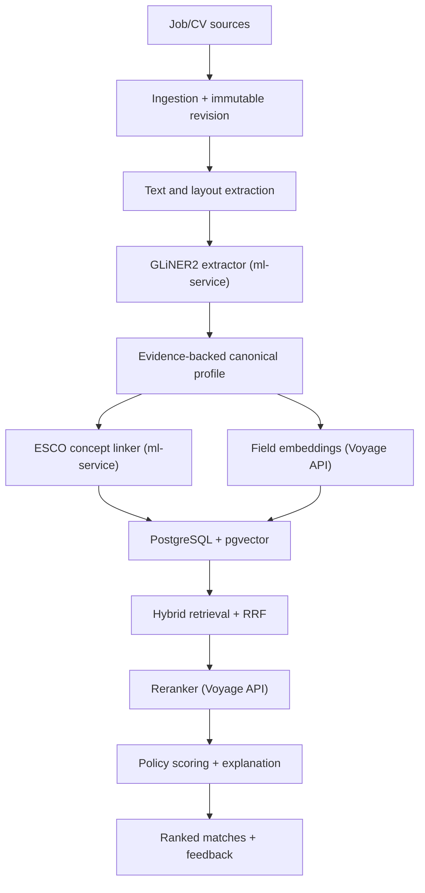
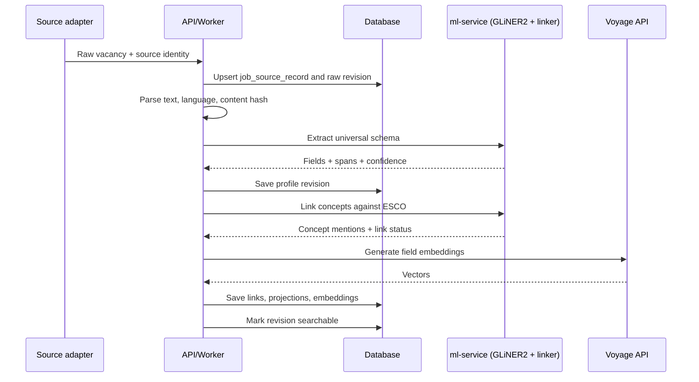

# Universal Job–Candidate Matching Engine

## Технічна специфікація та план реалізації v1.0

**Статус:** implementation-ready — архітектурні рішення ухвалено 2026-09-03 (розділ 3.5),
цей документ є основним архітектурним стержнем проєкту й скасовує попередні
архітектурні рішення там, де вони розходяться з ним  
**Основна мова документа:** українська  
**Читати першими:** 3.5 (ухвалені рішення), 3.6 (цільова архітектура одним
абзацом), 24.0 (інваріанти)  
**Ціль:** універсальний матчинг CV ↔ вакансія для IT, продажів, фінансів, медицини, логістики, виробництва, сервісу та інших професій без генеративної LLM у core pipeline.  
**Базовий стек (без змін):** FastAPI, PostgreSQL + pgvector, Redis, Celery, React + TypeScript, Docker Compose, Caddy — плюс один окремий ML inference process (`ml-service`) для self-hosted моделей, як і в оригінальному дизайні документа (2.7).  
**Моделі — дві різні задачі, дві різні відповіді:**
- **Retrieval (embedding + reranking для пошуку CV ↔ вакансія):** платний API-провайдер — Voyage базовий; інший платний провайдер, якщо вимірювання показує суттєвий приріст якості. Жодної генеративної LLM.
- **Extraction (структуровані факти, evidence spans, skill/competency mentions) і concept linking (ESCO):** self-hosted моделі — GLiNER2 для екстракції, локальний embedder + cross-encoder для concept linking. Інша задача, ніж у Voyage — не "розуміти й порівняти два документи", а "знайти й підтвердити конкретний факт у тексті", тому інший клас моделі.  
**Початкова інфраструктура:** та сама одна Oracle VM, що вже використовується.
RAM-бюджет 17.2 перерахований під один self-hosted процес (extractor + linking),
не під три моделі одразу — суттєво легше, ніж 8–11 GB оригінальної версії
документа, але не нуль.  

---

## 1. Результат, який треба отримати

Система повинна:

1. Приймати вакансії та CV різними мовами й у різних форматах.
2. Зберігати оригінал документа та всі наступні версії його обробки.
3. Витягувати лише факти, присутні в тексті, разом із доказовими фрагментами та confidence.
4. Працювати з універсальними поняттями: occupation, competency, knowledge, tool, qualification, license, language, responsibility, work condition, compensation, location constraint.
5. Не залежати від словника лише IT-технологій.
6. Нормалізувати професії та компетенції через ESCO (3.5.4), але не змушувати кожну згадку мати canonical concept.
7. Знаходити кандидатів або вакансії через hybrid retrieval: dense semantic search + lexical search + structured concept signals.
8. Переранжовувати обмежену множину результатів reranker-ом через платний API (3.5.1).
9. Показувати не тільки score, а й перевірювані причини: що збіглося, що частково збіглося, де інформації немає, а де є реальний конфлікт.
10. Збирати feedback і пізніше навчити власний reranker/ranking model без переписування системи.

Core pipeline не повинен викликати GPT, Claude, Gemini або іншу генеративну LLM. Генеративну модель можна підключити пізніше лише для пояснення людською мовою, cover letter або підказок, але вона не повинна визначати ranking.

---

## 2. Принципи, які не можна порушувати

### 2.1. Universal core, optional domain adapters

Основна схема однакова для всіх професій. Специфічні галузеві поля додаються через adapters/extensions:

- healthcare: license, specialty, clinical procedures;
- transport: driving category, ADR, vehicle type;
- finance/accounting: IFRS, GAAP, audit qualification;
- construction/trades: permits, safety certifications, equipment;
- software: languages, frameworks, architecture, cloud;
- sales: sales motion, customer segment, CRM, quota responsibility.

Domain adapter не створює окремий pipeline і не змінює core tables. Він додає namespaced extension data та, після окремої валідації, додаткові signals.

### 2.2. Evidence first

Кожен витягнутий факт має посилатися на конкретний фрагмент оригінального тексту:

```json
{
  "value": "Kubernetes",
  "confidence": 0.91,
  "evidence": {
    "document_revision_id": "uuid",
    "start_char": 1421,
    "end_char": 1431,
    "text": "Kubernetes"
  }
}
```

`confidence` тут — реальна оцінка GLiNER2 (3.5.2), не заглушка. Для полів, що й
далі парсяться deterministic-кодом (title, salary, dates — 8.5), `confidence`
типово `1.0`, бо це факт «рядок знайдено за офсетом», не оцінка моделі — обидва
джерела легітимні, і документ явно розрізняє їх, а не приховує різницю. Якщо
модель не може дати span, результат зберігається як low-trust inferred field і
не може стати hard filter.

### 2.3. `unknown` не дорівнює `false`

Якщо у CV не написано про певну компетенцію, система не має права стверджувати, що кандидат її не має.

Для кожної вимоги використовуються чотири стани:

| Стан | Значення |
|---|---|
| `satisfied` | у профілі є сильний доказ відповідності |
| `partial` | є споріднений або слабший доказ |
| `conflicting` | у профілі є явний несумісний факт |
| `unknown` | даних недостатньо |

`unknown` зменшує впевненість пояснення, але не повинен поводитися як нульовий match.

### 2.4. Hard filters тільки з перевірених фактів

Hard filter дозволений лише коли одночасно:

1. Обмеження справді має бінарну природу: work authorization, strict location, strict schedule, explicit employment type, legally required license тощо.
2. Вакансія явно позначає його mandatory.
3. Extraction confidence перевищує конфігурований поріг.
4. У кандидата є явний конфлікт або він сам позначив preference як strict.

Відсутність поля в CV не активує hard exclusion.

### 2.5. Taxonomy допомагає, але не вирішує

ESCO/O*NET (3.5.4, self-hosted import + linking) потрібні для normalization,
aliases, related concepts, filters, analytics і explanations. Остаточна
релевантність не визначається лише збігом taxonomy IDs. Semantic embeddings і
reranker для retrieval (обидва — платний API, 3.5.1) залишаються основним
механізмом ранжування; ESCO відповідає за explainability й normalization
mentions, не за сам ranking score.

### 2.6. Версіонування всього контексту

Кожен результат повинен містити:

- `schema_version`;
- `extractor_model_id` (GLiNER2 revision, 3.5.2 — self-hosted, тому pinned commit);
- `embedding_model_id` (Voyage чи інший платний API, 3.5.1);
- `reranker_model_id` (той самий провайдер, що й embedding, або окремий — 3.5.1);
- `taxonomy_version` (версія імпортованого ESCO-релізу, 3.5.4);
- `concept_linker_model_id` (self-hosted embedder + cross-encoder для linking, 3.5.4 — версіонується окремо від retrieval-моделей, бо це інша пара моделей з іншою задачею);
- `match_policy_version`;
- `created_at`.

Без цього неможливо відтворити score, порівняти моделі/провайдерів або безпечно переіндексувати дані.

### 2.7. No big-bang microservices

На старті потрібен modular monolith плюс **один** окремий ML inference process
(`ml-service`) — не зоопарк із десяти сервісів, і не нуль сервісів. За
рішеннями 3.5.1/3.5.2/3.5.4: retrieval-embedding і reranking йдуть через
зовнішній платний API (без локального процесу для них), а extraction і concept
linking — self-hosted, тому їм потрібен один спільний inference process. FastAPI,
Celery, PostgreSQL, Redis і цей один ML process можуть працювати на одній VM.
Внутрішні interfaces повинні дозволяти винести inference на іншу машину пізніше.

---

## 3. Межі v1 та стан репозиторію

### 3.1. У v1 входить

- ingestion вакансій із JSON/API/HTML/plain text (уже є через `JobSourceAdapter`);
- ingestion CV із PDF/DOCX/plain text (уже є);
- language detection;
- universal extraction через self-hosted GLiNER2 (3.5.2) — структуровані поля,
  requirements, skill/competency mentions з evidence spans;
- evidence spans з реальним model confidence;
- deterministic normalization одиниць і форматів (арифметика/парсинг, не заміна екстракції);
- ESCO import і concept linking, self-hosted (3.5.4);
- dense embeddings для retrieval через платний API-провайдер (Voyage);
- PostgreSQL lexical retrieval;
- structured retrieval signals (extracted requirements + concept overlap);
- reciprocal rank fusion;
- reranking для retrieval через платний API-провайдер (Voyage);
- versioned match results та explanations;
- ручне виправлення candidate profile;
- feedback events;
- evaluation harness;
- basic operational monitoring.

### 3.2. У v1 не входить

- автоматична відмова кандидату;
- ranking на основі фото, віку, статі, імені, етнічності, сімейного стану, інвалідності або інших protected attributes;
- автоматичне надсилання application;
- generative cover letters;
- повноцінний learning-to-rank у production;
- окремі fine-tuned models для кожної галузі;
- real-time streaming architecture;
- Kubernetes;
- **будь-яка генеративна LLM** (без змін від початкового принципу) — GLiNER2 не
  генеративна модель (non-generative, schema-conditioned extraction), тому не
  підпадає під цю заборону;
- заміна retrieval-embedding/reranking (Voyage) на self-hosted модель без
  окремого benchmark-обґрунтування — 3.5.1.

### 3.3. Що вже є в репозиторії (baseline, станом на 2026-09-02)

Цей документ написаний як greenfield-специфікація, але репозиторій уже містить
працюючий pipeline. Комміт `b5569d7` цілеспрямовано **видалив** попередній
LLM-шар (skill extraction, `candidate_profiles`, `ai_invocations`,
`document_versions`) і залишив вузьку систему на двох викликах Voyage. Робота за
цим документом починається не з нуля, а з наступного стану — і, за рішенням
3.5, повертає екстракцію, але іншим способом і з іншими гарантіями, ніж
видалена версія (3.4.2).

| Область специфікації | Що є в коді | Висновок |
|---|---|---|
| Modular monolith + один ML process (4, 2.7) | FastAPI + Celery **worker + окремий `beat`** + PostgreSQL/pgvector + Redis + React, Docker Compose, Caddy | є; `ml-service` — нове, для GLiNER2 + concept linker, 3.5.2/3.5.4. Увага: `beat` — окремий контейнер, якого таблиця runtime-компонентів у 4 не перелічує; prod-compose не має `web` (фронтенд на Cloudflare Pages) і має `caddy` |
| Source adapters (Phase 2) | `JobSourceAdapter` + registry, DOU і Djinni, ротація категорій | є; цей контракт треба визнати джерелом істини, а не писати другий |
| Raw → Normalized → Canonical (14.1) | `raw_jobs`, `job_source_records`, `canonical_jobs`, `DeduplicationService` (company + title + description similarity) | лишається джерелом істини; `document_revisions` надбудовується над ним, див. 3.4.3 |
| Immutable revisions, blocks, offsets (7.1) | немає | будувати з нуля |
| Language detection (5.1) | немає | будувати з нуля |
| Extraction, evidence spans, profile revisions (8) | немає; попередня neural-версія була видалена через ненадійність | повертаємо, з self-hosted GLiNER2 (3.5.2) — з умовами, які закривають попередній ризик, див. 3.4.2 |
| Taxonomy / concept linking (9) | немає | ESCO import + self-hosted linking, 3.5.4 |
| Embeddings для retrieval (10) | Voyage `voyage-4-large` через REST; **один вектор на весь документ**, `unique(document_type, document_id, model)`, `content_hash` для пропуску повторного embedding, точний cosine scan без ANN | лишається базовим провайдером, див. 3.5.1; додається field-level розбиття |
| Lexical retrieval, `tsvector` (11.2) | немає | будувати з нуля |
| Hybrid retrieval + RRF (11) | один dense-канал | додаємо lexical + concept канали, той самий Voyage dense-канал лишається |
| Reranker для retrieval (12) | Voyage `rerank-3` через REST, top-`rerank_top_k` (60) | лишається базовим провайдером, див. 3.5.1 |
| Requirement evaluation, чотири статуси, explanations (13) | немає | будувати з нуля, на основі extracted requirements + evidence |
| Score | `similarity × (1−w) + relevance × w`; усі три числа зберігаються на рядку матчу і показуються в UI | принцип «score — це арифметика, а не вирок» уже виконано |
| Hard filters (2.4) | `HardFilterService`: blocked stack, salary floor, локації, blacklist компаній, стеля досвіду; кожна відмова зберігає причину, а відхилена вакансія все одно записується | збігається за духом, але фільтри керуються **преференціями кандидата**, а не вимогами вакансії |
| `match_runs` / `match_results` (7.5) | `job_matches` з `unique(user_id, canonical_job_id)` — upsert, не append-only | пряма суперечність, див. 3.4 |
| `feedback_events` (7.5) | лише `job_matches.decision` (`pending`/`approved`/`rejected`) з кнопок Telegram | частково |
| Version bundle (2.6) | `embedding_model`, `rerank_model`, `rerank_weight` на кожному матчі | немає `model_registry` і pinned revisions — Voyage дає лише назву моделі |
| Idempotency (15, 16) | через unique-констрейнти; немає `Idempotency-Key` і немає outbox | частково |
| Evaluation harness (20) | немає | будувати з нуля |
| Observability (19) | структуровані логи, `pipeline_runs` з лічильниками кожного кроку, System page | немає метрик і дашбордів |
| Тести | 24 unit-файли / 133 тести, усі зелені; `ruff check` чисто; `mypy --strict` чисто на 98 файлах; є `tests/fixtures/{dou,djinni}`; немає integration/contract/evaluation каталогів | частково — це і є baseline, від якого Phase 0 міряє регресію |
| Міграції | 21 міграція, один лінійний head `f4c81a2e5b90` (`embedding_rerank_pipeline`) — він і видалив LLM-шар (`ai_invocations`, `candidate_profiles`, `candidate_skill_overrides`, `applications`, `embedding_lanes`) і схлопнув `document_embeddings` до одного вектора на документ | чисто: осиротілих колонок від видаленого шару не лишилось (`canonical_jobs.content_hash`/`content_version` теж прибрані) |

Крім того, у репозиторії є функціональність, якої **немає в цій специфікації** і
яку не можна зламати. Вона не «поза scope» — вона вже в продакшені:

- **Notifications.** Telegram-картки з Approve/Reject через webhook, quiet hours,
  поріг за score, ідемпотентна доставка per (notification, channel).
- **Pipeline config у базі.** Кожне число, на якому працює pipeline, редагується
  на System page разом із власним описом і межами; `.env` тримає лише секрети.
  Будь-яке нове число з цього документа (`rrf_k`, ліміти каналів, пороги
  confidence) має потрапити в той самий механізм, а не в YAML-файл поруч.
- **Operator surface.** System page: readiness і блокери, ручний запуск того
  самого Celery-таска, що й розклад, run locks, reset-дії з підрахунком
  видалених рядків.
- **Retention.** `job_retention_days` видаляє вакансію та все, що на неї
  посилається, після того як вона зникла зі скрейпів.
- **Category rotation.** Один категорійний скрейп на джерело за запуск,
  найдавніший першим.

### 3.4. Конфлікти з попередньої версії документа — вирішено

Попередня версія цього розділу перелічувала п'ять невирішених конфліктів.
Рішення 3.5 закривають чотири з них прямо; п'ятий (upsert проти append-only)
залишається технічним питанням міграції схеми, не архітектурним рішенням — його
розв'язок тепер у 7.5 і 24.

1. ~~Voyage проти локальних моделей~~ → вирішено: **не або/або.** Voyage (або
   інший платний API) — для retrieval embedding/reranking. Self-hosted GLiNER2 —
   для екстракції. Self-hosted embedder + cross-encoder — для concept linking.
   Це різні задачі з різними вимогами до якості й вартості за виклик, тому різні
   рішення для кожної. Див. 3.5.1.
2. ~~Екстракція вже була, і її видалили~~ → вирішено: екстракція повертається, з
   self-hosted GLiNER2, але з трьома умовами, які прямо адресують причину
   попереднього провалу (не невпевненість моделі як така, а відсутність evidence
   spans, review-циклу й eval-гейта). Див. 3.5.2.
3. ~~Дві моделі дедуплікації~~ → вирішено: `canonical_jobs` лишається джерелом
   істини для «одна вакансія, кілька джерел». Секція 7 і 14 приведені у
   відповідність — `document_revisions` тепер надбудовується **над**
   `job_source_records`, а не замінює `canonical_jobs`. Кластери
   крос-джерельних дублікатів (7.6) лишаються потрібними лише якщо
   `DeduplicationService` колись перестане справлятися — не бланкетна вимога.
4. **Upsert проти append-only — усе ще технічне рішення, не архітектурне.**
   `job_matches` (upsert, зберігає `decision`) і `match_runs`/`match_results`
   (append-only, версійовані) розв'язуються не вибором одного з двох, а шаром:
   `job_matches` лишається «поточний стан», `match_runs` додається як історія
   під ним, з retention (7.6) і backfill `decision` → `feedback_events`.
5. ~~Напрям продукту~~ → вирішено: candidate-side, як зараз. `tenant_id`/RLS/
   recruiter-права не будуються, поки продукт не зміниться. AI Act-розділ (18.4)
   лишається як застереження на майбутнє, не як вимога зараз.

**Новий конфлікт, виявлений під час Phase 0 audit (не вирішений):** розділ 15
описує весь API під префіксом `/api/v1/...`, а наявний застосунок віддає все
під `/api/...` без версії (`docs/api.md`, `app/api/router.py`) — і фронтенд у
`frontend/src/api/endpoints.ts` викликає саме ці шляхи. Три варіанти, і жоден
не є очевидно правильним: (a) нові ендпойнти під `/api/v1/`, наявні лишаються
де є — двоє префіксів назавжди; (b) перенести все під `/api/v1/` з redirect на
старих — одна міграція фронтенду; (c) відмовитись від версійного префікса в
цьому документі й лишити `/api/`. Рішення потрібне до Phase 8, не раніше, але
записати його треба зараз, поки видно причину.

### 3.5. Ухвалені архітектурні рішення (2026-09-03)

Ці рішення скасовують попередній розділ 3.5 і будь-яку суперечну частину решти
документа. Де написане нижче розходиться з якимось іншим розділом — чинним є
це.

#### 3.5.1. Провайдер моделей: дві задачі, дві відповіді

Ключова відмінність, яку ця версія рішень фіксує явно: **retrieval**
(порівняти CV з вакансією і повернути relevance) і **understanding**
(розпізнати конкретні факти й терміни в тексті одного документа) — це різні
задачі, і документ більше не намагається розв'язати їх однією політикою
"self-hosted чи API".

- **Retrieval — платний API, без self-hosted.** Embedding для dense-каналу й
  reranking фінального top-K лишаються тим, чим є зараз: REST-виклики до
  Voyage. Дозволено платити за **інший** embedding/rerank API-провайдер, якщо
  benchmark на evaluation-наборі (20) показує **суттєвий** приріст якості —
  «трохи краще nDCG» не підстава міняти провайдера, помітний відтворюваний
  виграш — підстава. Це той самий рівень задачі, що вже вирішує `VoyageClient`
  сьогодні: порівняти два документи. Генеративні LLM виключені з цього правила
  повністю, навіть за «сильний буст» — ціль документа (розділ 1) — ranking без
  генеративної моделі в ядрі.
- **Understanding (extraction + concept linking) — self-hosted.** GLiNER2 для
  екстракції (8), локальний embedder + cross-encoder для concept linking (9) —
  інша задача, ніж retrieval: знайти й підтвердити конкретний факт у тексті
  одного документа, не порівняти два документи. Ці моделі живуть в одному
  `ml-service` процесі (2.7), окремому від Voyage-викликів `worker`/`api`.
- `EmbeddingProvider`/`Reranker` (10.1, 12.1) лишаються інтерфейсами для
  retrieval-провайдера — по суті вже є в коді як `VoyageClient` — саме для
  того, щоб зміна провайдера була зміною конфігурації. `ProfileExtractor`
  (8.1) — окремий інтерфейс для GLiNER2, не той самий.
- Наслідок для 17: RAM-бюджет переписаний у 17.2 під один self-hosted процес
  (extractor + linking), не під три моделі одразу — легше за 8–11 GB
  оригінальної версії документа, важче за нуль.

#### 3.5.2. Екстракція: self-hosted GLiNER2, з умовами

Екстракція повертається — вона і є головна причина, чому цей документ існує:
дати системі змогу пояснити «вимогу 3 виконано», чого сьогоднішній Voyage-only
pipeline не може. Але вона повертається з трьома умовами, які прямо
адресують причину, з якої попередню версію видалили (3.4.2), а не просто
повторюють її:

1. **Кожен факт має evidence span у вихідному тексті** (2.2) — жодного
   витягнутого значення без точного офсету в `document_revision`. Модель, що
   не може дати span, зберігається як low-trust inferred field і не бере
   участі в hard filters.
2. **Кандидат бачить і виправляє видобуте до того, як воно впливає на
   ranking** — review-екран (5.2, Phase 8), user-confirmed факти мають вищий
   пріоритет за модельні (2.3).
3. **Жодна екстракція не потрапляє в score, поки eval-набір (20) не покаже, що
   вона краща за поточний baseline** (retrieval-only). Це gate, не формальність
   — розділ 20.6 "Release gates" застосовується до самої появи екстракції в
   ranking, не лише до її подальших змін.

Чому це не той самий провал ще раз: попередня версія не мала жодної з цих
трьох гарантій — не було evidence spans, не було review-циклу до впливу на
ranking, і не було eval-гейта перед тим, як skill list почав визначати
рекомендації. Технічно модель та сама (GLiNER2 замість того, що було раніше),
але контракт навколо неї — інший.

`extractor_model_id` (2.6) — pinned GLiNER2 revision, версіонується як будь-яка
self-hosted модель.

#### 3.5.3. Стек: без змін, плюс один ML process, як і планувалося

FastAPI, PostgreSQL + pgvector, Redis, Celery, React + TypeScript, Docker
Compose, Caddy — той самий склад компонентів, що й сьогодні. "Без змін" не
означає "без `ml-service`": розділ 2.7 з першої версії документа завжди
описував "modular monolith плюс один окремий ML inference process" — саме це
й будується, не зоопарк мікросервісів і не нуль додаткових процесів. Явно:

- один новий Docker-сервіс — `ml-service`, що хостить GLiNER2 + concept-linking
  моделі (embedder + cross-encoder); не хостить retrieval embedding/reranking
  (це лишається зовнішнім Voyage API call з `worker`/`api`, як сьогодні);
- нових черг/воркерів понад те, що вже є в 16, поки конкретна проблема не
  покаже потребу;
- ARM/x86 (17.2) — реальне питання знову, бо `ml-service` вантажить GLiNER2 та
  linking-моделі локально: перевірити доступність wheels і CPU-latency на
  цільовій VM у Phase 0, не в Phase 7.

#### 3.5.4. Taxonomy: ESCO import, self-hosted linking

ESCO лишається основним джерелом — розділ 9 (Taxonomy and concept linking)
будується як в оригінальній версії документа: pinned import, staging tables,
concept embeddings, retrieval + rerank + abstention linker (9.1–9.3), internal
concepts як supplement (9.4), не як заміна. Linking-моделі (embedder для
top-20 кандидатів, cross-encoder для reranking пари mention↔concept) — той
самий self-hosted `ml-service`, що й GLiNER2, бо задача та сама: розпізнати й
підтвердити конкретний факт, не порівняти два документи (3.5.1).

Секція 9.5 ("Linking cost budget") лишається чинною й важливою незалежно від
рішення "self-hosted чи API" — вона про об'єм (30 mentions × 20 candidates ×
5000 документів/день), а не про провайдера. Кешування за mention text,
пропуск reranker-а на впевнених кандидатах і асинхронне лінкування лишаються
обов'язковими практиками саме тому, що linking self-hosted: це не рахунок за
API-виклик, а CPU/RAM-бюджет одного процесу на тій самій VM, де крутиться
Postgres.

#### 3.5.5. Напрям продукту: candidate-side

Без змін від того, що вже є: користувач шукає вакансії для себе. Recruiter-side,
`tenant_id`, RLS — не будуються в v1.

---

### 3.6. Цільова архітектура одним абзацом

Що реально змінюється порівняно з сьогоднішнім pipeline (`scrape → embed →
match → notify`, один Voyage dense-канал, upsert-матчі): вакансії та CV
отримують **immutable revisions** замість перезапису; кожна вакансія і кожне
CV проходять через **self-hosted GLiNER2** (новий `ml-service`), яка видобуває
requirements, competencies й responsibilities з evidence spans; ці mentions
**лінкуються проти ESCO** (той самий `ml-service`, embedder + cross-encoder,
self-hosted); пошук стає **гібридним** — той самий Voyage dense-канал, плюс
новий lexical (`tsvector`) канал, плюс concept-overlap канал (з ESCO-лінків),
зведені **RRF**; Voyage rerank лишається над fused-результатом як і сьогодні;
додається **requirement-level evaluation**
(`satisfied`/`partial`/`unknown`/`conflicting`) на основі extracted evidence з
обох сторін, що виводиться в **explanation JSON** замість голого числа. Одна
нова інфраструктурна одиниця (`ml-service`), дві задачі моделей замість однієї
(retrieval лишається Voyage, understanding стає self-hosted). Це те, що робить
документ «простим і прозорим»: кожен рядок explanation можна простежити до
конкретного evidence span, з відомою моделлю й версією, що його видобула —
ніколи до непрозорого "AI сказав так" без джерела.

---

## 4. Високорівнева архітектура



### Runtime components

| Компонент | Відповідальність |
|---|---|
| `web` | React/TypeScript UI |
| `api` | FastAPI, auth, CRUD, orchestration, match endpoints |
| `worker` | Celery I/O tasks, parsing, indexing, maintenance, виклики до Voyage API |
| `ml-service` | завантажує GLiNER2 (extraction) і concept-linking embedder/cross-encoder **один раз** і виконує batched inference; **не** хостить retrieval embedding/reranking — те лишається Voyage API call |
| `postgres` | canonical data, revisions, taxonomy (ESCO), lexical index, pgvector |
| `redis` | Celery broker/result backend, short-lived cache, distributed locks |

ML models (GLiNER2, concept-linking) не можна завантажувати в кожен Celery
worker — інакше кілька worker processes продублюють модель у RAM і задушать
VM. Це причина, з якої `ml-service` — окремий, один процес, а не бібліотека,
імпортована в кожен worker. Voyage-виклики (embedding/rerank для retrieval)
лишаються звичайними HTTP-запитами з `worker`/`api`, точно як
`app/integrations/voyage.py` уже робить сьогодні — вони не проходять через
`ml-service`.

---

## 5. Повний data flow

### 5.1. Ingestion вакансії



Detailed steps (за рішенням 3.4.3 `document_revisions` надбудовується над
наявним `job_source_records`, не замінює його):

1. Source adapter sends `source`, `external_id`, URL, raw payload, observed timestamps — as today, into `job_source_records`.
2. `unique(source, external_id)` already makes this idempotent.
3. Compute `content_hash` from normalized-but-not-semantically-modified text.
4. If the hash already exists on the current revision, return idempotent success and do nothing.
5. If the record exists but the hash changed, create a new immutable `document_revision`.
6. Parse HTML/PDF/DOCX into ordered blocks with character offsets.
7. Detect document language; preserve original text.
8. Run extraction via `ml-service` (GLiNER2, 3.5.2): structural fields (formalizing today's `NormalizedJob` parsing into evidence-backed `Requirement`s), plus competency/skill mentions with real model confidence.
9. Validate output against versioned Pydantic/JSON Schema.
10. Store both accepted and rejected/low-confidence fields for audit, but expose only accepted fields to search projections.
11. Link mentions to ESCO via `ml-service` (embedder + cross-encoder, 3.5.4), with abstention (`unmapped` when below threshold).
12. Build deterministic textual representations for embedding (same shape as today's `job_document`/`profile_document`).
13. Call the Voyage API to generate field embeddings for retrieval.
14. Update relational projections and lexical `tsvector`.
15. Mark job revision `SEARCHABLE` in the same final transaction.
16. Trigger match refresh only for active candidates affected by the source/user policy; do not synchronously rerank every candidate.

"Affected" needs a definition, or step 16 is unimplementable. A candidate is
affected by a newly searchable job revision when all of these hold:

- the candidate has `matching_enabled` and a reviewed or extracted current
  profile revision;
- the job passes the candidate's hard filters (2.4) — cheap, structured, and it
  eliminates most pairs before any model runs;
- the job is within the candidate's retrieval reach: either it enters the
  candidate's top `fused_limit`, or the candidate has no match run newer than
  the job's revision.

Everything else waits for the candidate's next scheduled run. The existing
pipeline already refreshes every user on a timer rather than per document, which
is a perfectly good v1 answer at this corpus size — per-document fan-out is an
optimisation to reach for when the timer stops keeping up, and the definition
above is what it should mean when it arrives.

### 5.2. Ingestion CV

CV follows the same flow, with two differences:

- PII is stored separately from the matching profile.
- The user receives a review screen where extracted facts can be confirmed, corrected or hidden.

Candidate edits create a new `profile_revision` with `origin = user_override`; they never overwrite extracted history. User-confirmed facts have higher trust than neural extraction — 3.5.2, condition 2.

### 5.3. Match request

1. Load current candidate profile revision.
2. Apply safe pre-filters to active jobs.
3. Run parallel retrieval channels against precomputed job representations.
4. Merge result lists with Reciprocal Rank Fusion (RRF).
5. Keep top 100–200 candidates, configurable by benchmark.
6. Build compact pair representations for reranker; do not concatenate unlimited raw CV and raw vacancy.
7. Rerank top N, initially 50–100 depending on CPU benchmark.
8. Evaluate structured requirements against candidate evidence.
9. Apply explicit constraint penalties/exclusions.
10. Produce final score, confidence and explanation.
11. Store immutable `match_run` and `match_result` rows.

---

## 6. Canonical data model

### 6.1. Чому не один великий JSON і не повністю normalized SQL

Потрібен hybrid design:

- immutable JSONB profile revision зберігає повний output конкретної schema version;
- relational projection tables індексують concepts, requirements, evidence та fields для search;
- vector table зберігає кілька embeddings на revision;
- raw original залишається окремо.

Повністю normalized модель зробить кожну зміну extractor schema дорогою. Один JSONB зробить пошук, constraints і explainability болючими. Hybrid design дає обидві переваги.

### 6.2. Спільні типи

```json
{
  "EvidenceSpan": {
    "id": "uuid",
    "block_id": "uuid|null",
    "start_char": 0,
    "end_char": 12,
    "text": "source substring",
    "page": 1,
    "confidence": 0.93
  },
  "ConceptMention": {
    "raw_text": "MS Excel",
    "category": "tool",
    "concept_id": "esco:...|onet:...|internal:...|null",
    "link_status": "linked|ambiguous|unmapped|manual",
    "link_score": 0.91,
    "alternatives": [],
    "evidence_ids": ["uuid"]
  },
  "Requirement": {
    "id": "uuid",
    "kind": "competency|experience|education|credential|language|location|work_authorization|schedule|physical|other",
    "necessity": "required|preferred|unspecified",
    "operator": "has|at_least|at_most|one_of|all_of|not",
    "value": {},
    "explicit": true,
    "confidence": 0.92,
    "evidence_ids": ["uuid"]
  }
}
```

`operator: "not"` needs its interaction with the four statuses spelled out,
because negation inverts them and a naive implementation gets 2.3 exactly
backwards. For a negated requirement ("must not require relocation", "no night
shifts"):

- candidate evidence that contradicts the negated value → `conflicting`;
- candidate evidence consistent with it → `satisfied`;
- **silence stays `unknown`, not `satisfied`.** The temptation is to read "the CV
  never mentions night shifts" as compliance. It is absence of evidence, and
  treating it as satisfaction is the mirror image of treating a missing skill as
  `false`.

Negated requirements may never become hard filters on `unknown`, whatever their
confidence.

### 6.3. JobProfile v1

```json
{
  "schema_version": "job-profile/1.0",
  "document": {
    "language": "en",
    "title_raw": "Senior Financial Accountant",
    "source": "example_source"
  },
  "role": {
    "display_title": "Senior Financial Accountant",
    "occupation_mentions": [],
    "seniority": "senior|lead|manager|entry|mid|unknown",
    "management_scope": "none|people|function|project|unknown",
    "industries": [],
    "domains": []
  },
  "requirements": [],
  "competencies": [],
  "responsibilities": [
    {
      "text": "Prepare monthly consolidated statements",
      "evidence_ids": [],
      "confidence": 0.89
    }
  ],
  "experience_requirements": [
    {
      "years_min": 3,
      "years_max": null,
      "context": "corporate accounting",
      "necessity": "required",
      "evidence_ids": []
    }
  ],
  "education_requirements": [],
  "credentials": [],
  "languages": [],
  "work_conditions": {
    "employment_types": [],
    "work_modes": [],
    "schedule": null,
    "travel_percent_max": null,
    "relocation_required": null
  },
  "locations": [],
  "work_authorization": [],
  "compensation": {
    "raw": null,
    "currency": null,
    "min": null,
    "max": null,
    "period": null,
    "gross_net": "unknown",
    "normalized_monthly_min": null,
    "normalized_monthly_max": null
  },
  "benefits": [],
  "extensions": {},
  "quality": {
    "overall_confidence": 0.0,
    "warnings": [],
    "missing_critical_fields": []
  }
}
```

### 6.4. CandidateProfile v1

```json
{
  "schema_version": "candidate-profile/1.0",
  "document": {
    "language": "en"
  },
  "target_roles": [],
  "occupation_history": [
    {
      "title_raw": "Accountant",
      "occupation_mentions": [],
      "company": null,
      "industry_mentions": [],
      "start_date": "2022-05",
      "end_date": null,
      "duration_months": 52,
      "responsibilities": [],
      "achievements": [],
      "competencies": [],
      "evidence_ids": []
    }
  ],
  "competencies": [],
  "education": [],
  "credentials": [],
  "languages": [],
  "achievements": [],
  "preferences": {
    "target_occupations": [],
    "employment_types": [],
    "work_modes": [],
    "locations": [],
    "salary_min": null,
    "currency": null,
    "strict_fields": []
  },
  "work_authorization": [],
  "extensions": {},
  "quality": {
    "overall_confidence": 0.0,
    "warnings": [],
    "user_reviewed": false
  }
}
```

### 6.5. Competency record

Не всі competencies є software skills. Запис має бути універсальним:

```json
{
  "raw_text": "manage enterprise accounts",
  "category": "professional_skill",
  "necessity": "required",
  "proficiency": "advanced|intermediate|basic|unspecified",
  "years_min": null,
  "recency": null,
  "concept": {
    "concept_id": "esco:...",
    "status": "linked",
    "score": 0.88
  },
  "explicit": true,
  "confidence": 0.91,
  "evidence_ids": ["uuid"]
}
```

Фразові компетенції на кшталт "manage enterprise accounts" — саме те, для чого
GLiNER2 і ESCO-linking переважають literal keyword matching (3.5.2): точний
рядковий пошук їх майже ніколи не знайде через варіативність формулювання, а
schema-conditioned extraction розпізнає такий фрагмент як `professional_skill`
mention і передає на linking навіть без дослівного збігу з ESCO label.

Allowed competency categories:

- `professional_skill`;
- `tool`;
- `technology`;
- `methodology`;
- `domain_knowledge`;
- `regulation_knowledge`;
- `transversal_skill`;
- `physical_skill`;
- `other`.

Certification, formal language level and license remain separate first-class objects rather than being hidden inside competencies.

---

## 7. PostgreSQL schema

Нижче — logical schema. AI-агент має реалізувати її через SQLAlchemy 2.x models та Alembic migrations відповідно до conventions наявного repository.

### 7.1. Core document tables

За рішенням 3.4.3 немає окремої `source_items`: вона дублювала б
`job_source_records`/`cv_documents`, які вже є unique-ідентифікованими джерелом
істини. `document_revisions` FK-иться напряму на них. Немає `tenant_id` (3.5.5 —
candidate-side, без multi-tenant).

#### `document_revisions`

- `id uuid pk`
- `entity_kind enum(job, candidate)`
- `job_source_record_id uuid fk nullable` — заповнено коли `entity_kind = job`
- `cv_document_id uuid fk nullable` — заповнено коли `entity_kind = candidate`
- check: рівно одне з двох FK не-null
- `revision_no int`
- `content_hash char(64)`
- `mime_type text`
- `raw_payload jsonb nullable`
- `raw_text text`
- `parsed_text text`
- `language_code varchar(16)`
- `parser_name`, `parser_version`
- `status enum(received, parsed, extracting, extracted, indexing, searchable, failed)`
- `failure_code`, `failure_detail`
- `created_at timestamptz`
- unique `(job_source_record_id, revision_no)`, unique `(cv_document_id, revision_no)`
- unique `(job_source_record_id, content_hash)`, unique `(cv_document_id, content_hash)`

Міграція: `job_source_records`/`cv_documents` лишаються як є; це нова таблиця
поруч, не заміна. Перший запуск міграції створює `revision_no = 1` для кожного
наявного запису з `raw_text`/`description`, яке вже є, і `status = searchable`,
щоб не було періоду, коли наявні вакансії/CV випадають з пошуку.

#### `document_blocks`

- `id uuid pk`
- `document_revision_id uuid fk/index`
- `ordinal int`
- `block_type enum(title, heading, paragraph, list_item, table_cell, metadata, unknown)`
- `text text`
- `start_char int`, `end_char int`
- `page int nullable`
- `layout jsonb nullable`

### 7.2. Profile tables

#### `profile_revisions`

- `id uuid pk`
- `document_revision_id uuid fk/index`
- `profile_kind enum(job, candidate)`
- `schema_version text`
- `origin enum(neural_extraction, user_override, migration)`
- `parent_revision_id uuid nullable`
- `extractor_model_id text`
- `extracted_profile jsonb`
- `overall_confidence real`
- `validation_warnings jsonb`
- `created_at timestamptz`

#### `jobs`

- `id uuid pk`
- `source_item_id uuid unique`
- `current_profile_revision_id uuid`
- `company_id uuid nullable`
- `status enum(active, expired, removed, draft)`
- `published_at`, `expires_at`, `closed_at`
- denormalized filter columns: `remote_type`, `employment_type`, `country_code`, `salary_min_monthly`, `salary_max_monthly`, `currency`

#### `candidates`

- `id uuid pk`
- `user_id uuid/index`
- `current_profile_revision_id uuid`
- `matching_enabled bool`
- `created_at`, `updated_at`

PII such as email, phone and full name should be stored in a separate encrypted/permission-limited `candidate_private_data` table and must never be included in embedding or reranker input.

### 7.3. Evidence and concept projection

#### `evidence_spans`

- `id uuid pk`
- `profile_revision_id uuid/index`
- `document_block_id uuid nullable`
- `field_path text`
- `start_char`, `end_char`, `page`
- `text text`
- `confidence real`
- check offsets are non-negative and `end_char > start_char`

#### `taxonomy_concepts`

- `id uuid pk`
- `namespace text` (`esco`, `onet`, `internal`)
- `external_id text`
- `concept_type text`
- `preferred_label text`
- `labels jsonb`
- `description text`
- `status enum(active, obsolete)`
- `taxonomy_version text`
- unique `(namespace, external_id, taxonomy_version)`

#### `taxonomy_relations`

- `source_concept_id uuid`
- `target_concept_id uuid`
- `relation_type enum(broader, narrower, related, essential_for, optional_for, same_as)`
- composite primary key over source, target, type

#### `profile_concept_mentions`

- `id uuid pk`
- `profile_revision_id uuid/index`
- `evidence_span_id uuid nullable`
- `concept_id uuid nullable/index`
- `raw_text text`
- `category text`
- `role enum(held, target, required, preferred, responsibility, domain)`
- `link_status enum(linked, ambiguous, unmapped, manual)`
- `extraction_confidence real`
- `link_score real nullable`
- `metadata jsonb`

#### `profile_requirements`

- relational projection of `Requirement` objects;
- `kind`, `necessity`, `operator`, `value_jsonb`, `explicit`, `confidence`, `evidence_span_id`;
- indexes on `profile_revision_id`, `kind`, `necessity`.

### 7.4. Search and model tables

#### `profile_embeddings`

- `id uuid pk`
- `profile_revision_id uuid/index`
- `field_type enum(occupation, competencies, experience, responsibilities, full_profile)`
- `chunk_no int default 0`
- `model_id text`
- `model_revision text`
- `embedding vector(D)` or `halfvec(D)`
- `source_text_hash char(64)`
- unique `(profile_revision_id, field_type, chunk_no, model_id, model_revision)`

Do not add five vector columns to `jobs`; a row-per-field table makes model migrations and multiple model versions manageable.

Migration from today's `document_embeddings` (one vector per whole document,
`unique(document_type, document_id, model)`): this table becomes
`field_type = full_profile` for every existing row, with `profile_revision_id`
pointing at the revision created for that job/CV in the 7.1 backfill. Splitting
into `occupation`/`competencies`/`experience`/`responsibilities` is additive —
existing single-vector search keeps working on `full_profile` while the other
field types are populated incrementally.

#### `profile_search_documents`

- `profile_revision_id uuid pk`
- separate text columns for title/occupation, competencies, responsibilities, full profile;
- `search_vector tsvector` generated or transactionally updated;
- GIN index on `search_vector`;
- trigram indexes only if benchmark proves value.

#### `model_registry`

Дві категорії рядків, за 3.5.1: retrieval-моделі (API, легкі поля) і
understanding-моделі (self-hosted, pinned commit).

- `id uuid pk`
- `purpose enum(embedding, rerank, extraction, concept_linking)`
- `deployment enum(api, self_hosted)`
- `provider text` (`voyage` для API-рядків; `gliner2`/внутрішня назва для self-hosted)
- `model_id text` (напр. `voyage-4-large`, `rerank-3`, `fastino/gliner2.5-multi-v1`)
- `revision text nullable` — pinned commit/tag; **обов'язково** для `deployment = self_hosted`, необов'язково для `api` (там версію задає провайдер)
- `license text nullable` — застосовно лише до self-hosted моделей
- `runtime_backend text nullable` (напр. `pytorch_cpu`) — лише self-hosted
- `dimensions int nullable`, `max_tokens int nullable`
- `status enum(active, deprecated)`
- `activated_at timestamptz`
- `benchmark_report_id uuid nullable` — посилання на звіт з 20 (evaluation)

Активний retrieval-провайдер (embedding/rerank) лишається редагованим з System
page, за наявною конвенцією (3.3) — `model_registry` документує історію й
benchmark-обґрунтування. Активна self-hosted модель (`extraction`,
`concept_linking`) активується через `POST /api/v1/admin/models/{id}:activate`
(15) — зміна тут вимагає перезапуску `ml-service`, тому це адмінська дія, не
поле System page.

### 7.5. Matching and feedback tables

#### `match_runs`

- `id uuid pk`
- `candidate_profile_revision_id uuid`
- `query_jsonb`
- all model/taxonomy/policy versions;
- `status`, `started_at`, `finished_at`, `duration_ms`.

#### `match_results`

- `id uuid pk`
- `match_run_id uuid/index`
- `job_profile_revision_id uuid`
- `rank int`
- `final_score real`
- `confidence real`
- `retrieval_score`, `reranker_score`, `requirement_score`, `constraint_penalty`
- `component_scores jsonb`
- `explanation_jsonb`
- unique `(match_run_id, job_profile_revision_id)`

#### `requirement_match_results`

- `match_result_id`
- `job_requirement_id`
- `status enum(satisfied, partial, conflicting, unknown)`
- `score real`
- candidate evidence IDs;
- method/version metadata.

#### `feedback_events`

- `user_id`, `candidate_id`, `job_id`, `match_result_id nullable`;
- `event_type enum(impression, open, save, dismiss, apply, interview, offer, hired, correction)`;
- `value jsonb`, `occurred_at`, `source`;
- immutable append-only events.

Migration note: the repository already stores one user verdict per match
(`job_matches.decision`, set from the Telegram Approve/Reject buttons and
deliberately never overwritten by a re-match). That history is real feedback and
must be backfilled into `feedback_events` as `save`/`dismiss` events with their
original timestamps before `job_matches` is reshaped.

### 7.6. Operational tables

Sections 15, 16 and 14.2 require tables that the schema above does not define.
Without them those sections cannot be implemented as written.

#### `idempotency_keys`

Required by 15 ("all async mutation endpoints accept `Idempotency-Key`").

- `key text`, `endpoint text`, `tenant_id uuid nullable`
- `request_hash char(64)` — rejects a reused key carrying a different body
- `response_status int`, `response_body jsonb`
- `created_at`, `expires_at`
- primary key `(tenant_id, endpoint, key)`
- a `maintenance` task purges expired rows

#### `outbox_events`

Required by 16 ("transactional outbox").

- `id bigserial pk`, `aggregate_type text`, `aggregate_id uuid`
- `event_type text`, `payload jsonb`
- `created_at`, `published_at timestamptz nullable`, `attempts int`
- partial index on `published_at is null`
- written in the same transaction as the state change; a relay publishes to
  Celery and stamps `published_at`

#### `job_clusters` / `job_cluster_members`

Required by 14.2 ("select a representative for display, retain all source
records"). With `jobs.source_item_id` unique, one job row is one source posting,
so cross-source duplicates need an explicit cluster:

- `job_clusters`: `id uuid pk`, `representative_job_id uuid`, `method text`,
  `method_version text`, `created_at`
- `job_cluster_members`: `cluster_id`, `job_id`, `similarity real`,
  `matched_on jsonb`, primary key `(cluster_id, job_id)`
- the existing `canonical_jobs` table is the same idea under another name —
  decision 3.4.3 picks one and the other becomes a migration, not a second
  mechanism

#### Retention for match artifacts

`match_runs` and `match_results` are append-only per run. At
`retrieval_limit = 400` with a daily run that is ~146 000 result rows per
candidate per year, plus their explanations. Define, and make configurable
alongside the existing `job_retention_days`:

- keep the newest N runs per candidate in full (`match_run_retention_count`);
- keep older runs as the run row plus aggregate counters, dropping
  `match_results` and `explanation_jsonb`;
- never delete a run referenced by a `feedback_event`;
- deletion of a candidate removes runs, results, embeddings and evidence — this
  is the same flow 18.1 requires, so build it once.

---

## 8. Extraction design

Self-hosted GLiNER2, за рішенням 3.5.2. Задача — розпізнати конкретні факти в
одному документі; інша задача, ніж retrieval (порівняти два документи), яку
покриває Voyage. Живе в `ml-service` (2.7, 4).

### 8.1. Model adapter

Define an interface independent of GLiNER:

```python
class ProfileExtractor(Protocol):
    async def extract_job(self, document: ParsedDocument) -> ExtractionResult: ...
    async def extract_candidate(self, document: ParsedDocument) -> ExtractionResult: ...
```

`ExtractionResult` contains schema version, values, evidence spans, confidence, warnings, model ID and model revision.

Initial candidate: multilingual GLiNER2.5. The official project currently exposes multilingual schema-driven extraction, classification, records, relations, span attributes and long-document chunking. Pin the exact model revision rather than using an unpinned `main` branch.

Deterministic parsing (8.5) doesn't disappear — the repository already parses
title, company, employment_type, salary, seniority, required_experience_years
this way, and that continues unchanged for the fields it already handles well.
GLiNER2 is additive: it covers what deterministic parsing structurally cannot
— free-text competency/skill mentions, responsibility statements, necessity
inferred from natural phrasing rather than a recognized heading. `Requirement`
objects populated by either method carry the same shape; only their
`evidence`/`confidence` provenance differs (2.2, 2.6).

### 8.2. Do not request the whole profile in one giant schema

Use 2–4 bounded passes:

1. `document_meta`: role title, occupation, seniority, industries, work mode, employment type, locations, salary spans.
2. `requirements`: explicit requirement spans with necessity and requirement type.
3. `competencies`: skill/tool/knowledge mentions and required/preferred attributes.
4. `experience_blocks`: CV roles, dates, achievements and responsibilities.

Why: too many competing labels in one forward pass usually lower recall and make debugging impossible. The optimal number of passes must be confirmed by benchmark.

`experience_blocks` (CV occupation history, segmented into roles with dates,
achievements and responsibilities) is the highest-variance pass — free-form CVs
are inconsistently structured, and GLiNER2 will do better on some than others.
Treat its output as a genuine extraction subject to the same review/confidence
rules as everything else (2.2, 2.3), not as ground truth; a low-confidence or
missing segmentation falls back to the CV being embedded/reranked as one whole
document, exactly as it is today — extraction augments retrieval, it never
gates it.

### 8.3. Chunking

- Parse into semantic blocks first.
- Prefer section/block windows rather than arbitrary character slicing.
- For overlong blocks, use overlapping token windows.
- Store local-to-global offset mapping.
- Merge duplicate spans by global offsets and label.
- Never silently truncate a document.
- Add `document_truncated=false/true` and warnings.

### 8.4. Confidence policy

Thresholds live in versioned configuration, not scattered constants.

Suggested initial states:

- `accepted`: above field-specific threshold and valid evidence;
- `review`: near threshold or several conflicting values;
- `rejected`: invalid span, impossible type or below threshold.

Thresholds must be calibrated per field on the validation dataset. One universal `0.5` threshold is not acceptable.

### 8.5. What deterministic code is allowed

Avoid semantic rules such as `if "senior" in title`. Deterministic code is still required for:

- currency and period conversion;
- ISO country/language codes;
- dates and durations;
- numerical ranges;
- email/phone removal from matching text;
- text hashing and deduplication;
- validating that evidence span equals the source substring;
- schema/type validation.

This is serialization and arithmetic, not a hand-written understanding engine. Do not replace reliable arithmetic with a neural model just to claim “zero regex”. Any parser regex must be small, tested, field-local and never infer professional meaning.

---

## 9. Taxonomy and concept linking

Self-hosted, за рішенням 3.5.4 — та сама причина, що й для GLiNER2 (8): це
задача розпізнавання/підтвердження факту в тексті, не порівняння двох
документів, тому інший клас моделі, ніж Voyage.

### 9.1. Sources

Use ESCO as the primary European universal ontology. ESCO v1.2.1 exposes 13,939 skill/knowledge concepts, preferred and non-preferred labels, descriptions and occupation relationships in 28 languages. Import a pinned downloadable release rather than depending on a live API during matching.

Use O*NET as an optional US-centric enrichment layer, not as the universal truth. Keep namespaces separate and create explicit crosswalk relations where available.

### 9.2. Import pipeline

1. Download/pin source version and checksum.
2. Parse concepts, multilingual labels, descriptions and relations into staging tables.
3. Validate counts and referential integrity.
4. Generate a concept representation from preferred label + aliases + description + parents.
5. Embed concepts with the same or separately versioned concept model.
6. Atomically activate the new taxonomy version.
7. Keep previous version available for reproducibility.

### 9.3. Linking algorithm

For every extracted mention:

1. Retrieve top 20 concept candidates by multilingual embedding similarity.
2. Add lexical candidates from preferred/non-preferred labels.
3. Optionally bias candidates using predicted occupation, but never exclude concepts outside that occupation.
4. Rerank `mention context ↔ concept label + description`.
5. If top score is below threshold, store `unmapped`.
6. If top-1 and top-2 are too close, store `ambiguous` plus alternatives.
7. Only `linked` and `manual` concepts participate in exact concept overlap.

Forced linking is forbidden. A correct NIL/unmapped decision is better than a wrong taxonomy ID.

Both the candidate-embedder (step 1) and the reranker (step 4) are self-hosted,
co-located with GLiNER2 in `ml-service` (3.5.4) — a lightweight multilingual
embedding model for candidate retrieval, and a small cross-encoder for the
final rerank. Neither is Voyage: this is the same "understanding, not
retrieval" task family as extraction, and running it locally avoids turning
every one of the ~600 mention-candidate pairs per document (9.5) into a paid
API call.

### 9.4. Internal concepts

New tools and market-specific terms will appear before ESCO updates. Allow `internal` concepts with:

- stable UUID;
- labels and aliases learned from reviewed mentions;
- provisional type;
- optional parent/related links;
- approval state.

Do not automatically create a new concept for every unknown mention. Cluster unknown mentions offline and require review before promotion.

### 9.5. Linking cost budget

Step 4 of 9.3 reranks each mention against ~20 concept candidates. Because this
runs self-hosted (9.3), the cost is CPU/RAM on the same VM, not a per-call API
bill — but the volume is still the most expensive part of the whole ingestion
path, and the throughput target in 17.3 does not account for it by default.

Order of magnitude: 30 linkable mentions per document × 20 candidates = 600
cross-encoder pairs per document. At 5 000 documents/day that is 3 000 000 pairs
per day, competing for CPU with GLiNER2 extraction and, on the retrieval side,
with the (separate, API-based) Voyage reranking that also needs to stay
responsive for interactive matches. It does not fit on a 4-core VM without
deliberate budgeting.

So the linker must be budgeted explicitly, and every one of these is a benchmark
input rather than a fixed value:

- **Cache by mention text.** Linking is a function of `(normalized mention,
  taxonomy_version, model bundle)`, not of the document. A `mention_link_cache`
  table keyed on that tuple collapses the repeated 80% of mentions across a
  corpus — measure the hit rate before assuming a number.
- **Skip the reranker on confident cases.** If the top embedding candidate is
  above a high threshold and the gap to top-2 is wide, accept it without a
  cross-encoder pass. Reserve reranking for the ambiguous band.
- **Cut the candidate list.** 20 is a recall setting; measure top-5 recall and
  use the smallest list that holds it.
- **Link asynchronously.** Concept links are a retrieval *signal*, not a
  precondition. A revision can become `SEARCHABLE` on dense + lexical channels
  and gain its concept channel when linking completes, as long as the retrieval
  code treats a missing channel as absent rather than as zero.
- **Measure before Phase 4, not during it.** Phase 0's benchmark should include
  "cost to link one document" for exactly this reason.

If the measured cost still does not fit the VM, the honest fallback is embedding
similarity against concept vectors with abstention and no cross-encoder — worse
top-1 accuracy, and a linker that actually runs.

---

## 10. Embeddings and representations

### 10.1. Model abstraction

```python
class EmbeddingProvider(Protocol):
    dimensions: int
    max_tokens: int
    async def encode_queries(self, texts: list[str]) -> ndarray: ...
    async def encode_documents(self, texts: list[str]) -> ndarray: ...
```

The database and application must read dimension/model ID from the active model configuration. A model change requires background re-embedding and dual-read/dual-write migration, not an in-place overwrite.

### 10.2. Representations per job/candidate

Create deterministic plain-text projections, not raw JSON dumps:

- `occupation`: titles, normalized occupations, seniority and domain;
- `competencies`: raw and canonical competencies grouped by held/required/preferred;
- `experience`: job history, experience requirements and achievements;
- `responsibilities`: responsibility/outcome statements;
- `full_profile`: compact combination of the above plus education/languages/credentials.

The template version is part of model metadata. Example:

```text
[ROLE]
Senior Financial Accountant

[OCCUPATIONS]
financial accountant; accounting professional

[REQUIRED COMPETENCIES]
IFRS; consolidated reporting; Microsoft Excel

[PREFERRED COMPETENCIES]
SAP

[RESPONSIBILITIES]
prepare monthly consolidated statements
coordinate external audit
```

Do not include name, email, photo, age, address or other irrelevant PII.

### 10.3. Model benchmark set

За рішенням 3.5.1: retrieval embedding — лише платні API-провайдери, без
self-hosted (self-hosted моделі в цьому документі обслуговують іншу задачу —
extraction і concept linking, 8/9). Список нижче — кандидати на **заміну**
Voyage для retrieval, не на self-hosting.

Поточний baseline — `voyage-4-large` — завжди перший рядок benchmark-таблиці:
benchmark, який не включає те, що вже задеплоєно, не може сказати, чи варто
щось міняти. Заміна відбувається лише якщо альтернатива дає **суттєвий**
приріст на evaluation-наборі (20), не «трохи краще» — правило з 3.5.1.

Платні API-кандидати для порівняння, коли/якщо buy-in знадобиться:

- Cohere Embed v4 (multilingual, offers `search_query`/`search_document` input
  types — той самий принцип, що й E5's `query:`/`passage:` prefixes, вартий
  перевірки при інтеграції);
- Jina Embeddings v4 API (multilingual, довгий контекст);
- будь-який інший платний embedding API з задокументованою multilingual
  якістю — критерій відбору для benchmark-таблиці, не фіксований список.

Self-hosted моделі (E5, BGE-M3) з попередньої версії цього розділу видалені з
активного плану — вони застосовні лише якщо рішення 3.5.1 колись переглянуть.

### 10.4. Storage/index strategy

- Start with exact search if the collection is small enough and benchmark it.
- Add HNSW cosine indexes when exact search misses latency targets.
- Use one HNSW index per active embedding model/field partition.
- For restrictive metadata filters, enable/test pgvector iterative scans or prefilter candidates by indexed SQL columns.
- Consider `halfvec` only after measuring recall difference.
- Monitor approximate recall by periodically comparing with exact search.

---

## 11. Hybrid retrieval

### 11.1. Retrieval channels

Run independently:

1. occupation dense retrieval (Voyage API);
2. competencies dense retrieval (Voyage API);
3. experience/responsibility dense retrieval (Voyage API);
4. full-profile dense retrieval (Voyage API) — сьогоднішній єдиний канал, лишається;
5. lexical retrieval over `tsvector`;
6. canonical concept overlap/graph proximity — ESCO `taxonomy_relations` (7.3),
   populated by the self-hosted linker (9.3);
7. optional sparse retrieval if BGE-M3 sparse vectors are validated and
   operationally affordable — this would be a new self-hosted retrieval model,
   distinct from the extraction/linking models in `ml-service`; benchmark
   before committing (30).

### 11.2. Lexical MVP

Use PostgreSQL Full Text Search with a language-safe/simple configuration plus normalization. It is not strict BM25, so name it `lexical_score`, not `bm25_score`.

**Ukrainian is the hard case, and `simple` does not solve it.** PostgreSQL ships
no Ukrainian dictionary. Under the `simple` configuration there is no stemming at
all, so `розробника`, `розробники` and `розробник` are three unrelated lexemes —
in a heavily inflected language that costs most of the lexical channel's recall.
Decide this explicitly rather than inheriting the default:

- install `unaccent` and a hunspell/ispell `uk_UA` dictionary into a custom text
  search configuration, and pin the dictionary files the way models are pinned;
- or accept `simple` plus `pg_trgm` similarity as the Ukrainian path, and say so;
- benchmark both against the evaluation set — this is a measurable choice, not a
  matter of taste.

The configuration is also per-document, not global: a Polish vacancy and a
Ukrainian CV need different ones. Either store `search_vector` per
`language_code` with the config chosen at write time, or keep one column per
supported configuration. A generated column cannot depend on another row's
language, so a transactionally updated column is the simpler option here. Mixed
language documents (a Ukrainian CV with English skill names) must be indexed
under both their detected language and `simple`, or the English half disappears.

If benchmark proves lexical quality insufficient, replace this adapter with:

- ParadeDB/pg_search BM25 (runs inside PostgreSQL, no new service);
- OpenSearch/Elasticsearch — a new infrastructure component, treat as a
  decision on the scale of 3.5, not a drop-in replacement;
- BGE-M3 sparse retrieval (self-hosted, 11.1 item 7).

The rest of matching must not depend on the implementation.

### 11.3. Result fusion

Use Reciprocal Rank Fusion for v1:

```text
RRF(document) = Σ channel_weight / (k + rank_channel(document))
```

Recommended starting `k = 60`, but keep it versioned and benchmark it. Rank-based fusion avoids pretending that cosine, lexical and concept scores share a calibrated scale.

Use broad retrieval to protect recall. Suggested starting limits:

- top 150 per dense channel;
- top 200 lexical;
- top 200 concept;
- fused top 150;
- rerank top 50–100.

These are benchmark inputs, not permanent truths.

---

## 12. Reranking

### 12.1. Interface

```python
class Reranker(Protocol):
    async def score(self, pairs: list[tuple[str, str]]) -> list[float]: ...
```

### 12.2. Pair representation

Candidate side:

- target/current occupations;
- confirmed competencies;
- experience/achievements;
- education, credentials, languages;
- explicit preferences relevant to the job.

Job side:

- role/occupation;
- required/preferred requirements;
- responsibilities;
- conditions.

Use a strict token budget and deterministic truncation priority:

1. required requirements;
2. candidate evidence relevant to those requirements;
3. role/occupation;
4. responsibilities and achievements;
5. preferred requirements;
6. other context.

Never let company marketing text push requirements out of the context window.

### 12.3. Model benchmark set

Той самий принцип, що й 10.3: платний API, `rerank-3` (Voyage) — базовий рядок
benchmark-таблиці для **retrieval** reranking (фінальний CV↔вакансія рерank),
заміна лише за суттєвий вимірюваний приріст.

- CPU-oriented baseline: `cross-encoder/mmarco-mMiniLMv2-L12-H384-v1`;
- multilingual quality contender: `BAAI/bge-reranker-v2-m3`;
- платні API-кандидати: Cohere Rerank v3.5, Jina Reranker API, будь-який інший
  платний rerank API з задокументованою multilingual якістю.

The MiniLM model card lists 15 training languages and reports transfer to others; that is not proof of strong Ukrainian quality. BGE v2 M3 is explicitly multilingual but heavier. Choose using nDCG/latency/RAM measurements on the actual dataset.

Self-hosted кандидати тут (MiniLM, BGE reranker v2 M3) конкурують за роль
**retrieval-реранкера** з Voyage — не плутати з self-hosted cross-encoder-ом
для concept linking (9.3), який завжди self-hosted незалежно від результату
цього benchmark-у, бо це інша задача (3.5.1). Якщо той самий self-hosted
cross-encoder виявиться достатньо хорошим і дешевшим за Voyage для retrieval
теж — це підстава переглянути 3.5.1, а не мовчазна заміна.

### 12.4. Calibration

Raw reranker output is a ranking signal, not a truthful percentage. Do not display raw sigmoid as “83% fit”.

After collecting a labeled validation set:

- fit Platt scaling or isotonic calibration;
- measure Expected Calibration Error/Brier score;
- display `match_score` separately from `confidence`;
- until calibration exists, label the UI score as relative relevance.

---

## 13. Requirement evaluation and final scoring

### 13.1. Requirement-level evaluation

For each job requirement, compare it with candidate evidence using this order:

1. exact manually confirmed concept (user-reviewed candidate profile, 5.2);
2. exact linked ESCO concept on both sides (9.3) — job requires "Kubernetes",
   CV mentions a mention linked to the same concept → `satisfied`;
3. taxonomy relation or ancestor/child relation (`taxonomy_relations`, 7.3) —
   e.g. CV mentions a narrower/related concept than the one required;
4. semantic similarity of requirement and evidence — embedding comparison
   using the same field-level vectors already computed for retrieval (10);
5. targeted cross-encoder comparison — only for the residual band steps 1–4
   leave undecided, using the Voyage rerank API (12) on the short
   requirement-text/evidence-text pair, not a new self-hosted model;
6. no evidence → `unknown`.

Steps 1–4 cost nothing beyond what extraction/linking/embedding already
computed. Step 5 is the one place this evaluation calls a model per
requirement rather than reusing a precomputed signal — budget it the same way
9.5 budgets concept-linking reranking: cap how many requirements per
job-candidate pair reach step 5 (e.g., only `required`-necessity ones without
an earlier decision), and measure the resulting call volume in Phase 0 rather
than assuming it is affordable.

Store method and evidence for every decision.

### 13.2. Generic dynamic weighting

Do not define weights by profession in v1. Derive weights from the vacancy itself:

- required + explicit gets the largest weight;
- preferred gets smaller weight;
- unspecified gets minimal weight;
- legally mandatory/credential requirement can receive a policy multiplier only through a reviewed adapter;
- repeated wording may raise confidence but should not linearly multiply importance.

Initial configurable values, to be replaced after evaluation:

```yaml
requirement_weights:
  required: 3.0
  preferred: 1.0
  unspecified: 0.5
status_values:
  satisfied: 1.0
  partial: 0.65
  unknown: 0.45
  conflicting: 0.0
```

These values must live in `match-policy/v1.yaml`, be stored with each match run and never appear as unexplained constants in Python.

Two constraints on those numbers:

- **Ordering is an invariant, not a tuning choice:**
  `conflicting < unknown ≤ partial < satisfied`. A policy file that violates it
  should fail to load. This is what mechanically enforces 2.3 — `unknown` may
  never collapse onto `conflicting`.
- **`unknown` is a prior, so measure it.** `0.45` is a guess about how often a
  requirement the CV is silent on turns out to be satisfied. Once the evaluation
  set exists, estimate it from the data — the rate at which requirements marked
  `unknown` were judged satisfied by an annotator — instead of leaving a guess in
  the file forever. Note the visible consequence of any value: at `0.45` against
  `partial = 0.65`, a candidate who says nothing scores 69% of one with weak
  evidence, which is a product decision worth stating out loud rather than
  discovering from a support ticket.

**Where the policy lives.** The repository's existing convention is that every
number the pipeline runs on is stored in the database and edited from the System
page (see 3.3), while this document specifies a versioned YAML file. Both are
right about different things: a file gives a reproducible, reviewable version,
and a UI-editable value gives an operator control. Reconcile them as follows —
policy *versions* are files, checked in and immutable once published; the
*active policy version* is the DB-editable setting; and the full resolved policy
is snapshotted onto every `match_run`, so an edit can never retroactively change
what an old score meant.

### 13.3. Component scores

Calculate:

- `reranker_relevance`;
- `required_coverage`;
- `preferred_coverage`;
- `occupation_alignment`;
- `experience_alignment`;
- `constraints_status`;
- `evidence_completeness`;
- `retrieval_consensus`.

Suggested initial final formula:

```text
base = 0.60 * calibrated_reranker
     + 0.25 * requirement_coverage
     + 0.10 * occupation_alignment
     + 0.05 * retrieval_consensus

final = clamp(base - explicit_constraint_penalties, 0, 1)
```

This formula is a transparent baseline only. Keep all components so it can later be replaced by Logistic Regression, LightGBM or LambdaMART without reprocessing source documents.

`requirement_coverage` is not in the component list above; define it, rather than
leaving the formula referring to a name nothing produces:

```text
requirement_coverage =
    (w_required * required_coverage + w_preferred * preferred_coverage)
  / (w_required + w_preferred)
```

with `w_required` / `w_preferred` taken from `requirement_weights` in the policy
file, so the same weights drive requirement scoring and its rollup.

Four components appear in the list but not in the formula:
`experience_alignment`, `constraints_status`, `evidence_completeness` and
`preferred_coverage` (which enters only through `requirement_coverage`). This is
deliberate and should be stated where a reader will see it: they are **stored,
displayed and unscored** in v1. Storing them is what makes a later learned model
trainable on historical rows; scoring them now would mean inventing four more
weights with nothing to fit them against. `constraints_status` is the same
quantity as `explicit_constraint_penalties` in the formula — use one name.

**What the number may be called on screen.** 12.4 forbids presenting a raw
reranker sigmoid as a percentage fit; the same objection applies one level up.
Until calibration exists, `calibrated_reranker` is literally the raw score, so
`final` is an *ordinal* quantity — good for sorting, not for "78% match". Until
the evaluation set supports calibration, the UI shows rank order and bands
(strong / possible / weak) and the numeric breakdown on demand, exactly as the
existing app already shows `similarity`, `relevance` and the weight rather than a
verdict. After calibration, a percentage may appear — next to `confidence`, never
instead of it.

### 13.4. Explanations without a generative LLM

Build structured explanations:

```json
{
  "summary": {
    "matched_required": 6,
    "partial_required": 2,
    "unknown_required": 1,
    "conflicting_required": 0
  },
  "strengths": [
    {
      "job_requirement": "consolidated reporting",
      "candidate_evidence": "Prepared monthly consolidated reports for ...",
      "status": "satisfied"
    }
  ],
  "gaps": [],
  "unknowns": [],
  "constraints": []
}
```

UI renders this with fixed localized templates. Optional LLM prose may summarize the JSON later, but cannot alter statuses or score.

---

## 14. Deduplication and vacancy lifecycle

### 14.1. Exact deduplication

Use, in order:

1. `(source, external_id)`;
2. canonical URL;
3. content hash.

### 14.2. Cross-source near duplicates

Create a non-destructive duplicate cluster using:

- normalized company identity;
- occupation/title embedding;
- location/work mode;
- description MinHash/SimHash or embedding similarity;
- publication time window.

Do not delete duplicates automatically. Select a representative for display, retain all source records and expose source alternatives.

### 14.3. Updates

- A changed source item creates a new document/profile revision.
- Existing match results remain reproducible against old revision.
- Active UI points to current revision.
- Expired/removed jobs remain in history but are excluded from retrieval.

---

## 15. API contract

All async mutation endpoints accept `Idempotency-Key`. Use UUIDs, ISO 8601 timestamps, cursor pagination and a consistent problem-details error format.

### Ingestion

- `POST /api/v1/jobs:ingest` — one job;
- `POST /api/v1/jobs:bulk-ingest` — batch payload, returns operation ID;
- `POST /api/v1/candidates/{candidate_id}/documents` — upload CV;
- `GET /api/v1/operations/{operation_id}` — progress/failures;
- `POST /api/v1/documents/{revision_id}:reprocess` — explicit admin action with target schema/model version.

### Candidate review

- `GET /api/v1/candidates/{id}/profile`;
- `POST /api/v1/candidates/{id}/profile-revisions` — create user-corrected revision;
- `GET /api/v1/candidates/{id}/profile-revisions`;
- `POST /api/v1/candidates/{id}/profile-revisions/{revision_id}:activate`.

### Matching

- `POST /api/v1/candidates/{id}/match-runs`;
- `GET /api/v1/match-runs/{id}`;
- `GET /api/v1/match-runs/{id}/results?cursor=...`;
- `GET /api/v1/match-results/{id}/explanation`;
- `POST /api/v1/match-results/{id}/feedback`.

### Admin/ML operations

- `GET /api/v1/admin/models`;
- `POST /api/v1/admin/models/{id}:activate`;
- `POST /api/v1/admin/taxonomies:import`;
- `POST /api/v1/admin/evaluations:run`;
- `GET /api/v1/admin/evaluations/{id}`.

### Important response fields

Every match response includes:

- display score and score semantics;
- confidence/evidence completeness;
- component scores;
- matched/partial/unknown/conflicting requirements;
- source and job revision IDs;
- model/policy version bundle;
- warnings such as `candidate_profile_not_reviewed`.

---

## 16. Queues, retries and idempotency

### Celery queues

| Queue | Tasks | Initial concurrency |
|---|---|---|
| `ingest_io` | downloads, source adapters, HTML/PDF parsing | 2 |
| `ml_extract` | calls to `ml-service` extractor (GLiNER2, self-hosted) | 1 |
| `ml_embed` | batched Voyage embedding requests (retrieval, API) | 1 |
| `ml_rerank` | interactive Voyage reranking (retrieval, API) | 1, priority queue |
| `maintenance` | expiry, ESCO/taxonomy imports, reindexing | 1 off-peak |
| `notifications` | user notifications | 1 |

Actual concurrency must come from benchmark. `ml-service` should batch
extraction/linking requests internally; Voyage calls (`ml_embed`/`ml_rerank`)
should batch and prioritize interactive reranking over background embeddings.

**This is six queues where the repository has one worker running one sequential
task** (`scrape → embed → match → notify`), chosen so that "what is the pipeline
doing right now" has a single honest answer. Do not split it into six on the
strength of this table. The split earns its complexity only when a specific
problem appears, and each queue has a different trigger:

- `ml_rerank` separates first, and only when interactive match latency is hurt by
  background embedding work — that is the one genuine priority inversion here;
- `ml_extract` separates when `ml-service` throughput needs its own backpressure,
  distinct from the Voyage-facing queues;
- `ingest_io` separates when a slow source blocks the rest of a run;
- `maintenance` separates when ESCO imports or reindexing start colliding
  with normal runs;
- `notifications` is already separate in the repository (`notify.dispatch`).

Until then, one worker with the stage counters it already writes to
`pipeline_runs` is easier to operate and easier to debug on a 4-core VM. Whatever
the split, keep the property the existing design has: the scheduled run and the
System page button execute the same code path.

### Task properties

- tasks receive stable IDs, not entire documents;
- each stage checks current state and becomes idempotent;
- exponential backoff with jitter for transient errors;
- invalid document/schema is a permanent failure and goes to a dead-letter/admin view;
- retry count and last error are persisted;
- distributed lock key is based on revision + stage + model version;
- final state transition to `SEARCHABLE` happens transactionally after all required projections exist.

### Outbox

Use a transactional outbox for events that must not be lost between database commit and Celery publish, especially `document_revision_created`, `profile_revision_activated` and `job_expired`.

---

## 17. Deployment on Oracle VM 4/24

### 17.1. Recommended topology

Той самий Docker Compose, що вже задеплоєний, плюс один новий сервіс (3.5.3):

- reverse proxy (Caddy);
- frontend static assets;
- FastAPI API;
- one Celery worker;
- **`ml-service`** — один процес, GLiNER2 + concept-linking embedder/cross-encoder;
- PostgreSQL + pgvector;
- Redis.

Do not run multiple replicas of `ml-service` until RAM and throughput
benchmarks justify it. Voyage-виклики (retrieval embedding/rerank) лишаються
звичайними HTTP-запитами з `api`/`worker` — вони не додають топології, лише
мережевий виклик, точно як сьогодні.

### 17.2. Resource budget target — виміряно на цільовій VM

**Статус: виміряно 2026-09-04 на самій Oracle VM**, не оцінено. Числа нижче —
з реального прогону GLiNER2 на 30 справжніх вакансіях із продакшн-бази
(розмір 500–7900 символів, середнє 3157). Деталі й наслідки — у 17.5.

| Component | RAM |
|---|---:|
| OS + Docker overhead | 2–3 GB |
| PostgreSQL + vector indexes | 2–4 GB (exact search, 10.4) |
| Redis/API/worker | 2–3 GB |
| `ml-service` — **GLiNER2 сам** | **2.6 GB resident, 3.7 GB peak** (виміряно) |
| `ml-service` — concept-linking embedder + cross-encoder | ще не виміряно, поверх наведеного |
| safety reserve/page cache | 2–3 GB |
| **total (без linking-моделей)** | **12–17 GB** |

**Оцінка «3–5 GB на весь `ml-service`» була заниженою.** GLiNER2 сам займає
майже весь цей діапазон, тож concept-linking моделі (9.3) у нього не
вміщаються. Три варіанти, і вибір належить Phase 4, а не цьому розділу:
менші linking-моделі, lazy loading з eviction (ціна — 24 с холодного старту,
див. нижче), або відмова від cross-encoder у лінкуванні на користь
embedding-similarity з abstention, що 9.5 уже називає чесним fallback-ом.

### 17.5. Phase 0 benchmark: GLiNER2 на Oracle ARM (2026-09-04)

Прогін: `python:3.13-slim` на `VM.Standard.A1.Flex` (aarch64, 4 OCPU, 23 GB),
контейнер обмежено `--memory=8g --cpus=4`, `fastino/gliner2-base-v1`, один
bounded pass із entity-схемою, 30 реальних вакансій із продакшн-корпусу.

| Метрика | Значення |
|---|---:|
| model load (cold) | 24.4 s |
| RSS після завантаження | 2611 MB |
| RSS peak під навантаженням | 3689 MB |
| latency p50 | 3.05 s / документ |
| latency p95 | 8.10 s / документ |
| latency max | 10.02 s / документ |
| пропускна здатність | 871 символів/с |
| 5000 документів/добу (17.3) | **4.9 год одного ядра** |

**Що це вирішує.**

- **ARM-питання закрите.** `torch 2.14.0` має нативне `manylinux_2_28_aarch64`
  колесо. Ні QEMU, ні збірки з джерел, ні x86-only kernels — попередження в
  попередній редакції цього розділу знімається.
- **Гейт 3.5.2 умова 3 прохідний за ресурсами.** 4.9 год одного ядра на добу —
  це ~5% чотириядерної машини за один прохід. Екстракція на цій VM реальна.
- **Але 8.2 просить 2–4 bounded passes.** Лінійно це 10–20 год ядра на добу,
  тобто вже помітна частка машини, що конкурує з Postgres. Кількість проходів
  стає не питанням якості, а питанням бюджету — і має вимірюватись разом із
  recall, а не обиратись наперед.
- **9.5 перестає бути теоретичним.** Якщо один прохід GLiNER2 коштує 3 с, то
  600 cross-encoder пар на документ для лінкування (9.5) домінуватиме над
  екстракцією на порядок. Кешування за mention text, пропуск reranker-а на
  впевнених кандидатах і асинхронне лінкування з 9.5 — тепер обов'язкові
  практики, а не рекомендації.

**Два висновки для збирання образу, які коштують 8 GB диска.**

1. Стандартне колесо `torch` із PyPI для aarch64 — 454 MB і тягне за собою
   повний CUDA-стек (`nvidia-*`, `triton`, `cuda-toolkit`) на машину без GPU:
   ~8 GB диска намарно, і образ роздувається до 9.3 GB. Колесо з
   `--index-url https://download.pytorch.org/whl/cpu` — **159 MB, без жодного
   CUDA-пакета**. `ml-service` мусить збиратися саме з нього.
2. `pip install gliner2` не тягне `transformers`, `peft` і `accelerate` — їх
   треба перелічити явно, інакше модель падає на завантаженні, а не на імпорті.

### 17.6. Вибір варіанта GLiNER2: вимірювання на власному корпусі (2026-09-05)

Phase 0 бенчмаркала `fastino/gliner2-base-v1`. Її картка моделі каже
`language: ["en"]`, а **36% корпусу — українською** (715 з 1961 ревізій; ще 1245
англійською, 1 російською). Жодна з карток варіантів не перелічує `uk`, тому
питання не вирішується документацією — тільки вакансіями.

Прогін: 16 реальних вакансій із прода (8 uk + 8 en, 1500–4000 символів),
однакова схема з трьох міток (`technology`, `tool`, `professional skill`),
`include_spans=True, include_confidence=True`.

| Модель | en сутностей/док | uk сутностей/док | uk confidence | uk с/док | RSS |
|---|---:|---:|---:|---:|---:|
| `gliner2-base-v1` | 27.2 | 12.9 | 0.713 | 3.45 | 2107 MB |
| **`gliner2-multi-v1`** | **33.4** | **18.6** | **0.789** | **2.14** | 3932 MB |
| `gliner2.5-multi-v1` | не завантажується з gliner2 2.0.0 (`ExtractorConfig` без `max_width`) | | | | |

**Обрано `fastino/gliner2-multi-v1`**, revision
`c6296e25603e4d31f68ef8a9f4edb73421d1e45a`, Apache-2.0. +44% сутностей на
українських вакансіях із вищою впевненістю й на 38% швидше, і краще на
англійських теж (base пропускала Java, Python, Oracle, ETL/ELT там, де multi їх
знаходить). Ціна — +1.8 GB RSS, що на 23 GB машині з 21 GB вільних не є
обмеженням.

**Що вирішило придатність узагалі.** Високорівневий `extract()` повертає
`{label: [рядок]}` — без офсетів і без оцінок. Цього недостатньо: умова 1 із
3.5.2 вимагає точний офсет, а "Python" тричі трапляється в одній короткій
вакансії, тож шукати рядок постфактум — це вгадувати. Два прапорці, вимкнені за
замовчуванням, дають і те, і те: `include_spans` і `include_confidence`.
Перевірено, що `text[start:end]` дорівнює сутності — і для англійської, і для
української. Без них `ml-service` було б неможливо збудувати чесно.

**Виміряно в проді після розгортання:** завантаження ваг 9.7 с (запечені в
образ, мережа не потрібна), 5.55 с на документ ~2500 символів під `cpus: 2.0`,
0 відкинутих спанів на реальному батчі. Українські вакансії дають саме те, чого
base не могла: `уважність до деталей`, `стресостійкість`,
`Ведення обліку валютних операцій`, `М.E.Doc`, `БпЛА`, `тепловізійні камери`.
Поза IT працює так само (бухгалтерія, дрони, рекрутинг, fashion) — це і є
перевірка вимоги 2.1 "не IT-специфічно".

### 17.3. Throughput target

5,000 jobs/day equals about 0.058 jobs/second average. Design for at least 3× sustained headroom and burst queues:

- ingestion target: ≥ 0.18 completed job revisions/second sustained;
- queue age p95 below 30 minutes during a normal daily import;
- no unbounded retry loop;
- interactive match result may be async in v1 if p95 reranking latency exceeds UI target.

### 17.4. Backup

- nightly PostgreSQL logical backup plus periodic base backup;
- retain raw document revisions and taxonomy/model configs;
- test restore monthly;
- self-hosted model weights (GLiNER2, concept-linking models) can be
  re-downloaded only if exact revision/checksum is pinned in `model_registry`
  (7.4) — do not depend on a floating `main`/`latest` tag being reproducible;
- do not treat Docker volumes as backups.

---

## 18. Security, privacy and employment-risk controls

### 18.1. Data minimization

- Strip PII from embedding and reranker representations.
- Do not embed full names, email, phone, photo captions, date of birth or home address.
- Encrypt sensitive candidate data at rest where supported.
- Separate permissions for regular users vs. admin (System page) — no recruiter role in v1 (3.5.5).
- No `tenant_id`/RLS in v1 — single-tenant, candidate-side product (3.5.5); revisit only if the product direction changes.
- Log access to candidate documents.
- Define retention/deletion flow that also removes derived embeddings and match data.

### 18.2. Protected attributes

No score feature may derive from:

- name or inferred gender/ethnicity/nationality;
- photo or appearance;
- exact age/date of birth;
- marital/family status;
- health/disability;
- religion/political views;
- other legally protected information.

Country/location and work authorization may be used only as explicit operational constraints, not as proxies for protected identity.

### 18.3. Human oversight

The product must present ranking as decision support, not an automatic hiring decision. Users need:

- source evidence;
- ability to correct candidate facts;
- ability to inspect why a result ranked high/low;
- ability to override ranking;
- reporting path for incorrect or discriminatory results.

### 18.4. EU note

Scope this against decision 3.5 before paying for it. The application as it
stands is candidate-side: it ranks vacancies for a person looking for work, which
is not the employment use case the AI Act's high-risk annex is aimed at. The
obligations below attach when the direction changes — when an employer uses the
system to screen, filter or rank *applicants*. Building the whole compliance
apparatus for a product nobody has decided to build is as much a mistake as
bolting it on late; deciding first is what avoids both.

If this system is offered to employers for CV sorting/recruitment in the EU, it can fall into the AI Act high-risk employment category. Therefore audit logs, dataset quality, technical documentation, accuracy/robustness testing, human oversight and post-market monitoring should be designed in now rather than bolted on later. This document is an engineering control plan, not legal advice; obtain specialist legal review before commercial recruitment deployment.

---

## 19. Observability

### Metrics

Ingestion:

- documents received/processed/failed by source and type;
- stage duration p50/p95/p99;
- queue depth and oldest-task age;
- dedup ratio;
- document language/domain distribution.

Extraction:

- accepted/review/rejected field counts;
- mean confidence by field/language/domain;
- schema validation failures;
- missing evidence span rate;
- truncation/chunk count.

Search/matching:

- retrieval latency by channel;
- RRF candidate count;
- reranker batch size/latency;
- result score distribution;
- unknown/conflict rate;
- exact-vs-HNSW recall sample;
- zero-result rate.

Infrastructure:

- per-process RSS/CPU;
- PostgreSQL buffer/cache/index statistics;
- Redis memory;
- disk usage and backup freshness.

### Logs/traces

Use structured JSON logs with `request_id`, `operation_id`, `document_revision_id`, `profile_revision_id`, `match_run_id`, task ID and version bundle. Never log raw CV or sensitive PII.

---

## 20. Evaluation strategy

### 20.1. Build the evaluation set before tuning weights

Minimum useful v1 set:

- 50–100 candidate profiles;
- 500+ unique vacancies;
- at least 10 occupational families;
- Ukrainian, English and Polish, including cross-language pairs;
- 3,000+ judged candidate–job pairs;
- labels `0 irrelevant`, `1 weak`, `2 relevant`, `3 strong`;
- double annotation on at least 15% to measure agreement.

Split by candidate and near-duplicate vacancy cluster, not random pairs, to prevent leakage.

**Annotation is the critical path, so start it in Phase 0.** 3 000 judged pairs
at roughly a minute of careful reading each is about 50 hours of one person's
attention, and that work is a hard dependency of the recall gate (20.4), the
confidence thresholds (8.4), the `unknown` prior (13.2) and calibration (12.4).
Placing it in Phase 9 means every one of those is tuned on nothing. Split it:

| Tier | Size | Gates | When |
|---|---:|---|---|
| **Seed** | 300 pairs, 2 languages, 3 occupational families | Phase 6 recall measurement, Phase 7 sanity | annotate during Phases 1–3 |
| **Core** | 1 200 pairs, 3 languages, 6 families | threshold and weight tuning, first calibration | before Phase 7 ships |
| **Full** | 3 000+, as above | release gates, counterfactual slices, LTR | before Phase 10 |

Two shortcuts that are legitimate and two that are not. Legitimate: sample the
pairs to judge from what the current system already retrieved, so annotators
spend their time in the region where ranking decisions actually happen, and mine
the existing `job_matches.decision` history — real Approve/Reject verdicts on
real vacancies — as weak labels for agreement checks and for prioritising which
pairs a human should look at. Not legitimate: generating judgements with an LLM
and calling them ground truth, or letting the same person who tuned a weight be
the only annotator for the slice that weight affects.

Suggested occupational coverage:

- software/data;
- accounting/finance;
- sales/customer success;
- marketing/design;
- HR/operations;
- healthcare;
- logistics/driving;
- skilled trades/construction;
- hospitality/service;
- entry-level/general office.

### 20.2. Extraction metrics

- span precision/recall/F1 by entity type;
- requirement necessity accuracy;
- numeric normalization accuracy;
- evidence offset validity;
- field coverage;
- results sliced by language and occupation.

### 20.3. Concept linking metrics

- top-1 accuracy;
- top-5 recall;
- NIL/unmapped precision and recall;
- ambiguity detection accuracy;
- taxonomy coverage by domain/language.

### 20.4. Retrieval/ranking metrics

- Recall@50/100/200 before reranking;
- nDCG@5/10/20;
- MRR@10;
- Precision@10;
- candidate-level zero-result rate;
- latency and memory alongside quality.

The retrieval gate is Recall@100. A reranker cannot recover a relevant job that retrieval never returned.

### 20.5. Counterfactual and fairness tests

Create paired candidate documents where job-relevant evidence stays identical but name, pronouns or formatting vary. Scores/ranks should remain within a tiny configured tolerance. Also compare error rates by language, occupational family, seniority and CV length.

### 20.6. Release gates

A new model/policy does not ship merely because average nDCG increased. Required:

- no material regression in any critical language/domain slice;
- retrieval recall gate passes;
- latency/RAM within deployment budget;
- extraction evidence validity stays above target;
- counterfactual tests pass;
- `model_registry` (7.4) row recorded for any new provider/model, with its
  benchmark report linked (3.5.1);
- rollback path tested.

---

## 21. Feedback and learning-to-rank roadmap

### 21.1. Signal strength

Do not treat all events as labels:

| Event | Interpretation |
|---|---|
| impression | exposure only |
| open | weak positive, position-biased |
| save | medium positive |
| dismiss as irrelevant | useful explicit negative |
| apply | strong intent, not proof of fit |
| interview | stronger downstream signal |
| offer/hired | strong but sparse and affected by employer behavior |
| rejection | not automatically negative; reason is often unknown |
| profile correction | direct extraction supervision |

### 21.2. Later training stages

1. Calibrate existing scores.
2. Train simple Logistic Regression/LightGBM on stored components.
3. Train pairwise LambdaMART when enough unbiased labels exist.
4. Fine-tune reranker with judged positives and hard negatives from retrieval.
5. Fine-tune extractor using user corrections/reviewed annotations.

Never train directly on raw clicks without accounting for impression/rank bias.

---

## 22. Domain adapter contract

```python
class DomainAdapter(Protocol):
    name: str
    version: str

    def applicable(self, profile: BaseProfile) -> float: ...
    def extraction_extension_schema(self) -> dict: ...
    def validate_extensions(self, extensions: dict) -> list[Warning]: ...
    def project_signals(self, profile: BaseProfile) -> list[StructuredSignal]: ...
```

Rules:

- adapter applicability is multi-label;
- core extraction always runs first;
- extension data lives under `extensions.<adapter_name>`;
- adapter failure does not fail core ingestion;
- new adapter signals run in shadow mode before affecting ranking;
- every adapter needs its own test fixtures and evaluation slice;
- adapter cannot access or infer protected attributes.

---

## 23. Repository structure

Adapt names to the existing repository instead of blindly creating a second architecture.

```text
backend/
  app/
    api/v1/
    core/
      config.py
      errors.py
      observability.py
    domain/
      documents/
      profiles/
      taxonomy/
      matching/
      feedback/
    application/
      ingestion/
      extraction/
      indexing/
      matching/
    infrastructure/
      db/
      queues/
      parsers/
      model_clients/
      taxonomy_importers/
    workers/
  ml_service/
    adapters/
      extractor.py
      embedder.py
      reranker.py
    batching/
    schemas/
    main.py
  migrations/
  tests/
    unit/
    integration/
    contract/
    evaluation/
frontend/
  src/
    features/candidate-profile/
    features/matches/
    features/match-explanation/
    features/admin-processing/
evaluation/
  datasets/
  scripts/
  reports/
config/
  extraction/
  match-policies/
  models/
docs/
  adr/
  architecture/
```

`ml_service/adapters/embedder.py`/`reranker.py` тут — не Voyage-клієнт (той
лишається `integrations/voyage.py`, викликається з `app`/`worker`); це
self-hosted embedder + cross-encoder для concept linking (9.3), інша пара
моделей з іншою роллю.

Keep domain logic independent from FastAPI, Celery and particular model libraries. Do not create abstractions with no second implementation unless the boundary is explicitly required here for model replacement/testing.

**The tree above is illustrative; the repository's existing layout wins.** It
already satisfies the requirement this section is really making — framework-free
domain logic, adapters at the edges — under different names. Use this mapping and
do not create the left column:

| Above | Actual | Note |
|---|---|---|
| `app/api/v1/` | `app/api/routes/` + `app/api/router.py` | no version prefix in the tree; versioning is in the URL |
| `app/core/` | `app/config/`, `app/observability/` | `errors.py` does not exist yet — add it where the API layer already lives |
| `app/domain/documents|profiles|taxonomy|matching|feedback/` | `app/domain/{jobs,candidates,matching,notifications}/` | add `documents/`, `profiles/`, `taxonomy/`, `feedback/` alongside; **keep `notifications/`** |
| `app/application/ingestion|extraction|indexing|matching/` | `app/services/` | this repository calls the use-case layer `services`; do not introduce a second one |
| `app/infrastructure/db|queues|parsers|model_clients|taxonomy_importers/` | `app/db/`, `app/workers/`, `app/integrations/` | `integrations/sources/` is the existing adapter home; `model_clients` is where `integrations/voyage.py` (retrieval) already lives — `ml_service` calls (extraction/linking) are a separate client, not this one |
| `app/workers/` | `app/workers/tasks/` | already exists, with `pipeline`, `notify`, `retention` |
| `ml_service/` | new top-level, per 3.5.1/3.5.2/3.5.4 | hosts GLiNER2 (extraction, 8) and the concept-linking embedder/cross-encoder (9.3); does not host retrieval embedding/reranking — that stays Voyage API calls from `app`/`worker` |
| `migrations/` | `backend/alembic/versions/` | |
| `tests/unit|integration|contract|evaluation/` | `backend/tests/unit/` + `fixtures/` | the other three directories are genuinely missing and should be added |
| `config/extraction|match-policies|models/` | new — but see 13.2 for match-policies; `config/models/` seeds `model_registry` (7.4), the active retrieval provider stays in the database | |
| `frontend/src/features/...` | `frontend/src/pages/` + `api/` + `components/` | page-based, not feature-folder-based; follow what is there |

Two directories in the tree have no counterpart because the corresponding
functionality does not exist yet and is genuinely new: `evaluation/` and
`docs/adr/`. Create those as written.

---

## 24. Detailed implementation plan

### 24.-1. Стан фаз (оновлено 2026-09-04)

| Фаза | Стан | Що лишилось |
|---|---|---|
| **0** — Baseline і вимірювання | **майже завершено** | ADR-файли під `docs/adr/` не написані (рішення зафіксовані тут, у 3.5); seed-анотація (20.1) не почата |
| **1** — Storage foundation | **завершено** | — міграції прогнані на копії продакшн-даних, backfill і всі констрейнти перевірені |
| **2** — Parsing and immutable ingestion | **завершено** | — |
| **3** — Universal extraction | **завершено** | `ml-service` збудований і працює в проді (17.6); нейроекстракція дає компетенції з evidence spans і реальним confidence. Лишається те, що фаза й не обіцяла: eval-набір (20) — гейт 3.5.2 умови 3, без якого екстракція не входить у score |
| **4** — Taxonomy import and concept linker | **лексична частина завершена, тепер по згадках моделі** | concept embeddings і cross-encoder rerank (9.3 кроки 1 і 4) — вся решта фази. Перед реалізацією потрібен вимір 9.5 (див. нижче) |
| **5–10** | не почато | — |

**Що вже працює в проді:** ingestion пише immutable revisions з блоками й
offset-ами, екстракція йде через outbox і дає evidence-backed профілі, кандидат
може переглянути й виправити видобуте. З 2026-09-05 екстракція — нейромережева:
`ml-service` (GLiNER2 `gliner2-multi-v1`, ваги запечені в образ) віддає
компетенції з точними офсетами й власним confidence моделі, лінкування працює
саме по цих згадках, а не по всьому тексту (9.3). Матчинг досі працює на
старому шляху (Voyage embed + rerank) — профілі поки нічого не оцінюють, і за
3.5.2 умова 3 не мають, доки не буде eval-набору.

**Деградація замість падіння.** Якщо `ml-service` недоступний, профіль
зберігається структурний, `extractor_model_id` лишається `structural/1.0`, а в
профілі записано, що компетенції не шукались. "Не знайдено" і "не шукали" —
різні факти (5.1 крок 10), і тільки один із них варто перезапускати. Задача
`backfill.reextract_revisions` вибирає саме за цим: "найновіший профіль зроблено
не тією моделлю, що працює зараз", тому оновлення моделі само по собі ставить
корпус у чергу, без жодного прапорця.

**ESCO v1.2.1 (en) імпортовано в прод:** 18 237 концептів, 30 285 звʼязків,
133 051 індексована форма. Імпорт — 3.5 с, лексичне лінкування — 0.5 мс на
вакансію. На реальних вакансіях воно коректно звʼязує PostgreSQL, TypeScript,
Git → "tools for software configuration management", ETL, Scrum, IAM, і так
само добре працює поза IT (`customs broker`, `warehouse operations`).

**Корпус пройдено повністю (2026-09-05).** 1777 ревізій, які міграція Phase 1
залила одразу в `searchable` (і які тому ніколи не парсились), проведені через
парсинг → екстракцію → лінкування задачею `backfill.parse_revisions`. Парсинг —
1772 документи за 97 с, 0 помилок; екстракція йде через outbox по 100 подій за
тік релею, ~7 с на сотню, тобто ≈70 мс на документ разом із лінкуванням.
Підсумок: **усі 1961 ревізій у стані `extracted`, 1961 профіль, жодної
`failed`**; 12 701 linked / 8069 unmapped / 2211 ambiguous концепт-згадок
(≈6.5 звʼязаних концептів на вакансію). Alias-індекс будується раз на процес за
1 с (133 051 форма) — кеш із 9.5 працює як задумано.

Одне обмеження цього backfill варто памʼятати: Phase 1 копіювала
`job_source_records.description`, вже сплющений `html_to_text`, тому ці
документи парсяться в один абзац замість двадцяти заголовків і пунктів списку.
Сьогодні це нічого не коштує — `StructuralExtractor` читає поля адаптера, а не
блоки, лінкування сканує весь текст — але почне коштувати, коли GLiNER2 читатиме
necessity із заголовків секцій. `raw_jobs.payload["html"]` досі зберігає
оригінальну сторінку для всіх 1959, отже re-parse можливий тоді, коли буде
потрібен.

**Найближчий блокер лишається той самий (17.5):** якщо один прохід GLiNER2
коштує 3 с, то 600 cross-encoder пар на документ переважать екстракцію на
порядок. Лексична стадія цього не торкається — вона безкоштовна — але
embedding-стадія 9.3 упреться саме в це.

**Перше спостереження до бюджету 9.5 (2026-09-05).** Спроба виміряти
embedding-лінкування дала побічний результат, важливіший за сам вимір: другий
модельний процес (e5-small, енкодинг 18 237 концептів) і `ml-service` разом
тримали по ~194% CPU кожен, тобто повністю з'їли всі 4 ядра машини. Екстракція
корпусу при цьому впала з 10 документів/хв приблизно вдвічі. Це рівно те, про
що попереджає 9.5: на цій VM understanding-моделі конкурують не з Postgres, а
одна з одною. Отже кроки 1 і 4 з 9.3 не можна просто "додати другу модель у
`ml-service`" — спершу треба виміряти, скільки згадок насправді доходить до
семантичної стадії після того, як лексична їх відсіяла, і чи вистачає
embedding-абстенції без cross-encoder (9.5 називає це чесним fallback-ом).
Сам вимір ще не завершено.

### 24.0. Invariants that survive every phase

These hold in every phase below. A change that breaks one is wrong even if the
phase's own definition of done is met:

1. **The app keeps working throughout.** Scraping, matching, Telegram delivery
   and the System page must function at the end of every phase, not only at the
   end of Phase 10. Nothing in this document is worth a week of downtime.
2. **The operator surface stays truthful.** Every new pipeline stage reports its
   counts onto the `pipeline_runs` row and appears on the System page. A stage
   that runs invisibly is a stage nobody can debug.
3. **New tunables go where the existing ones are** — database-backed, with a
   description and bounds rendered by the UI (3.3), not a YAML file nobody can
   see. The exception is versioned policy, resolved in 13.2.
4. **Nothing that costs money runs twice for the same input.** The existing
   `content_hash` skip is the pattern: every new model call gets the same
   treatment.
5. **User data is never destroyed by a migration.** Uploaded CVs, preferences,
   Telegram connections, pipeline config and Approve/Reject decisions survive
   every schema change in this plan.
6. **Retention comes with the table.** Any new table that grows per run ships
   with its cleanup in the same phase, not in Phase 9.

### 24.1. Що рішення 3.5 змінюють у цьому плані

Phases 0–10 нижче — той самий план, що й в оригінальній версії документа,
за одним важливим уточненням: рішення 3.5 вже закриті (провайдер моделей,
екстракція, taxonomy, продукт), тому Phase 0 не витрачає час на вибір
підходу — лише на вимірювання й ADR-документування вже ухваленого. Ні ESCO
import (Phase 4), ні self-hosted extraction (Phase 3) не скорочені й не
видалені — вони саме те, що документ будує.

Що це найпомітніше змінює порівняно з версією "рішення відкриті":

- **Phase 0 вимірює на цільовій VM**, а не вирішує self-hosted-vs-API — це
  вже вирішено (3.5.1). Але саме тому ARM/x86 і GLiNER2-latency benchmark
  лишаються критичними: `ml-service` self-hosted, і без вимірювання на
  Oracle A1.Flex (ARM) неможливо знати, чи GLiNER2 взагалі прийнятно швидкий.
- **Phase 3 несе ризик, названий у 3.4.2 явно** — не тому, що екстракція
  повторює провал, а тому, що умови, які мають цей провал не повторити
  (evidence spans, review-цикл, eval-гейт, 3.5.2), реалізуються саме тут.
  Definition of done цієї фази — перевірка цих умов, не milestone.
- **Retrieval (Voyage) і understanding (GLiNER2/ESCO) розвиваються
  паралельно, не послідовно** — Phase 5–6 (retrieval: embeddings, hybrid
  search) не залежать від завершення Phase 3–4 (understanding: extraction,
  linking), крім спільної схеми revisions з Phase 1. Це можна розпаралелити
  між двома напрямками роботи, якщо є ресурс.

Найвища цінність у плані лишається тією самою: **Phase 7's requirement
evaluation with explanations** — це те, чого сьогоднішня система справді не
може: сказати не лише "вакансія в сусідній ніші", а "вимогу 3 виконано,
доказ ось тут". Вона залежить від Phase 3 (extraction) і Phase 4 (linking)
обох.

### Phase 0 — Repository audit and measurable baseline

**Goal:** verify the baseline already documented in 3.3, record decisions
3.5.1–3.5.5 as ADRs, and benchmark what those decisions actually cost on the
target VM before committing schema.

Tasks:

1. Verify 3.3 against the current tree and correct anything that has drifted.
2. Record decisions 3.5.1–3.5.5 as ADRs under `docs/adr/` — this is
   transcription of what is already decided, not a new discussion.
3. Add ADRs for the two remaining boundaries this document introduces on top of
   the repository: `document_revisions` layered over `job_source_records`/
   `cv_documents` (3.4.3), and score semantics (13).
4. Create a fixture set across at least five occupational domains and three
   languages, drawn from the corpus already in the database rather than invented.
5. **Benchmark on the target VM, not a laptop** — this is what makes 3.5.1's
   RAM/latency numbers real rather than assumed:
   - GLiNER2 extractor latency and RSS for one document, per pass count;
   - concept-linking embedder + cross-encoder latency for the ~600-pair volume
     from 9.5;
   - Voyage retrieval-embedding/reranking latency (already in production —
     confirm it stays healthy once `ml-service` shares the VM);
   - all of it under Oracle's actual ARM (`VM.Standard.A1.Flex`) architecture.
6. Start seed-tier annotation (20.1) in parallel — it has the longest lead time.
7. Record current end-to-end pipeline timings and add characterization tests for
   present behavior before anything is refactored.

Definition of done:

- no production behavior changed;
- decisions 3.5.1–3.5.5 recorded as ADRs;
- a benchmark report exists with GLiNER2/linking/Voyage numbers from the
  deployment VM, and 17.2's budget has been confirmed or corrected against them;
- migration sequence is proposed and reviewed;
- seed annotation is underway with an agreed labelling guide;
- baseline tests run in CI and local compose.

### Phase 1 — Storage foundation and versioning

Tasks:

1. pgvector is already enabled — verify, don't re-add.
2. Add `document_revisions` (layered over the existing `job_source_records`/
   `cv_documents`, 7.1 — no new `source_items` table), `document_blocks`,
   `profile_revisions`, `model_registry` (7.4, no local-model fields).
3. Add enums/check constraints/unique idempotency constraints.
4. Implement state machine with allowed transitions.
5. Backfill: one `revision_no = 1` per existing `job_source_record`/`cv_document`,
   `status = searchable`, so nothing drops out of matching mid-migration.
6. Add repository/service tests and rollback-safe migrations.

Definition of done:

- duplicate ingest does not create a new revision;
- changed content creates revision `n+1`;
- failed processing preserves raw document;
- every state transition is audited;
- today's scrape → embed → match → notify pipeline still runs unchanged against
  the backfilled data.

### Phase 2 — Parsing and immutable ingestion

Tasks:

1. Implement `SourceAdapter` contract.
2. Implement initial JSON/plain text/HTML adapters and CV PDF/DOCX parsing.
3. Produce ordered blocks and global offsets.
4. Add language detection and PII-safe logs.
5. Add transactional outbox and Celery workflow.

Definition of done:

- source-specific code ends at the raw document boundary;
- parsed text is deterministic for identical input/version;
- block spans reconstruct substrings correctly;
- retrying every stage is safe.

### Phase 3 — Universal extraction

Tasks:

1. Create versioned Pydantic schemas shown above.
2. Implement `ProfileExtractor` adapter and the `ml-service` GLiNER2 endpoint
   (3.5.1/3.5.2, 8.1) — a new, single-purpose process; deterministic
   `structural_fields` parsing (today's `NormalizedJob` logic) keeps running
   unchanged for the fields it already handles, formalized into `Requirement`
   objects with evidence spans.
3. Add bounded passes, chunking and span remapping.
4. Persist accepted/review/rejected results and warnings.
5. Add extraction fixtures for all occupational slices.
6. Add user correction revision flow for candidates — this is one of the three
   conditions from 3.5.2 that must ship with this phase, not after it.

Definition of done:

- no semantic job-specific `if keyword` rules in application code — GLiNER2
  handles semantic recognition, deterministic code stays limited to what 8.5
  allows;
- every accepted field has valid evidence or explicit low-trust marker;
- a long document is not silently truncated;
- extractor/model failures never corrupt current active profile;
- the candidate review/correction flow is live before extracted facts can
  affect any match score (3.5.2 condition 2).

### Phase 4 — Taxonomy import and concept linker

Tasks:

1. Build pinned ESCO importer into staging tables.
2. Import labels/aliases/descriptions/relations and validate counts/checksum.
3. Generate concept representations/embeddings — self-hosted, co-located with
   GLiNER2 in `ml-service` (3.5.4).
4. Implement retrieval + rerank + abstention linker (9.3), budgeted per 9.5
   (caching, confident-case shortcut, async linking) from the start, not
   retrofitted after a performance incident.
5. Add manual mapping and unknown-mention review workflow.

Definition of done:

- imports are repeatable and versioned;
- current and previous taxonomy versions can coexist;
- linker can return unmapped/ambiguous;
- concept link always retains raw mention and evidence;
- measured linking cost per document is within the Phase 0 benchmark's
  boundaries, or the budgeting measures from 9.5 are demonstrably in place.

### Phase 5 — Embedding and indexing

Tasks:

1. Implement deterministic representation templates.
2. Extend the existing `VoyageClient` (or its interface, 10.1) to field-level
   batching — same provider, more granular calls, not a new adapter.
3. Store field/chunk vectors (migrating today's single `full_profile` vector,
   7.4) and lexical projections.
4. Add exact search baseline, then HNSW behind configuration.
5. Implement re-embedding job and dual model version support.

Definition of done:

- identical representation/model version is not re-embedded;
- vector dimension mismatch fails early with a clear error;
- model migration does not overwrite old vectors;
- exact/HNSW recall comparison test exists.

### Phase 6 — Hybrid retrieval

Tasks:

1. Implement independent retrieval channels.
2. Implement safe metadata prefilters.
3. Implement RRF with versioned config.
4. Persist per-channel ranks for debugging.
5. Measure Recall@100 on evaluation fixtures.

Definition of done:

- disabling one channel does not break others;
- `unknown` fields do not exclude candidates/jobs;
- retrieval result explains which channels found each job;
- recall gate passes before reranker work continues.

### Phase 7 — Reranker and requirement matching

Tasks:

1. Implement reranker adapter and priority batching.
2. Build token-budgeted pair representation.
3. Add requirement-level evidence matching.
4. Add score components and versioned policy file.
5. Generate deterministic explanation JSON.

Definition of done:

- reranker scores only fused candidates;
- raw score is not presented as probability;
- every gap/strength points to source evidence;
- same inputs/version bundle reproduce the same result within defined numeric tolerance.

### Phase 8 — Product API and frontend

Tasks:

1. Implement async operations and match endpoints.
2. Candidate profile review/correction UI.
3. Match list with score semantics and confidence.
4. Explanation view with `matched`, `partial`, `unknown`, `conflicting` sections.
5. Feedback actions with impression tracking.
6. Admin processing/failure screen.

Definition of done:

- user can correct extracted facts without editing raw CV;
- UI clearly distinguishes unknown from missing requirement;
- loading/error/empty/reprocessing states are handled;
- accessibility and keyboard navigation are covered.

### Phase 9 — Evaluation, security and operations

Tasks:

1. Build offline evaluation command and report artifact.
2. Add metrics, logs and dashboards/alerts.
3. Add retention/deletion flow for raw and derived data.
4. Add counterfactual tests and access-control tests.
5. Run Oracle VM load/memory benchmark.
6. Document backup/restore and rollback runbooks.

Definition of done:

- release gates are automated where possible;
- model/config change produces comparative report;
- deletion removes embeddings and derived match artifacts;
- system survives worker/API restart without lost processing state.

### Phase 10 — Shadow launch and learning loop

Tasks:

1. Run new engine alongside existing behavior if one exists.
2. Compare rankings without affecting users.
3. Review worst disagreements and extractor/linker errors.
4. Activate for a small user cohort behind a feature flag.
5. Collect explicit feedback and corrections.
6. Tune thresholds/weights only from evaluation evidence.

Definition of done:

- rollback is one feature flag/config activation;
- no old data is destroyed;
- launch report includes quality, latency, RAM and slice regressions.

---

## 25. AI coding agent instructions

### 25.1. Master prompt

Give the coding agent this document and the following instruction:

```text
You are modifying an existing production-oriented repository. Implement only the requested phase from Universal Job–Candidate Matching Engine Spec v1.0.

Before editing:
1. Read ARCHITECTURE.md, README.md and docs/ completely — especially
   docs/pipeline.md, docs/domain-model.md and docs/source-adapters.md, which
   describe the behavior you are extending.
2. Read sections 3.3, 3.4, 3.5, 23 and 24.0 of this specification. They record
   what already exists, where this document conflicted with it, the decisions
   that resolved those conflicts, and which invariants hold in every phase.
3. Inspect the relevant tree, current models, migrations, services, tests and Docker configuration.
4. Confirm or correct 3.3 against what you find; report any drift.
5. Propose the smallest migration-compatible implementation plan for this phase.

Implementation rules:
- Do not rewrite unrelated code.
- Do not implement future phases unless a minimal interface is required now.
- Preserve user changes and existing API behavior unless this phase explicitly changes it.
- Use FastAPI/SQLAlchemy/Alembic/Celery conventions already present in the repository.
- Two separate model boundaries, per 3.5.1 — do not blur them:
  - **Retrieval** (embedding for search, reranking the final candidate set):
    paid third-party API only (Voyage today), behind the
    `EmbeddingProvider`/`Reranker` adapters (10.1, 12.1) — extend
    `VoyageClient` or add a sibling client, never inline HTTP calls into
    domain/service code, never a self-hosted model in this role.
  - **Understanding** (extraction, concept linking): self-hosted, via
    `ml-service` (3.5.2, 3.5.4) — GLiNER2 for extraction, an embedder +
    cross-encoder for ESCO linking. This is a genuinely different task from
    retrieval and is expected to run locally; do not "simplify" it into a
    deterministic-only or Voyage-backed substitute without a documented
    decision overriding 3.5.2/3.5.4.
- Do not introduce generative LLM calls anywhere in extraction, retrieval, reranking or scoring — unconditional, and unrelated to the self-hosted-vs-API question above. GLiNER2 is non-generative and is not a generative LLM.
- Deterministic parsing (8.5) stays deterministic for the fields it already handles (title, company, employment_type, salary, seniority, required_experience_years) — do not replace working deterministic parsing with a model call for fields that don't need one. Do not add profession-specific *semantic* keyword rules in application code (`if "senior" in title`-style inference) — that is GLiNER2's job, not a regex's.
- Preserve raw values, evidence spans, confidence and complete version metadata.
- Treat missing candidate information as unknown, never as false.
- Never use protected attributes or PII in embeddings, reranker inputs or scores.
- Add reversible migrations and idempotent tasks.
- Pin model IDs and revisions for self-hosted models (`ml-service`); use a named, non-floating model identifier for retrieval API calls (e.g. `voyage-4-large`, not an "auto"/"latest" alias). Record both in `model_registry` (7.4).
- No placeholder TODO implementation in a path claimed complete.
- Extraction (GLiNER2) and concept linking (ESCO) run only in `ml-service` — never loaded into `api` or every `worker` process (4); Voyage calls for retrieval never route through `ml-service`.
- Extracted facts do not affect any match score until the candidate review flow (5.2, Phase 3 condition 2) and the eval-gate (3.5.2 condition 3) are both in place — this is not optional scaffolding, it is the condition that makes this extraction different from the one that was removed.
- Do not create a parallel use-case layer, adapter registry, config mechanism or
  documentation set beside the ones that exist; see the mapping in 23.
- Leave scraping, matching, notifications and the System page working at the end
  of every phase.
- New per-run tables ship with their retention in the same change.

Testing rules:
- Add/update unit, integration and contract tests for every changed behavior.
- Include negative cases, retries, duplicate requests, invalid model output and long-document chunk boundaries.
- Run the narrowest relevant test suite first, then the full available suite.
- Run formatting, linting and type checks used by the repository.
- Report commands and exact outcomes.

At the end provide:
1. Outcome summary.
2. Files changed and why.
3. Database/API/config changes.
4. Tests run and results.
5. Remaining risks and intentionally deferred work.
6. Rollback notes.

Stop and ask for clarification if a required choice would cause destructive data migration, break a public API, add a *new* self-hosted model or Docker service beyond what 3.5.2/3.5.4 already specify (GLiNER2 + concept-linking models in `ml-service`), switch/add a retrieval provider without a completed 3.5.1 benchmark, or materially expand the phase.
```

### 25.2. Phase request template

```text
Implement Phase <N>: <name> from the attached specification.

Scope:
- <copy exact phase tasks>

Acceptance criteria:
- <copy exact Definition of done>

Additional repository-specific constraints:
- <fill only known constraints>

Do not start Phase <N+1>. You may add interfaces required by the current phase, but leave later implementations out.
```

### 25.3. How to review AI output

Reject the change if any of these appear:

- a giant service/function implementing the whole pipeline;
- generated facts without source evidence;
- missing skill treated as `false`;
- one vector column overwritten when the model changes;
- `score = 0.8` style weights scattered through code;
- raw reranker sigmoid called a probability/percentage fit;
- regex/keyword lists encoding occupations or professional meaning hardcoded in
  application code — that is GLiNER2's job (3.5.2), not a Python literal;
- taxonomy linking that always chooses some concept instead of returning
  `unmapped`/`ambiguous`;
- retrieval embedding or reranking (the CV↔vacancy comparison) implemented with
  a self-hosted model instead of the approved paid API, without a completed
  3.5.1 benchmark backing the switch;
- extraction or concept-linking routed through a paid generative LLM, or
  loaded into every Celery worker instead of the single `ml-service` process (4);
- Celery tasks passing whole PDFs/JSON blobs through Redis;
- every worker independently loading the extraction/linking models instead of
  the shared `ml-service` process;
- migrations that drop/overwrite current data without a staged path;
- embeddings containing candidate PII;
- tests only for software-engineer vacancies;
- “works locally” without memory/latency measurements from the actual
  deployment VM (ARM, 17.2) — a self-hosted model's laptop benchmark proves
  nothing about production;
- a new per-run table with no retention policy in the same change;
- a model call that repeats for input whose content hash has not changed;
- a second use-case layer, adapter registry or config mechanism parallel to the
  one the repository already has;
- a phase that leaves scraping, matching, notifications or the System page
  broken “until the next phase”;
- a displayed percentage backed by an uncalibrated score;
- silence in a CV read as compliance with a negated requirement;
- extracted facts influencing ranking before the candidate review flow and
  eval-gate from 3.5.2 are both live — this is the condition that makes this
  extraction different from the one that was already tried and removed.

---

## 26. Testing matrix

| Area | Required cases |
|---|---|
| Ingestion | duplicate ID, changed content, missing external ID, retry, removed source |
| Parsing | HTML lists/tables, PDF pages, DOCX headings, broken file, Unicode offsets |
| Languages | Ukrainian, English, Polish, mixed-language CV/job |
| Domains | IT, finance, sales, healthcare, logistics, trades, service |
| Extraction | required/preferred, negation, multiple years, ambiguous location, no salary |
| Evidence | exact substring, cross-chunk span, overlap merge, invalid offset |
| Taxonomy | exact alias, semantic alias, ambiguous candidates, NIL/unmapped, obsolete concept |
| Search | dense-only hit, lexical-only hit, concept-only hit, filter + HNSW recall |
| Matching | satisfied, partial, conflicting, unknown, strict preference conflict |
| Safety | PII excluded, tenant isolation, protected-field counterfactual |
| Resilience | ML timeout, worker restart, Redis retry, DB transaction rollback |
| Versioning | schema/model/taxonomy/policy upgrade and reproduction of old result |

---

## 27. Initial configuration examples

### `config/models/active.yaml`

Two different lifecycles here, per 3.5.1 — the file below seeds
`model_registry` (7.4) for both, but they are activated differently. The
`extractor` entry is what `ml-service` loads at boot (self-hosted, pinned
revision required). The `embedder`/`reranker` entries describe the *retrieval*
provider — per 3.3's existing convention, the actually-active provider/model
name for retrieval stays a `pipeline_config` (DB) setting edited from the
System page, exactly like `rerank_weight`; the YAML below documents what has
been benchmarked and is available to select, not what's live right now.

```yaml
extractor:
  adapter: gliner2
  model_id: fastino/gliner2.5-multi-v1
  revision: PIN_EXACT_COMMIT
  runtime: pytorch_cpu

concept_linker:
  adapter: sentence_transformers
  embedder_model_id: intfloat/multilingual-e5-small
  embedder_revision: PIN_EXACT_COMMIT
  reranker_model_id: cross-encoder/mmarco-mMiniLMv2-L12-H384-v1
  reranker_revision: PIN_EXACT_COMMIT
  # self-hosted, co-located with the extractor in ml-service (3.5.4) — a
  # different pair of models than the retrieval embedder/reranker below,
  # chosen for CPU-latency at ESCO's ~14k-concept candidate volume (9.5).

embedder:
  adapter: voyage
  model_id: voyage-4-large
  dimensions: 1024
  # retrieval — paid API, activated via pipeline_config, not this file (3.3)

reranker:
  adapter: voyage
  model_id: rerank-3
  # retrieval — paid API, activated via pipeline_config, not this file (3.3)
```

This is a boot configuration for `ml-service`'s self-hosted models, not an
endorsement that these are final winners. Activate only after Phase 0
benchmark and license/revision verification. If a different paid
embedding/rerank provider is ever adopted under 3.5.1's rule, it gets a
`model_registry` row and a `pipeline_config` change — not an edit to this file.

### `config/match-policies/v1.yaml`

```yaml
version: match-policy/1.0
retrieval:
  rrf_k: 60
  dense_limit_per_channel: 150
  lexical_limit: 200
  concept_limit: 200
  fused_limit: 150
  rerank_limit: 75

hard_filters:
  require_explicit_job_constraint: true
  require_explicit_candidate_conflict: true
  minimum_extraction_confidence: 0.90
  missing_is_conflict: false

requirement_weights:
  required: 3.0
  preferred: 1.0
  unspecified: 0.5

status_values:
  satisfied: 1.0
  partial: 0.65
  unknown: 0.45
  conflicting: 0.0

final_weights:
  reranker: 0.60
  requirement_coverage: 0.25
  occupation_alignment: 0.10
  retrieval_consensus: 0.05
```

---

## 28. Rollout and migration strategy

1. Add new tables without altering current behavior.
2. Dual-write new incoming jobs into raw revisions while current system continues.
3. Backfill existing jobs in bounded batches with checkpoints.
4. Run extraction/indexing in shadow mode.
5. Compare retrieval/ranking with current results.
6. Expose new explanation UI to internal/admin users.
7. Enable new matches for a small cohort.
8. Monitor quality/latency/errors and collect corrections.
9. Promote new engine via versioned feature flag.
10. Keep rollback to previous engine/read path until stability period passes.

Never couple database migration completion with immediate activation of a new model.

---

## 29. Concrete first sprint

Do not begin by wiring all three neural models at once. The first sprint
should produce a vertical but narrow foundation — decisions 3.5 are already
closed, so this sprint benchmarks and verifies them, it does not choose among
options:

1. Record decisions 3.5.1–3.5.5 as ADRs.
2. `document_revisions` + `profile_revisions`, attached to the **existing**
   `job_source_records`/`cv_documents` rather than a new `source_items` table —
   pgvector is already enabled and ingestion is already idempotent on
   `unique(source, external_id)`, so neither needs rebuilding.
3. Store `raw_text`, `parsed_text`, `content_hash` and `language_code` on each
   revision, and make a re-scrape that changed nothing create no new revision.
4. One versioned JobProfile Pydantic schema.
5. Fake/deterministic extractor adapter for contract tests only.
6. One real GLiNER2 spike in a benchmark command on the target VM (ARM), not
   yet in the production path — this is what turns 3.5.1/17.2's numbers from
   assumption into measurement.
7. Stage duration and failure counts reported onto the existing `pipeline_runs`
   row and rendered on the System page.
8. Seed-tier annotation started (20.1).

Sprint acceptance demo:

- ingest the same job twice → one revision;
- ingest modified text → second revision;
- process with fake adapter → evidence-backed profile;
- invalid span → revision fails safely and old active profile stays intact;
- run the GLiNER2 benchmark on a small multilingual fixture set on the actual
  Oracle VM and report latency/RAM/quality observations — this is the number
  17.2's budget depends on.

This gives a stable skeleton before expensive model integration.

---

## 30. Decisions that must be benchmarked, not guessed

- GLiNER2.5 multi vs alternative extractor/fine-tune;
- one extraction pass vs several bounded passes;
- concept-linking embedder/cross-encoder choice for ESCO matching (9.3) —
  distinct from the retrieval embedder/reranker below;
- alternative paid embedding/rerank API vs. Voyage for retrieval, only when a
  concrete candidate is proposed (10.3, 12.3) — not a standing task;
- `unaccent`+hunspell `uk_UA` vs. `simple`+`pg_trgm` for lexical search (11.2);
- exact vector search vs. HNSW threshold (10.4);
- RRF channel weights and `rrf_k` (11.3);
- rerank top 50 vs 75 vs 100;
- confidence thresholds per field (8.4);
- final score weights and calibration (13.3, 12.4);
- lazy loading vs simultaneously resident `ml-service` models (17.2);
- synchronous vs asynchronous match UX on the Oracle VM.

The implementation must make each of these choices configurable and measurable.

---

## 31. Official technical references

- [GLiNER2 official repository](https://github.com/fastino-ai/GLiNER2) — schema-conditioned extraction, multilingual checkpoints, evidence spans, confidence, long-document APIs and model-loading options.
- [Sentence Transformers: Retrieve & Re-Rank](https://www.sbert.net/examples/sentence_transformer/applications/retrieve_rerank/README.html) — bi-encoder retrieval followed by CrossEncoder reranking of a bounded candidate set; applies both to concept linking (self-hosted) and to the retrieve-then-rerank pattern this document follows generally.
- [pgvector official repository](https://github.com/pgvector/pgvector) — vector types, exact/HNSW/IVFFlat search, filtering, iterative scans and recall monitoring.
- [Multilingual E5 base model card](https://huggingface.co/intfloat/multilingual-e5-base) — 768 dimensions, prefixes, language support and 512-token limitation; a concept-linking embedder candidate (9.3), not a retrieval-embedding candidate (3.5.1 keeps retrieval on Voyage/paid API).
- [BGE-M3 model card](https://huggingface.co/BAAI/bge-m3) — multilingual dense/sparse/multi-vector retrieval and long-context specifications.
- [BGE reranker v2 M3 model card](https://huggingface.co/BAAI/bge-reranker-v2-m3) — multilingual cross-encoder reranking; a concept-linking reranker candidate (9.3).
- [Multilingual MiniLM CrossEncoder model card](https://huggingface.co/cross-encoder/mmarco-mMiniLMv2-L12-H384-v1) — compact multilingual reranker baseline, for concept linking (9.3).
- [PostgreSQL Full Text Search documentation](https://www.postgresql.org/docs/current/textsearch.html) — `tsvector`, text search configurations, and building a custom configuration for a language without a bundled dictionary.
- [ESCO classification](https://esco.ec.europa.eu/en/classification) and [ESCO downloads](https://esco.ec.europa.eu/en/use-esco/download) — versioned occupational/skills data and multilingual taxonomy downloads.
- [O*NET database](https://www.onetcenter.org/database.html) — US occupational data, skills, knowledge, tasks, tools and downloadable releases.
- [Voyage AI documentation](https://docs.voyageai.com/) — the retrieval embedding/rerank provider already integrated (`app/integrations/voyage.py`).
- [European Commission AI Act overview](https://digital-strategy.ec.europa.eu/en/policies/regulatory-framework-ai) — employment/CV sorting as a high-risk use case; relevant only if the product direction changes per 3.5.5.

---

## 32. Final architecture decision

Recommended v1 direction, after decisions 3.5:

```text
Immutable raw documents (revisions over existing job_source_records / cv_documents)
    → self-hosted GLiNER2: universal evidence-backed extraction
    → deterministic type/unit normalization
    → ESCO-first concept linking with abstention (self-hosted embedder + cross-encoder)
    → field-level multilingual embeddings via paid API (Voyage)
    → PostgreSQL lexical + dense (Voyage) + concept retrieval
    → RRF top candidates
    → reranker via paid API (Voyage)
    → requirement-level evidence evaluation
    → transparent versioned policy score
    → deterministic explanation + feedback
```

The most important product rule is simple: the system ranks evidence, not people. It must remain possible to show which source fact affected every meaningful part of the result, and to say "unknown" when the CV or vacancy does not contain enough information.

Two model families, two responsibilities (2026-09-03 decision, 3.5.1): a paid
API compares documents (retrieval), self-hosted models understand one document
at a time (extraction, linking). Neither is a shortcut around the other — this
is what lets the pipeline both find neighbouring vacancies *and* explain
"requirement 3", which today's Voyage-only system cannot do.
